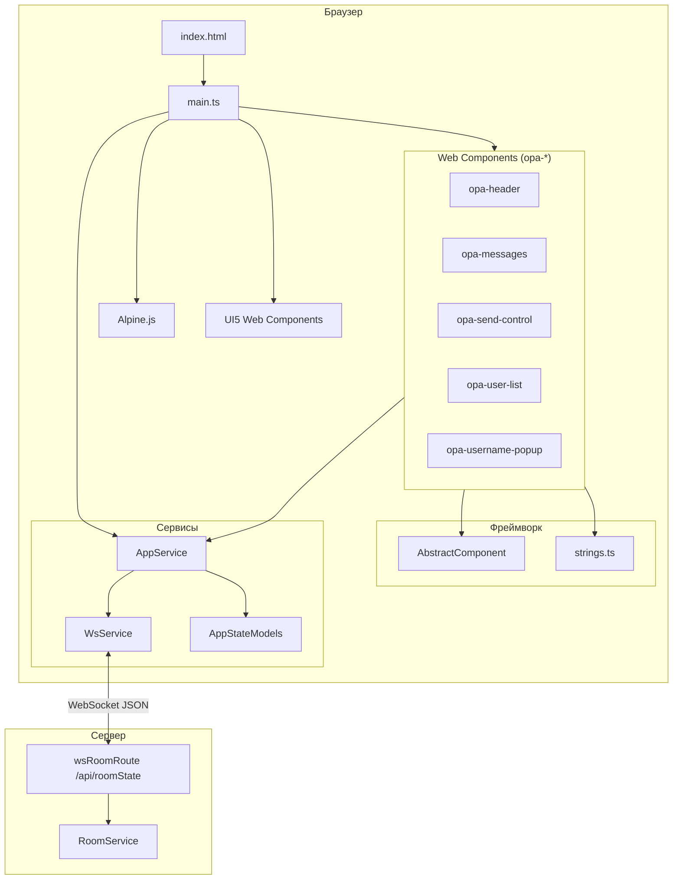
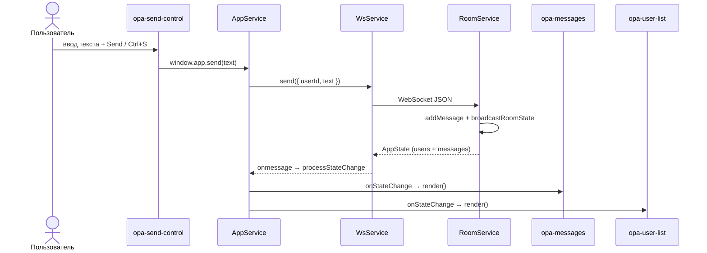

# Документация OPA — Open Platform Application

Главная точка входа в документацию клиентского фреймворка OPA Boilerplate: чат-приложение на **нативных Web Components**, **Alpine.js** и **SAP UI5 Web Components**.

> **Важно:** OPA — это **не Angular**. Стек: TypeScript, Custom Elements API, императивные HTML-шаблоны, модульный синглтон `AppService` и WebSocket-транспорт. Никаких `@Component`, RxJS или Angular DI.

---

## Содержание

1. [Обзор фреймворка](#обзор-фреймворка)
2. [Архитектура](#архитектура)
3. [Структура `client/src/app`](#структура-clientsrcapp)
4. [Поток данных](#поток-данных)
5. [Быстрый старт для разработчиков](#быстрый-старт-для-разработчиков)
6. [Справочник custom elements и сервисов](#справочник-custom-elements-и-сервисов)
7. [Навигация по документации](#навигация-по-документации)

---

## Обзор фреймворка

OPA — минималистичный клиентский каркас для одностраничных приложений с real-time состоянием. Текущая реализация — **чат-комнаты**: пользователи создают комнату по URL (`?room=<uuid>`), обмениваются сообщениями через WebSocket, видят список участников.

### Технологический стек

| Слой | Технология | Роль |
|------|------------|------|
| UI-компоненты | Web Components (`HTMLElement` + `customElements.define`) | Инкапсуляция разметки и lifecycle |
| Базовый класс | `AbstractComponent` | Единый цикл `template → innerHTML` |
| Реактивность в шаблонах | Alpine.js (`x-data`, `x-for`, `x-model`) | Списки, условия, двустороннее связывание |
| Дизайн-система | UI5 Web Components (`ui5-button`, `ui5-list`, …) | Кнопки, диалоги, toast |
| Состояние и оркестрация | `AppService` (модуль-синглтон) | Комнаты, пользователь, pub/sub, DOM |
| Транспорт | `WsService` | WebSocket `/api/roomState` |
| Типы | `AppStateModels` | `User`, `Message`, `AppState` |
| Строки UI | `strings.ts` | Централизованные подписи (без runtime i18n) |

### Ключевые принципы

- **Light DOM** — без Shadow DOM; глобальные стили и Alpine работают в общем дереве документа.
- **Императивный рендер** — функция-шаблон возвращает HTML-строку; полная замена `innerHTML` при обновлении.
- **Два способа доступа к сервису** — `import { AppService }` в TypeScript и `window.app` в inline-обработчиках.
- **Состояние комнаты не хранится в AppService** — сервер рассылает снимок `AppState`; компоненты подписываются через `onStateChange`.

---

## Архитектура



### Слои ответственности

| Слой | Файлы | Ответственность |
|------|-------|-----------------|
| Точка входа | `main.ts`, `index.html` | Регистрация компонентов, `window.app`, `init()` |
| Presentation | `components/opa-*.ts`, `AbstractComponent.ts` | Разметка, события UI, подписки на state |
| Application | `AppService.ts` | Бизнес-логика клиента, pub/sub, localStorage, DOM |
| Transport | `WsService.ts` | Соединение, heartbeat, реконнект |
| Contracts | `AppStateModels.ts` | TypeScript-интерфейсы состояния |
| i18n (статический) | `strings.ts` | UI-подписи |

---

## Структура `client/src/app`

```
client/src/app/
├── AbstractComponent.ts      # Базовый класс всех opa-* компонентов
├── strings.ts                # Централизованные UI-строки
├── components/
│   ├── opa-header.ts         # <opa-header> — панель управления комнатой
│   ├── opa-messages.ts       # <opa-messages> — лента сообщений
│   ├── opa-send-control.ts   # <opa-send-control> — ввод и отправка
│   ├── opa-user-list.ts      # <opa-user-list> — список участников
│   └── opa-username-popup.ts # <opa-username-popup> — диалог имени
├── services/
│   ├── AppService.ts         # Центральный координатор приложения
│   ├── AppStateModels.ts     # Интерфейсы User, Message, AppState
│   └── WsService.ts          # WebSocket-клиент
└── icons/
    └── user.svg              # Иконка в диалоге имени
```

Точка входа приложения — `client/src/main.ts` (импорт Alpine, UI5, компонентов, `AppService.init()`).  
Разметка — `client/index.html` (сетка `.opa-content-layout` с областями `area-a` … `area-d`).  
Стили — `client/src/style.css`.

---

## Поток данных

Типичный цикл: **действие пользователя → AppService → WsService → сервер → состояние → компоненты**.



### Краткое описание этапов

1. **Инициализация** — `main.ts` регистрирует компоненты, публикует `window.app`, вызывает `AppService.init()` (userId, userName, парсинг `?room=`, показ/скрытие UI).
2. **Действие UI** — кнопки и формы вызывают методы `AppService` (напрямую или через `window.app`).
3. **Отправка на сервер** — `AppService.send` → `WsService.send` → JSON по WebSocket.
4. **Обработка на сервере** — `RoomService` обновляет комнату и вызывает `broadcastRoomState`.
5. **Приём состояния** — `WsService` парсит JSON → `AppService.processStateChange` → все подписчики `onStateChange`.
6. **Обновление UI** — `opa-messages` и `opa-user-list` трансформируют `AppState` и вызывают `render()`; `opa-header` управляется атрибутом `room-exist` и `display` соседних панелей.

Подробности: [AppService.md](./services/AppService.md), [WsService.md](./services/WsService.md), [AppStateModels.md](./services/AppStateModels.md).

---

## Быстрый старт для разработчиков

### 1. Создать новый компонент

```typescript
// client/src/app/components/opa-my-widget.ts
import { AbstractComponent } from "../AbstractComponent";
import { strings } from "../strings";

const template = (params: any) => `
    <div class="opa-my-widget">${strings.OpaMyWidget?.title ?? "Widget"}</div>
`;

class OpaMyWidget extends AbstractComponent {
    constructor() {
        super(template, { /* начальный state */ });
        // AppService.onStateChange(...) при необходимости
    }
}

customElements.define("opa-my-widget", OpaMyWidget);
```

### 2. Добавить строки UI

В `strings.ts` — секция `OpaMyWidget`. См. [strings.md](./framework/strings.md).

### 3. Зарегистрировать и разместить

```typescript
// main.ts
import "./app/components/opa-my-widget"
```

```html
<!-- index.html -->
<opa-my-widget class="area-x"></opa-my-widget>
```

### 4. Подключить к состоянию (опционально)

```typescript
import { AppService } from "../services/AppService";
import { AppState } from "../services/AppStateModels";

AppService.onStateChange((state: AppState) => {
    this.state.data = state.users.length;
    this.render();
});
```

### 5. Стили

Добавить классы в `client/src/style.css` (light DOM — селекторы глобальные).

### Чеклист расширения

- [ ] `extends AbstractComponent`, `super(template[, state])`
- [ ] `customElements.define` с уникальным именем
- [ ] Импорт в `main.ts`
- [ ] Тег в `index.html` (при необходимости)
- [ ] Секция в `strings.ts` (если есть пользовательский текст)
- [ ] Документация в `docs/components/`

Полное руководство по базовому классу: [AbstractComponent.md](./framework/AbstractComponent.md).

---

## Справочник custom elements и сервисов

### Custom Elements

| Тег | Класс | Файл | Назначение | Ключевые атрибуты | Связь с AppService |
|-----|-------|------|------------|-------------------|-------------------|
| `<opa-header>` | `OpaHeader` | `opa-header.ts` | Панель: имя, комната, выход, toast ошибок | `room-exist` | `window.app`: `showUsernamePopup`, `createRoom`, `leaveRoom` |
| `<opa-messages>` | `OpaMessages` | `opa-messages.ts` | Лента сообщений чата | — | `onStateChange` → `render()` |
| `<opa-send-control>` | `OpaSendControl` | `opa-send-control.ts` | Textarea + кнопка отправки | — | `window.app.send` |
| `<opa-user-list>` | `OpaUserList` | `opa-user-list.ts` | Список участников (активные/неактивные) | — | `onStateChange` → `render()` |
| `<opa-username-popup>` | `OpaUsernamePopup` | `opa-username-popup.ts` | Диалог имени и смены user ID | `username` | `getUserName`, `setNewUserName`, `setNewUserId`, `closeUsernamePopup` |

### Сервисы и модели

| Модуль | Тип | Файл | Назначение |
|--------|-----|------|------------|
| `AppService` | объект-синглтон | `AppService.ts` | Инициализация, комнаты, pub/sub, localStorage, DOM |
| `WsService` | объект-синглтон | `WsService.ts` | WebSocket: подключение, send, disconnect, реконнект |
| `AppState` / `User` / `Message` | интерфейсы | `AppStateModels.ts` | Контракт состояния комнаты с сервера |
| `strings` | константа | `strings.ts` | UI-строки (11 ключей, 4 группы) |
| `AbstractComponent` | абстрактный класс | `AbstractComponent.ts` | Базовый lifecycle и рендер для всех `opa-*` |

### Глобальные объекты браузера

| Имя | Источник | Использование |
|-----|----------|---------------|
| `window.app` | `main.ts` | Тот же объект, что `AppService` |
| `window.wcToastError` | `#wcToastError` в `opa-header` | Ошибки WebSocket |
| `window.wcToastPopup` | `#wcToastPopup` в `opa-username-popup` | Валидация пустого имени |

---

## Навигация по документации

### Фреймворк (`docs/framework/`)

| Документ | Описание |
|----------|----------|
| [AbstractComponent.md](./framework/AbstractComponent.md) | Базовый класс Web Components: API, lifecycle, создание новых компонентов |
| [strings.md](./framework/strings.md) | Все ключи UI-строк, i18n-паттерн, использование по компонентам, расширение |

### Сервисы (`docs/services/`)

| Документ | Описание |
|----------|----------|
| [AppService.md](./services/AppService.md) | Центральный координатор: API, localStorage, DOM, WebSocket, `window.app` |
| [AppStateModels.md](./services/AppStateModels.md) | Интерфейсы `User`, `Message`, `AppState`, контракт с сервером |
| [WsService.md](./services/WsService.md) | WebSocket: URL, heartbeat, реконнект, протокол сообщений |

### Компоненты (`docs/components/`)

| Документ | Custom Element | Краткое описание |
|----------|----------------|------------------|
| [opa-header.md](./components/opa-header.md) | `<opa-header>` | Заголовок, кнопки комнаты, toast ошибок |
| [opa-messages.md](./components/opa-messages.md) | `<opa-messages>` | Лента сообщений, Alpine `x-for`, автоскролл |
| [opa-send-control.md](./components/opa-send-control.md) | `<opa-send-control>` | Ввод сообщения, Send, Ctrl+S |
| [opa-user-list.md](./components/opa-user-list.md) | `<opa-user-list>` | UI5-список участников, метка «Inactive» |
| [opa-username-popup.md](./components/opa-username-popup.md) | `<opa-username-popup>` | Диалог имени, Save, Change ID |

### Исходники (вне `docs/`)

| Путь | Назначение |
|------|------------|
| `client/src/main.ts` | Точка входа клиента |
| `client/index.html` | Разметка custom elements |
| `server/src/services/roomService.ts` | Серверная логика комнаты |
| `server/src/controllers/wsRoomRoute.ts` | WebSocket-маршрут |

---

*Документация OPA Boilerplate. При изменении архитектуры обновите этот файл и соответствующие дочерние документы.*
