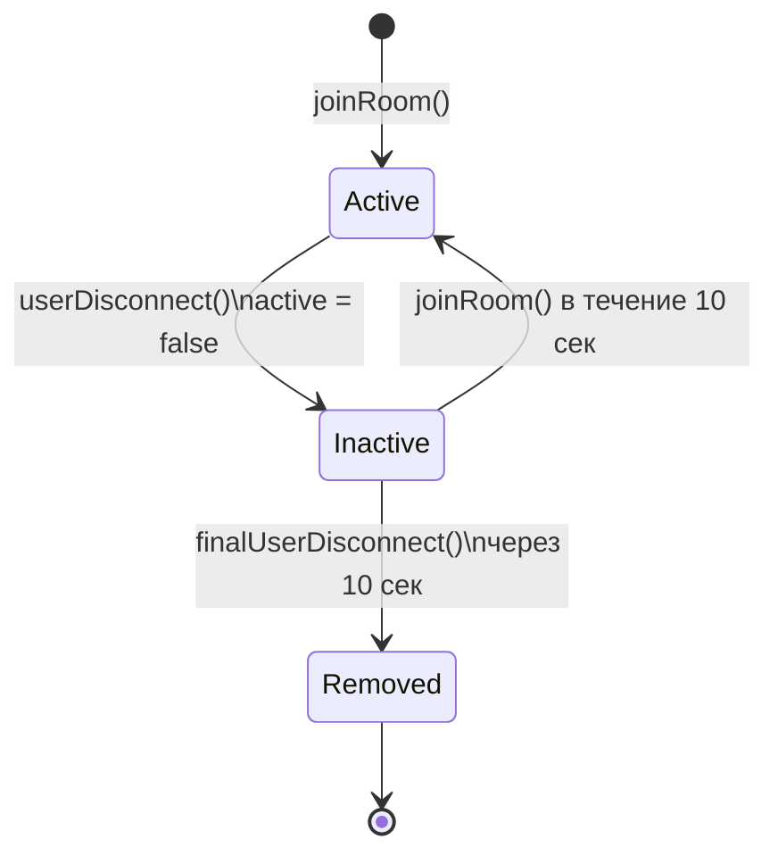
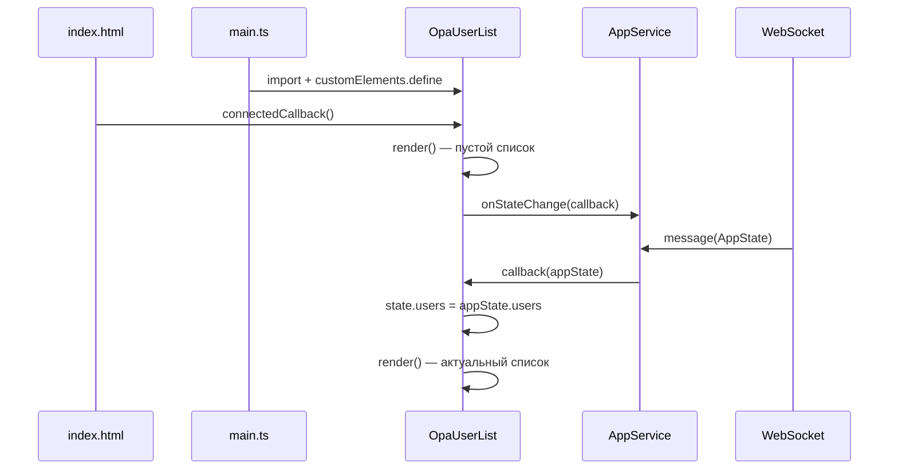

# Компонент `opa-user-list`

Подробная документация по веб-компоненту списка пользователей комнаты OPA Boilerplate.

---

## Содержание

1. [Назначение](#назначение)
2. [Расположение в проекте](#расположение-в-проекте)
3. [Пользовательский элемент (Custom Element)](#пользовательский-элемент-custom-element)
4. [Модели состояния (`AppStateModels`)](#модели-состояния-appstatemodels)
5. [Подписка на состояние приложения](#подписка-на-состояние-приложения)
6. [Шаблон Alpine.js](#шаблон-alpinejs)
7. [Элементы UI5 (`ui5-list`, `ui5-li`)](#элементы-ui5-ui5-list-ui5-li)
8. [Отображение активных и неактивных пользователей](#отображение-активных-и-неактивных-пользователей)
9. [Интернационализация (`strings.ts`)](#интернационализация-stringsts)
10. [Жизненный цикл рендеринга](#жизненный-цикл-рендеринга)
11. [Интеграция в макет страницы](#интеграция-в-макет-страницы)
12. [Стилизация](#стилизация)
13. [Серверная логика статуса `active`](#серверная-логика-статуса-active)
14. [Зависимости и регистрация](#зависимости-и-регистрация)
15. [Полный исходный код](#полный-исходный-код)
16. [Связь с другими компонентами](#связь-с-другими-компонентами)
17. [Особенности реализации и ограничения](#особенности-реализации-и-ограничения)

---

## Назначение

Компонент **`opa-user-list`** отображает список пользователей, подключённых к текущей комнате чата. Он показывает имя каждого участника и визуально помечает тех, кто временно отключился от WebSocket-соединения, но ещё не удалён из комнаты.

Основные задачи компонента:

- подписаться на глобальное состояние приложения (`AppState`) через `AppService`;
- отрисовать актуальный список пользователей в виде UI5-списка;
- для неактивных пользователей (`active: false`) вывести дополнительную подпись «Inactive»;
- обновляться при каждом изменении состояния комнаты, приходящем по WebSocket.

Компонент виден только когда пользователь находится в комнате (есть параметр `?room=` в URL). Вне комнаты он скрывается через `AppService.hideRoom()`.

---

## Расположение в проекте

| Элемент | Путь |
|---------|------|
| Исходный код компонента | `client/src/app/components/opa-user-list.ts` |
| Базовый класс | `client/src/app/AbstractComponent.ts` |
| Модели состояния | `client/src/app/services/AppStateModels.ts` |
| Сервис состояния | `client/src/app/services/AppService.ts` |
| Строки i18n | `client/src/app/strings.ts` |
| Регистрация в приложении | `client/src/main.ts` |
| Разметка страницы | `client/index.html` |
| Стили | `client/src/style.css` |

---

## Пользовательский элемент (Custom Element)

### Тег и регистрация

Компонент реализован как **нативный веб-компонент** (Web Component) и регистрируется под именем:

```html
<opa-user-list></opa-user-list>
```

Регистрация выполняется в конце файла:

```typescript
customElements.define("opa-user-list", OpaUserList);
```

После импорта модуля в `main.ts` браузер распознаёт тег `<opa-user-list>` и создаёт экземпляр класса `OpaUserList`.

### Наследование от `AbstractComponent`

Класс `OpaUserList` наследует абстрактный базовый класс `AbstractComponent`, который расширяет `HTMLElement`:

```typescript
class OpaUserList extends AbstractComponent {
    constructor() {
        super(template, {users: []});
        // ...
    }
}
```

`AbstractComponent` предоставляет:

| Механизм | Описание |
|----------|----------|
| `template` | Функция, возвращающая HTML-строку на основе `state` и атрибутов |
| `state` | Внутренний объект состояния компонента (здесь: `{ users: [] }`) |
| `render()` | Заменяет `innerHTML` элемента результатом вызова `template(params)` |
| `connectedCallback()` | Вызывает первый `render()` при добавлении элемента в DOM |
| `observedAttributes` | По умолчанию пустой массив — компонент не реагирует на HTML-атрибуты |

Для `opa-user-list` начальное состояние: `{ users: [] }` — пустой массив до получения данных с сервера.

### Отсутствие Shadow DOM

Компонент **не использует** Shadow DOM. Рендеринг идёт напрямую в `innerHTML` хост-элемента. Это означает:

- глобальные стили из `style.css` применяются к внутренним элементам;
- Alpine.js и UI5 Web Components инициализируются в общем дереве документа;
- при каждом `render()` всё содержимое компонента пересоздаётся заново.

---

## Модели состояния (`AppStateModels`)

Файл `client/src/app/services/AppStateModels.ts` определяет типы данных, с которыми работает компонент.

### Интерфейс `User`

```typescript
export interface User {
    id: string;
    name: string;
    active: boolean;
}
```

| Поле | Тип | Назначение |
|------|-----|------------|
| `id` | `string` | Уникальный идентификатор пользователя (UUID, хранится в `localStorage`) |
| `name` | `string` | Отображаемое имя пользователя |
| `active` | `boolean` | `true` — пользователь онлайн (WebSocket открыт); `false` — временно отключён |

Компонент `opa-user-list` использует поля **`name`** и **`active`**. Поле `id` в шаблоне не отображается, но присутствует в данных Alpine.

### Интерфейс `AppState`

```typescript
export interface AppState {
    users: User[]
    messages: Message[]; // last 5 min messages
}
```

Компонент забирает только массив `users`:

```typescript
this.state.users = appState.users || [];
```

Если `users` отсутствует или равен `null`/`undefined`, подставляется пустой массив `[]`.

### Соответствие серверной модели

На сервере (`server/src/services/roomModels.ts`) интерфейс `User` идентичен. Состояние комнаты (`Room`) передаётся клиенту целиком через WebSocket в формате JSON. Клиент десериализует его как `AppState` (поле `messages` используется другими компонентами).

---

## Подписка на состояние приложения

### Механизм `AppService.onStateChange`

В конструкторе `OpaUserList` выполняется подписка:

```typescript
AppService.onStateChange((appState: AppState) => {
    this.state.users = appState.users || [];
    this.render();
});
```

### Как работает `AppService`

`AppService` (`client/src/app/services/AppService.ts`) реализует простой паттерн **наблюдателя (observer)**:

1. WebSocket получает JSON-сообщение с состоянием комнаты.
2. Колбэк `WsRoomCallback.message` вызывает `processStateChange(state)`.
3. `processStateChange` последовательно вызывает все зарегистрированные колбэки.
4. `opa-user-list` обновляет `this.state.users` и перерисовывает шаблон.

```typescript
let callbacks: Function[] = [];
const processStateChange = (appState: AppState): void =>
    callbacks.forEach(callback => callback(appState));

const onStateChange = (callback: Function): any => {
    callbacks.push(callback);
    return { unsubscribe: () => callbacks = callbacks.filter(item => item != callback) };
}
```

### Важные детали подписки

| Аспект | Поведение |
|--------|-----------|
| Момент подписки | Сразу при создании экземпляра компонента (в конструкторе) |
| Отписка | **Не используется** — компонент живёт всё время сессии страницы |
| Частота обновлений | При каждом `broadcastRoomState()` на сервере (вход/выход, сообщения, смена имени) |
| Побочный эффект `render()` | Полная замена `innerHTML`; Alpine переинициализирует `x-data` |

### Показ и скрытие компонента

`AppService` управляет видимостью через `style.display`:

```typescript
// showRoom() — пользователь в комнате
document.getElementsByTagName("opa-user-list")[0].style.display = "block";

// hideRoom() — комната не выбрана
document.getElementsByTagName("opa-user-list")[0].style.display = "none";
```

Подписка на состояние **остаётся активной** даже когда список скрыт. Данные продолжают обновляться в `this.state.users`.

---

## Шаблон Alpine.js

### Структура шаблона

Шаблон — это функция, возвращающая HTML-строку:

```typescript
const template = ({users}) => {
    users = JSON.stringify(users || []);
    return `
        <ui5-list id="opa-user-list" class="opa-user-list full-width" x-data='{ users : ${users} }'>
            <template x-for="user in users">
                <ui5-li
                    x-text="user.name"
                    x-bind:additional-text="user.active ? '' : '${strings.OpaUserList.inactive}'"
                    additional-text-state="Information"
                ></ui5-li>
            </template>
        </ui5-list>
    `;
};
```

### Сериализация данных в `x-data`

Перед вставкой в шаблон массив `users` преобразуется в JSON:

```typescript
users = JSON.stringify(users || []);
```

Результат встраивается в атрибут `x-data`:

```html
x-data='{ users : [{"id":"...","name":"Alice","active":true}, ...] }'
```

Это позволяет Alpine.js получить готовый JavaScript-массив объектов при инициализации компонента без дополнительных HTTP-запросов.

### Директивы Alpine.js

| Директива | Элемент | Назначение |
|-----------|---------|------------|
| `x-data` | `<ui5-list>` | Объявляет реактивное состояние `{ users: [...] }` |
| `x-for="user in users"` | `<template>` | Цикл по массиву пользователей; для каждого создаётся `<ui5-li>` |
| `x-text="user.name"` | `<ui5-li>` | Устанавливает текстовое содержимое элемента — имя пользователя |
| `x-bind:additional-text` | `<ui5-li>` | Динамически привязывает дополнительный текст (подпись «Inactive») |

### Почему Alpine, а не чистый TypeScript?

Проект использует **гибридный подход**:

- TypeScript/Web Components управляют жизненным циклом и подпиской на `AppState`;
- Alpine.js отвечает за декларативный рендеринг списка внутри сгенерированного HTML.

Аналогичный паттерн применяется в `opa-messages.ts`.

### Переинициализация Alpine при `render()`

Каждый вызов `this.render()` полностью заменяет DOM-содержимое. Alpine.js (подключён в `main.ts` как `alpinejs/dist/cdn.min.js`) автоматически обрабуживает новые узлы с директивами `x-*` при их появлении в документе.

---

## Элементы UI5 (`ui5-list`, `ui5-li`)

### Импорт Web Components

В `client/src/main.ts` регистрируются необходимые UI5-компоненты:

```typescript
import "@ui5/webcomponents/dist/List";
import "@ui5/webcomponents/dist/StandardListItem";
```

Тег `<ui5-li>` — это **алиас** для `StandardListItem` из SAP UI5 Web Components.

### `<ui5-list>`

Контейнер списка с атрибутами:

| Атрибут/класс | Значение | Назначение |
|---------------|----------|------------|
| `id` | `opa-user-list` | Идентификатор для CSS и отладки |
| `class` | `opa-user-list full-width` | Стилизация и растягивание на всю ширину области |
| `x-data` | `{ users: [...] }` | Данные для Alpine.js |

UI5 List поддерживает вложенные `ui5-li` как дочерние элементы и отображает их в стандартном SAP Fiori-стиле.

### `<ui5-li>` (StandardListItem)

Каждый пункт списка — один пользователь:

```html
<ui5-li
    x-text="user.name"
    x-bind:additional-text="user.active ? '' : 'Inactive'"
    additional-text-state="Information"
></ui5-li>
```

| Свойство / атрибут | Описание |
|--------------------|----------|
| Основной текст (`x-text`) | Имя пользователя (`user.name`) |
| `additional-text` | Вторичный текст справа или под основным (пустая строка для активных) |
| `additional-text-state` | Визуальное состояние доп. текста: `"Information"` — нейтральный информационный стиль UI5 |

Значение `additional-text-state="Information"` задаётся **статически** (не через Alpine) и определяет цветовую схему подписи «Inactive» в дизайн-системе UI5.

### Отсутствие интерактивности

Пункты списка **не кликабельны** — не заданы `type="Active"`, обработчики событий или навигация. Компонент носит исключительно **информационный** характер.

---

## Отображение активных и неактивных пользователей

### Логика на клиенте

Условие в шаблоне Alpine:

```javascript
user.active ? '' : 'Inactive'
```

| Состояние `user.active` | Основной текст | `additional-text` | Визуальный результат |
|-------------------------|----------------|-------------------|----------------------|
| `true` | Имя пользователя | `''` (пустая строка) | Только имя, без пометок |
| `false` | Имя пользователя | `'Inactive'` | Имя + информационная подпись «Inactive» |

Пользователь **остаётся в списке** даже при `active: false`. Он не удаляется из DOM до тех пор, пока сервер не исключит его из массива `users`.

### Логика на сервере

Сервер (`server/src/services/roomService.ts`) управляет полем `active`:

#### Пользователь подключается (`joinRoom`)

```typescript
if (foundUser) {
    foundUser.name = userName;
    foundUser.active = true;   // повторное подключение
} else {
    this.room.users.push({id: userId, name: userName, active: true}); // новый пользователь
}
```

#### Пользователь отключается (`userDisconnect`)

```typescript
foundUser.active = false;
this.broadcastRoomState();
// Запускается таймер отложенного удаления (10 секунд)
this.userLazyRemoveTimers[userId] = setTimeout(
    () => this.finalUserDisconnect(userId),
    this.LAZY_REMOVE_TIMEOUT  // 10 * 1000 мс
);
```

#### Окончательное удаление (`finalUserDisconnect`)

Через 10 секунд после отключения WebSocket пользователь удаляется из `room.users`. До этого момента клиент видит его как **неактивного** с подписью «Inactive».

#### Повторное подключение до истечения таймера

Если пользователь переподключится в течение 10 секунд, таймер сбрасывается и `active` снова становится `true`.

### Диаграмма жизненного цикла пользователя в списке



### Пример отображения

Допустим, в комнате три пользователя:

```json
[
  { "id": "uuid-1", "name": "Алиса", "active": true },
  { "id": "uuid-2", "name": "Боб", "active": true },
  { "id": "uuid-3", "name": "Карл", "active": false }
]
```

Список отобразит:

```
Алиса
Боб
Карл          Inactive
```

---

## Интернационализация (`strings.ts`)

### Используемые строки

Компонент импортирует объект `strings` из `client/src/app/strings.ts`:

```typescript
import {strings} from "../strings";
```

Для `opa-user-list` задействована **одна** строка:

```typescript
export const strings = {
    // ...
    OpaUserList: {
        inactive: "Inactive"
    },
    // ...
};
```

### Применение в шаблоне

Строка встраивается в шаблон **на этапе компиляции TypeScript** (интерполяция в template literal):

```typescript
x-bind:additional-text="user.active ? '' : '${strings.OpaUserList.inactive}'"
```

В сгенерированном HTML это становится:

```html
x-bind:additional-text="user.active ? '' : 'Inactive'"
```

### Особенности текущей i18n-реализации

| Аспект | Текущее состояние |
|--------|-------------------|
| Язык строк | Английский (`"Inactive"`) |
| Механизм | Статический объект `strings`, без библиотек i18n |
| Локализация | Не реализована — все строки захардкожены |
| Область `OpaUserList` | Только ключ `inactive`; других строк у компонента нет |
| Момент подстановки | При каждом `render()` значение уже «зашито» в HTML |

### Как добавить русскую локализацию

Для перевода подписи неактивного пользователя достаточно изменить:

```typescript
OpaUserList: {
    inactive: "Не в сети"  // или "Неактивен"
}
```

Более полноценная i18n потребует выноса `strings` в языковые файлы и механизма выбора локали — в текущей архитектуре этого нет.

### Полный контекст `strings.ts` (для справки)

Компонент использует только `OpaUserList.inactive`. Остальные ключи относятся к другим компонентам:

| Группа | Ключи | Компонент |
|--------|-------|-----------|
| `OpaHeader` | `changeName`, `createRoom`, `leaveRoom`, `error`, `createRoomFirst` | `opa-header` |
| `OpaSendControl` | `send` | `opa-send-control` |
| **`OpaUserList`** | **`inactive`** | **`opa-user-list`** |
| `OpaUsernamePopup` | `changeUserName`, `save`, `changeId`, `pleaseEnterUsername` | `opa-username-popup` |

---

## Жизненный цикл рендеринга

### Последовательность событий



### Шаги `render()` в `AbstractComponent`

1. Собирается объект `params` из `observedAttributes` (пусто для этого компонента) и `this.state`.
2. В консоль выводится лог: `Params for OpaUserList template: { users: [...] }`.
3. `this.innerHTML = this.template(params)` — полная замена содержимого.
4. Alpine.js инициализирует `x-data` на новом `<ui5-list>`.
5. UI5 Web Components апгрейдят `<ui5-list>` и `<ui5-li>` до кастомных элементов.

### Первый рендер

При загрузке страницы `users` пуст: отображается `<ui5-list>` без пунктов. Данные появятся после подключения к WebSocket и первого `broadcastRoomState()`.

---

## Интеграция в макет страницы

### Разметка `index.html`

```html
<div class="opa-content-layout">
    <opa-header class="area-a"></opa-header>
    <opa-messages class="area-b"></opa-messages>
    <opa-send-control class="area-c"></opa-send-control>
    <opa-user-list class="area-d"></opa-user-list>
</div>
```

### CSS Grid

Компонент занимает область **`d`** (правая колонка):

```css
.opa-content-layout {
    display: grid;
    grid-template-areas:
        "a a a"
        "b b d"
        "b b d"
        "c c d";
    grid-template-columns: auto auto minmax(150px, 20%);
    grid-template-rows: 50px 1fr 1fr 50px;
}

.area-d {
    grid-area: d;
}
```

Список пользователей располагается **справа** от области сообщений и растягивается на три ряда сетки (со 2-го по 4-й). Минимальная ширина колонки — 150px, максимальная доля — 20% viewport.

---

## Стилизация

### Класс `.opa-user-list`

```css
.opa-user-list {
    border: 1px solid black;
}
```

Применяется к внутреннему `<ui5-list>`, а не к хост-элементу `<opa-user-list>`. Рамка визуально отделяет список пользователей от остальных областей.

### Класс `full-width`

Используется совместно с `opa-user-list` на `<ui5-list>` для растягивания на всю ширину grid-ячейки. Определение `full-width` может наследоваться из глобальных утилитарных стилей проекта.

### Стили хост-элемента

Сам тег `<opa-user-list class="area-d">` стилизуется только через `grid-area: d`. Дополнительных правил для хост-элемента нет.

---

## Серверная логика статуса `active`

Поле `active` **не вычисляется на клиенте** — оно приходит готовым с сервера в составе `Room.users`.

Ключевые константы сервера:

| Параметр | Значение |
|----------|----------|
| `LAZY_REMOVE_TIMEOUT` | 10 000 мс (10 секунд) |
| Триггер `broadcastRoomState` | Любое изменение users/messages |

Клиентская модель `Message.date` типизирована как `string`, серверная — как `number` (миллисекунды). Для `opa-user-list` это не имеет значения, так как сообщения компонентом не используются.

---

## Зависимости и регистрация

### Граф зависимостей модуля

```
opa-user-list.ts
├── AbstractComponent.ts
├── AppService.ts
│   ├── AppStateModels.ts
│   └── WsService.ts
└── strings.ts
```

### Внешние runtime-зависимости

| Зависимость | Подключение | Роль |
|-------------|-------------|------|
| Alpine.js | `main.ts` → `alpinejs/dist/cdn.min.js` | `x-data`, `x-for`, `x-text`, `x-bind` |
| UI5 List | `@ui5/webcomponents/dist/List` | `<ui5-list>` |
| UI5 StandardListItem | `@ui5/webcomponents/dist/StandardListItem` | `<ui5-li>` |

### Порядок загрузки в `main.ts`

```typescript
import "alpinejs/dist/cdn.min.js"          // 1. Alpine
import "@ui5/webcomponents/dist/List"        // 2. UI5
import "@ui5/webcomponents/dist/StandardListItem"
import "./app/components/opa-user-list"      // 3. Компонент
import {AppService} from "./app/services/AppService";
AppService.init();                           // 4. Инициализация (WebSocket)
```

Alpine и UI5 должны быть загружены **до** первого `render()` компонента.

---

## Полный исходный код

```typescript
import {AbstractComponent} from "../AbstractComponent";
import {AppService} from "../services/AppService";
import {strings} from "../strings";
import {AppState} from "../services/AppStateModels";

//@ts-ignore
const template = ({users}) => {
    users = JSON.stringify(users || []);
    return `
        <ui5-list id="opa-user-list" class="opa-user-list full-width" x-data='{ users : ${users} }'>
            <template x-for="user in users">
                <ui5-li
                    x-text="user.name"
                    x-bind:additional-text="user.active ? '' : '${strings.OpaUserList.inactive}'"
                    additional-text-state="Information"
                ></ui5-li>
            </template>
        </ui5-list>
    `;
};

class OpaUserList extends AbstractComponent {
    constructor() {
        super(template, {users: []});
        AppService.onStateChange((appState: AppState) => {
            this.state.users = appState.users || [];
            this.render();
        });
    }
}

customElements.define("opa-user-list", OpaUserList);
```

---

## Связь с другими компонентами

| Компонент | Связь с `opa-user-list` |
|-----------|-------------------------|
| `opa-messages` | Использует `appState.users` для подстановки имён авторов сообщений по `userId` |
| `opa-header` | Управляет комнатой; косвенно влияет на видимость списка через `showRoom`/`hideRoom` |
| `opa-send-control` | Совместно показывается/скрывается при входе/выходе из комнаты |
| `opa-username-popup` | Смена имени пользователя обновляет `user.name` на сервере и транслируется в список |

Все перечисленные компоненты подписаны на один и тот же `AppService.onStateChange` и получают одинаковый снимок `AppState` при каждом обновлении.

---

## Особенности реализации и ограничения

### Текущие ограничения

1. **Нет отписки** — колбэк `onStateChange` не удаляется при уничтожении компонента (на практике компонент не удаляется из DOM).
2. **Полный перерендер** — каждое обновление состояния пересоздаёт весь DOM списка; для больших комнат это может быть неэффективно.
3. **Нет сортировки** — пользователи отображаются в порядке массива `users` с сервера.
4. **Нет выделения текущего пользователя** — свой `userId` из `localStorage` не сравнивается с `user.id`.
5. **Нет локализации UI** — строка «Inactive» на английском, несмотря на русскоязычную документацию.
6. **Логирование в консоль** — `AbstractComponent.render()` выводит параметры шаблона при каждом рендере.
7. **Один экземпляр** — `AppService.showRoom()`/`hideRoom()` обращаются к `getElementsByTagName("opa-user-list")[0]`, предполагая единственный экземпляр на странице.

### Потенциальные улучшения

- Дифференциальный рендеринг вместо полной замены `innerHTML`.
- Подсветка текущего пользователя в списке.
- Сортировка: активные сверху, неактивные снизу.
- Полноценная i18n с поддержкой русского языка.
- Использование `unsubscribe` при `disconnectedCallback`.
- Отображение `id` в `additional-text` для отладки (как в серверных логах).

---

## Краткая справка

| Вопрос | Ответ |
|--------|-------|
| Тег компонента | `<opa-user-list>` |
| Когда виден | Только в комнате (`?room=...`) |
| Источник данных | `AppState.users` через WebSocket |
| Как отличить неактивного | Подпись `Inactive` в `additional-text` |
| Строка i18n | `strings.OpaUserList.inactive` → `"Inactive"` |
| UI-библиотека | SAP UI5 Web Components (`ui5-list`, `ui5-li`) |
| Клиентский рендеринг | Alpine.js (`x-for`, `x-text`, `x-bind`) |
