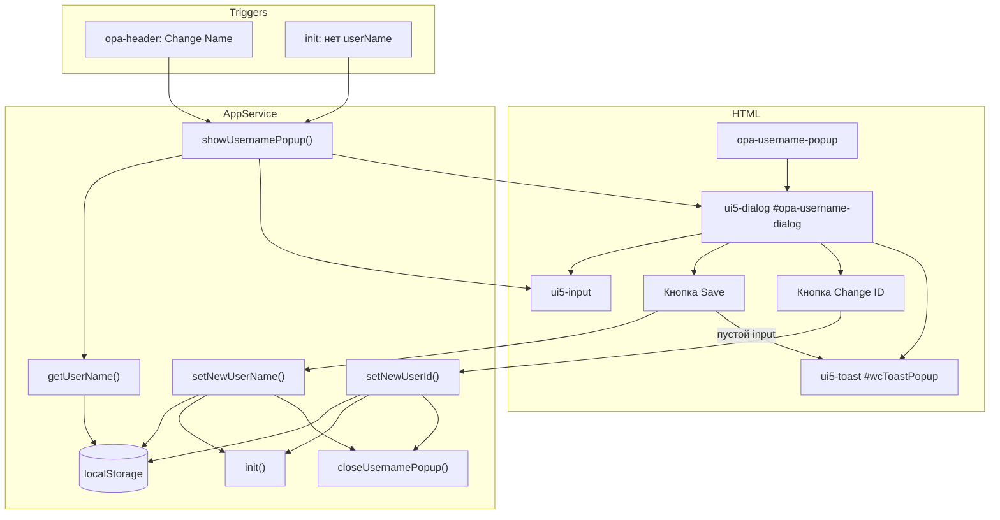

# `opa-username-popup` — диалог смены имени пользователя

Документация описывает веб-компонент `opa-username-popup`, который отвечает за ввод и изменение отображаемого имени пользователя (username) и за смену анонимного идентификатора (user ID) в клиентском приложении OPA.

**Исходный файл:** `client/src/app/components/opa-username-popup.ts`

---

## Содержание

1. [Назначение и место в приложении](#назначение-и-место-в-приложении)
2. [Custom Element](#custom-element)
3. [Архитектура и базовый класс](#архитектура-и-базовый-класс)
4. [Атрибут `username`](#атрибут-username)
5. [Разметка и UI5 Web Components](#разметка-и-ui5-web-components)
6. [Иконка `user.svg`](#иконка-usersvg)
7. [Локализованные строки (`strings.ts`)](#локализованные-строки-stringsts)
8. [Поток «Сохранить» (Save)](#поток-сохранить-save)
9. [Поток «Сменить ID» (Change ID)](#поток-сменить-id-change-id)
10. [Валидация и Toast-уведомление](#валидация-и-toast-уведомление)
11. [Интеграция с `AppService`](#интеграция-с-appservice)
12. [Жизненный цикл и сценарии открытия](#жизненный-цикл-и-сценарии-открытия)
13. [Известная проблема: мерцание (TODO)](#известная-проблема-мерцание-todo)
14. [Зависимости и подключение](#зависимости-и-подключение)
15. [Ограничения и особенности реализации](#ограничения-и-особенности-реализации)
16. [Справочник API](#справочник-api)

---

## Назначение и место в приложении

Компонент `opa-username-popup` реализует модальный диалог, в котором пользователь может:

- **задать или изменить отображаемое имя** (username), сохраняемое в `localStorage` под ключом `userName`;
- **сгенерировать новый анонимный идентификатор** (user ID), сохраняемый в `localStorage` под ключом `userId`.

Имя и ID используются при подключении к WebSocket-комнате (`WsService.attachWsToRoom`) и отображаются в списке участников. Без имени пользователя приложение не подключается к комнате — диалог открывается автоматически при первом запуске.

Компонент размещён **вне основного layout** в `index.html`, сразу после `<body>`:

```html
<opa-username-popup></opa-username-popup>
<div class="opa-content-layout">
    ...
</div>
```

Такое размещение позволяет диалогу перекрывать всё приложение независимо от сетки `opa-content-layout`.

Открыть диалог вручную можно из заголовка (`opa-header`) кнопкой «Change Name», которая вызывает глобальный объект `app.showUsernamePopup()` (см. [Интеграция с AppService](#интеграция-с-appservice)).

---

## Custom Element

### Регистрация

```typescript
customElements.define("opa-username-popup", OpaUsernamePopup);
```

| Свойство | Значение |
|----------|----------|
| **Тег** | `<opa-username-popup>` |
| **Класс** | `OpaUsernamePopup` |
| **Базовый класс** | `AbstractComponent` (наследует `HTMLElement`) |
| **Файл регистрации** | импортируется в `client/src/main.ts` |

### Поведение при подключении к DOM

1. При первом `connectedCallback` базового класса `AbstractComponent` вызывается `render()`.
2. `OpaUsernamePopup` переопределяет `render()`: сначала вызывает `super.render()`, затем навешивает обработчики на кнопки и синхронизирует поле ввода с `AppService.getUserName()`.

Компонент **не использует Shadow DOM** — разметка записывается напрямую в `innerHTML` элемента.

---

## Архитектура и базовый класс

`OpaUsernamePopup` наследует `AbstractComponent` (`client/src/app/AbstractComponent.ts`), который реализует общий паттерн веб-компонентов проекта:

| Механизм | Описание |
|----------|----------|
| **Шаблон** | Функция `template(params) => string`, возвращающая HTML-строку |
| **Рендер** | `innerHTML = template(params)`, где `params` собираются из `observedAttributes` и `state` |
| **Первый рендер** | Один раз в `connectedCallback` (флаг `rendered`) |
| **Повторный рендер** | При изменении наблюдаемых атрибутов через `attributeChangedCallback` |

Для `opa-username-popup` шаблон объявлен как:

```typescript
const template = ({username = ""}) => `...`;
```

Параметр `username` подставляется в атрибут `value` элемента `<ui5-input>` при рендере.

---

## Атрибут `username`

### Объявление

```typescript
static get observedAttributes() {
    return ["username"];
}
```

Атрибут `username` зарегистрирован как **наблюдаемый**: при его изменении `AbstractComponent` перерисовывает весь `innerHTML` компонента.

### Назначение

Атрибут предназначен для передачи текущего имени пользователя в шаблон при рендере:

```html
<ui5-input value="${username}"></ui5-input>
```

### Фактическое использование в проекте

На момент написания документации атрибут **практически не используется** для открытия диалога. В `AppService.showUsernamePopup()` закомментирован вызов:

```typescript
// document.getElementById("opa-username-popup").setAttribute("username", getUserName() || "");
```

Вместо этого значение поля задаётся напрямую через DOM:

```typescript
document.querySelector(".opa-username-component > ui5-input")!.setAttribute("value", getUserName() || "");
```

Дополнительно в `OpaUsernamePopup.render()` после `super.render()` поле ввода **снова** перезаписывается:

```typescript
dialogInput.value = AppService.getUserName();
```

Таким образом, источником истины для отображаемого имени при открытии диалога является **`AppService.getUserName()`** (чтение из `localStorage`), а не HTML-атрибут `username` на custom element.

### Рекомендация при доработке

Для согласованности с архитектурой `AbstractComponent` предпочтительно раскомментировать установку атрибута в `showUsernamePopup()` и убрать дублирующие прямые манипуляции с `ui5-input`, чтобы единственным механизмом обновления UI служил рендер по атрибуту.

---

## Разметка и UI5 Web Components

Шаблон компонента построен на [UI5 Web Components](https://sap.github.io/ui5-webcomponents/). Импорты в `main.ts`:

- `@ui5/webcomponents/dist/Dialog`
- `@ui5/webcomponents/dist/Title`
- `@ui5/webcomponents/dist/Input`
- `@ui5/webcomponents/dist/Button`
- `@ui5/webcomponents/dist/Toast`

### Структура DOM

```
opa-username-popup
└── ui5-dialog#opa-username-dialog
    ├── [slot=header]
    │   └── ui5-title (level="H5")
    ├── div.opa-username-component
    │   ├── img (иконка user.svg, 30×30)
    │   └── ui5-input
    ├── [slot=footer]
    │   ├── ui5-button.opa-username-popup__save (design="Emphasized")
    │   └── ui5-button.opa-username-popup__change-id (design="Attention")
    └── ui5-toast#wcToastPopup (placement="TopCenter")
```

### `ui5-dialog` (`#opa-username-dialog`)

| Свойство | Значение |
|----------|----------|
| **ID** | `opa-username-dialog` — глобальный идентификатор, используется в `AppService` для `show()` / `close()` |
| **Открытие** | `dialog.show()` — метод UI5 Dialog API |
| **Закрытие** | `dialog.close()` |

Диалог не открывается автоматически при рендере; видимость полностью управляется через `AppService`.

### `ui5-title` (заголовок)

- **Уровень:** `H5`
- **Слот:** `header`
- **Текст:** `strings.OpaUsernamePopup.changeUserName` → `"Change user name"`

### `ui5-input` (поле ввода имени)

- Начальное значение задаётся из шаблона (`username`) и затем перезаписывается в `render()` из `AppService.getUserName()`.
- При сохранении читается свойство `dialogInput.value` (не атрибут `value`).
- Пустая строка, `null` и отсутствие ввода трактуются как ошибка валидации (см. [Валидация](#валидация-и-toast-уведомление)).

### `ui5-button` (кнопки футера)

| Класс | Design | Назначение | Текст (`strings`) |
|-------|--------|------------|-------------------|
| `.opa-username-popup__save` | `Emphasized` | Сохранить новое имя | `save` → `"Save"` |
| `.opa-username-popup__change-id` | `Attention` | Сгенерировать новый user ID | `changeId` → `"Change ID"` |

Классы используются как селекторы в `document.querySelector` внутри `render()` для привязки обработчиков `click`.

### `ui5-toast` (`#wcToastPopup`)

| Свойство | Значение |
|----------|----------|
| **ID** | `wcToastPopup` |
| **Размещение** | `placement="TopCenter"` |
| **Текст** | `strings.OpaUsernamePopup.pleaseEnterUsername` |
| **Показ** | `(window as any).wcToastPopup.show()` при пустом имени |

> **Примечание:** Toast объявлен **внутри** `ui5-dialog`, но показывается через глобальную ссылку `window.wcToastPopup` (ID элемента попадает в глобальную область видимости браузера). Аналогичный паттерн используется для `wcToastError` в `opa-header`.

### Контейнер `.opa-username-component`

Обёртка для иконки и поля ввода. Селектор `.opa-username-component > ui5-input` используется в `AppService.showUsernamePopup()` для установки значения при открытии диалога.

Отдельных CSS-правил для этого класса в `style.css` нет — внешний вид определяется стилями UI5 Web Components.

---

## Иконка `user.svg`

**Путь:** `client/src/app/icons/user.svg`

**Импорт в компоненте:**

```typescript
import userLogo from "../icons/user.svg";
```

Сборщик (Vite) обрабатывает SVG как URL-ресурс; в шаблоне подставляется в `src` тега ``:

```html

```

### Описание SVG

| Параметр | Значение |
|----------|----------|
| **Автор** | Treer (gitlab.com/Treer) |
| **Размер viewBox** | 600×600 |
| **Стиль** | Контурный (`fill="none"`), чёрный обвод (`stroke="black"`, `stroke-width="30"`) |
| **Элементы** | Круг (голова), круг поменьше (лицо/силуэт), дуга (плечи/торс) |
| **Title** | `Abstract user icon` |

В UI иконка отображается фиксированным размером **30×30 px** независимо от исходного размера SVG (600×600), что обеспечивает компактное отображение рядом с полем ввода.

Иконка несёт **декоративную** функцию: визуально обозначает, что диалог относится к профилю/пользователю. На логику сохранения или валидации не влияет.

---

## Локализованные строки (`strings.ts`)

Все пользовательские тексты диалога вынесены в `client/src/app/strings.ts` в объект `strings.OpaUsernamePopup`:

| Ключ | Значение (EN) | Где используется |
|------|---------------|------------------|
| `changeUserName` | `"Change user name"` | Заголовок `ui5-title` |
| `save` | `"Save"` | Кнопка сохранения |
| `changeId` | `"Change ID"` | Кнопка смены ID |
| `pleaseEnterUsername` | `"Please enter username"` | Текст toast при пустом вводе |

Пример доступа в шаблоне:

```typescript
${strings.OpaUsernamePopup.changeUserName}
```

Локализация на другие языки в текущей версии не реализована — строки заданы статически на английском. Для русификации достаточно изменить значения в `strings.OpaUsernamePopup` или вынести их в систему i18n.

---

## Поток «Сохранить» (Save)

Обработчик на кнопке `.opa-username-popup__save`:

```
[Клик «Save»]
       │
       ▼
Чтение dialogInput.value
       │
       ├── value truthy (непустая строка)
       │         │
       │         ▼
       │   AppService.setNewUserName(username)
       │         │
       │         ├── localStorage.setItem("userName", userName)
       │         └── AppService.init()
       │                   │
       │                   ├── userId есть? иначе uuid()
       │                   ├── roomId из URL? showRoom/hideRoom
       │                   ├── userName есть? иначе showUsernamePopup (не наш случай)
       │                   └── roomId есть? connect(roomId, userId, userName)
       │
       │         ▼
       │   AppService.closeUsernamePopup()
       │         └── dialog.close()
       │
       └── value falsy (пустая строка)
                 │
                 ▼
           window.wcToastPopup.show()
           (диалог остаётся открытым)
```

### Детали `setNewUserName`

```typescript
const setNewUserName = (userName: string): void => {
    setUserName(userName);  // localStorage "userName"
    init();                 // переинициализация приложения
}
```

После сохранения имени вызывается полный `init()`, что может:

- переподключить WebSocket к комнате с новым `userName` (если пользователь уже в комнате);
- обновить видимость блоков комнаты;
- **не** открыть диалог снова, так как `userName` уже задан.

### Закрытие диалога

```typescript
AppService.closeUsernamePopup();
```

Вызывает `document.getElementById("opa-username-dialog").close()`.

---

## Поток «Сменить ID» (Change ID)

Обработчик на кнопке `.opa-username-popup__change-id`:

```
[Клик «Change ID»]
       │
       ▼
AppService.setNewUserId()
       │
       ├── setUserId(uuid())  → localStorage "userId" = новый UUID v4
       └── init()
                 │
                 └── при наличии roomId → connect с новым userId
       │
       ▼
AppService.closeUsernamePopup()
```

### Детали `setNewUserId`

```typescript
const setNewUserId = (): void => {
    setUserId(uuid());
    init();
}
```

**Важно:** смена ID **не меняет** `userName`. Пользователь остаётся с тем же отображаемым именем, но на сервере и в комнате будет восприниматься как **новый участник** с новым `userId`.

Используется библиотека `uuid` (`v4 as uuid`) для генерации идентификатора.

Диалог закрывается **без валидации** поля имени — кнопка Change ID не проверяет, заполнен ли input.

---

## Валидация и Toast-уведомление

### Правило валидации

При нажатии **Save** выполняется единственная проверка:

```typescript
if (username) {
    // сохранить
} else {
    (window as any).wcToastPopup.show();
}
```

| Условие | Поведение |
|---------|-----------|
| Непустая строка в `ui5-input` | Имя сохраняется, диалог закрывается |
| Пустая строка `""` | Toast «Please enter username», диалог **остаётся открытым** |
| Пробелы только | В JavaScript непустая строка из пробелов — **truthy**, сохранится как есть |

Дополнительных проверок (максимальная длина, запрещённые символы, trim) **нет**.

### Toast `wcToastPopup`

- Компонент: `ui5-toast`
- Метод показа: `.show()` (API UI5 Web Components)
- Доступ: через `window.wcToastPopup` (глобальный ID)
- Позиция: верх по центру (`TopCenter`)

Toast используется **только** для ошибки валидации имени. Ошибки WebSocket обрабатываются отдельным toast `wcToastError` в `opa-header`.

---

## Интеграция с `AppService`

`AppService` (`client/src/app/services/AppService.ts`) — центральный сервис инициализации, хранения пользовательских данных и управления диалогом. Экспортируется в глобальную область:

```typescript
(window as any).app = AppService;
```

### Методы, связанные с `opa-username-popup`

| Метод | Назначение | Взаимодействие с компонентом |
|-------|------------|------------------------------|
| `getUserName()` | `localStorage.getItem("userName")` | Чтение при `render()` для заполнения input |
| `getUserId()` | `localStorage.getItem("userId")` | Не вызывается напрямую из popup |
| `setNewUserName(userName)` | Сохранить имя + `init()` | Вызывается по кнопке Save |
| `setNewUserId()` | Новый UUID + `init()` | Вызывается по кнопке Change ID |
| `showUsernamePopup()` | Открыть диалог | Устанавливает value input, `dialog.show()` |
| `closeUsernamePopup()` | Закрыть диалог | `dialog.close()` |
| `init()` | Стартовая логика приложения | Автооткрытие popup если нет `userName` |

### `showUsernamePopup()` — пошагово

```typescript
const showUsernamePopup = (): void => {
    document.querySelector(".opa-username-component > ui5-input")!
        .setAttribute("value", getUserName() || "");
    const dialog: any = document.getElementById("opa-username-dialog");
    dialog.show();
}
```

1. Находит `ui5-input` внутри `.opa-username-component` (глобальный `document.querySelector`, не привязан к экземпляру custom element).
2. Устанавливает атрибут `value` из `getUserName()` или пустую строку.
3. Открывает диалог по ID `opa-username-dialog`.

### `closeUsernamePopup()` — пошагово

```typescript
const closeUsernamePopup = (): void => {
    const dialog: any = document.getElementById("opa-username-dialog");
    dialog.close();
}
```

### Автоматическое открытие при старте (`init`)

```typescript
if (getUserName() == null) {
    setTimeout(() => {
        showUsernamePopup();
    }); // wa to show popup after it will be rendered
    return;
}
```

Если в `localStorage` нет `userName`:

1. `init()` планирует `showUsernamePopup()` в следующем макрозадании (`setTimeout` без задержки).
2. Выполнение `init()` **прерывается** (`return`) — WebSocket **не** подключается до ввода имени.
3. Комментарий в коде поясняет: задержка нужна, чтобы custom element успел отрендериться до вызова `dialog.show()`.

### Ручное открытие из заголовка

В `opa-header.ts`:

```html
<ui5-button onclick="app.showUsernamePopup()">${strings.OpaHeader.changeName}</ui5-button>
```

Позволяет изменить имя в любой момент, не только при первом входе.

### Связь с WebSocket после сохранения

При наличии `roomId` в URL `init()` после установки имени вызывает:

```typescript
connect(roomId, getUserId()!, getUserName()!);
```

`connect` передаёт `userName` в query-параметры WebSocket:

```
/api/roomState?roomId=...&userId=...&userName=...
```

Смена имени или ID через popup приводит к повторному `init()` и, при нахождении в комнате, к новому подключению с обновлёнными параметрами.

---

## Жизненный цикл и сценарии открытия

### Сценарий 1: Первый визит (нет `userName` в localStorage)

```
main.ts → AppService.init()
    → getUserName() == null
    → setTimeout(showUsernamePopup)
    → [пользователь вводит имя] → Save
    → setNewUserName → init() → connect (если есть room)
```

### Сценарий 2: Повторный визит (есть `userName`)

```
init() → getUserName() != null
    → при roomId: connect(...)
    → popup не открывается автоматически
```

### Сценарий 3: Смена имени из заголовка

```
Клик «Change Name» → app.showUsernamePopup()
    → input = текущее getUserName()
    → dialog.show()
    → Save / Change ID / закрытие вручную (если UI5 Dialog поддерживает)
```

### Сценарий 4: Смена ID без смены имени

```
Клик «Change ID» → setNewUserId() → init() → closeUsernamePopup()
```

Поле имени при этом не валидируется и не перечитывается.

---

## Известная проблема: мерцание (TODO)

В исходном коде компонента зафиксирован комментарий:

```typescript
//TODO blink because of username change -> make two components
```

### Суть проблемы

При изменении имени пользователя (через атрибут `username` или полный перерендер компонента) наблюдается **визуальное мерцание** (`blink`) интерфейса. Вероятная причина — архитектурное смешение двух ответственностей в одном компоненте:

1. **Статическая оболочка диалога** (разметка, toast, кнопки).
2. **Динамическое обновление значения имени**, которое сейчас реализовано через:
   - перерисовку всего `innerHTML` при смене атрибута `username`;
   - дублирующую установку `dialogInput.value` в `render()`;
   - прямую манипуляцию DOM из `AppService.showUsernamePopup()`.

Каждый полный `render()` уничтожает и пересоздаёт DOM внутри custom element, что может кратковременно скрывать/показывать диалог или сбрасывать фокус — пользователь воспринимает это как мерцание.

### Предлагаемое направление исправления (из TODO)

Разделить на **два компонента**, например:

- оболочка диалога (контейнер, кнопки, toast);
- отдельный элемент для поля имени / состояния username, обновляемый без полного перерендера родителя.

До рефакторинга рекомендуется избегать `setAttribute("username", ...)` на горячем пути, если диалог уже открыт.

---

## Зависимости и подключение

### Цепочка импортов

```
index.html
  └── <opa-username-popup>
main.ts
  ├── UI5: Dialog, Title, Input, Button, Toast
  ├── import "./app/components/opa-username-popup"
  ├── (window).app = AppService
  └── AppService.init()
opa-username-popup.ts
  ├── AbstractComponent
  ├── AppService
  ├── strings
  └── user.svg (как URL)
```

### Внешние зависимости

| Пакет / модуль | Роль |
|----------------|------|
| `@ui5/webcomponents` | UI-компоненты диалога |
| `uuid` | Генерация user ID (через `AppService.setNewUserId`) |
| Vite (или аналог) | Импорт SVG как URL |

### Глобальные идентификаторы DOM

Следующие ID используются **глобально** по всему `document` (не внутри Shadow DOM):

- `opa-username-dialog`
- `wcToastPopup`

Это упрощает доступ из `AppService`, но предполагает **единственный** экземпляр `<opa-username-popup>` на странице.

---

## Ограничения и особенности реализации

1. **Один экземпляр на страницу** — жёстко заданные ID и `document.querySelector` не поддерживают несколько popup на одной странице.

2. **Повторная привязка обработчиков** — при каждом `render()` (в т.ч. при смене атрибута `username`) заново вызывается `addEventListener` на кнопки без удаления старых. При частых перерисовках возможны дублирующиеся обработчики.

3. **Три источника значения input** — шаблон (`username`), `AppService` при `showUsernamePopup()`, и `render()` (`getUserName()`). Потенциальная рассинхронизация.

4. **Нет trim** — имя из одних пробелов считается валидным.

5. **Change ID без подтверждения** — новый UUID применяется сразу; откат не предусмотрен.

6. **Типизация** — `dialogInput`, `dialog` приведены к `any` для доступа к UI5 API (`show`, `close`, `value`).

7. **Стили** — для `.opa-username-component` и кнопок popup нет dedicated CSS; внешний вид полностью от UI5 theme.

8. **Закрытие по Escape / overlay** — поведение зависит от настроек `ui5-dialog` по умолчанию; в коде явно не перехватывается.

---

## Справочник API

### Custom Element

```html
<opa-username-popup username="optional-initial-value"></opa-username-popup>
```

| Атрибут | Тип | Описание |
|---------|-----|----------|
| `username` | `string` | Начальное значение для шаблона `ui5-input`; наблюдаемый, вызывает re-render |

Публичных методов или свойств на классе `OpaUsernamePopup` не экспортируется — управление только через DOM и `AppService`.

### AppService (релевантный фрагмент)

```typescript
export const AppService = {
    getUserId,
    getUserName,
    showUsernamePopup,
    closeUsernamePopup,
    setNewUserId,
    setNewUserName,
    init,
    // ...
}
```

### localStorage

| Ключ | Устанавливается | Читается |
|------|-----------------|----------|
| `userName` | `setNewUserName` / `setUserName` | `getUserName`, шаблон, WS |
| `userId` | `setNewUserId` / `init` (авто UUID) | `getUserId`, WS |

### События (императивные, не Custom Events)

Компонент **не** генерирует `CustomEvent`. Взаимодействие — через `click` на кнопках и вызовы методов `AppService`.

---

## Краткая схема взаимодействия



---

## Связанные файлы

| Файл | Связь |
|------|-------|
| `client/src/app/components/opa-username-popup.ts` | Реализация компонента |
| `client/src/app/services/AppService.ts` | Открытие/закрытие, сохранение, init |
| `client/src/app/strings.ts` | Тексты UI |
| `client/src/app/icons/user.svg` | Иконка пользователя |
| `client/src/app/AbstractComponent.ts` | Базовый класс веб-компонента |
| `client/src/app/components/opa-header.ts` | Кнопка вызова диалога |
| `client/index.html` | Размещение `<opa-username-popup>` |
| `client/src/main.ts` | Регистрация UI5 и компонента, `AppService.init()` |
