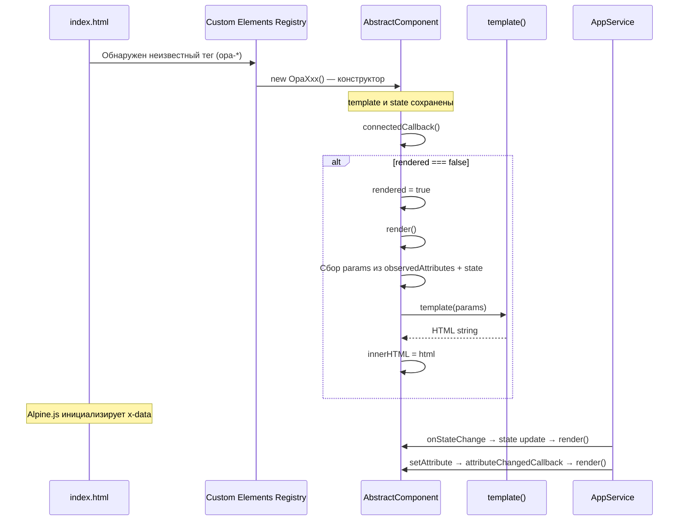

# AbstractComponent

**Путь к исходнику:** `client/src/app/AbstractComponent.ts`

**Версия документации:** соответствует текущему состоянию кодовой базы OPA Boilerplate.

---

## Обзор

`AbstractComponent` — абстрактный базовый класс для всех пользовательских Web Components (Custom Elements) клиентского приложения OPA. Он инкапсулирует минимальный, но единообразный паттерн рендеринга: функция-шаблон получает параметры (атрибуты DOM-элемента + внутреннее состояние) и возвращает HTML-строку, которая записывается в `innerHTML` элемента.

Файл также экспортирует вспомогательную утилиту `interpolateTemplateString` и тип `templateTypeFunction`, описывающий контракт шаблона.

Класс **не использует Shadow DOM** — разметка вставляется напрямую в light DOM элемента. Это сознательное упрощение, совместимое с глобальными стилями (`style.css`), Alpine.js (`x-data`, `x-for`) и SAP UI5 Web Components (`ui5-button`, `ui5-list` и т.д.).

---

## Роль в архитектуре

```
┌─────────────────────────────────────────────────────────────────┐
│                        index.html                               │
│  <opa-header>, <opa-messages>, <opa-send-control>, ...          │
└────────────────────────────┬────────────────────────────────────┘
                             │ Custom Elements API
                             ▼
┌─────────────────────────────────────────────────────────────────┐
│              Конкретные компоненты (opa-*.ts)                   │
│  OpaHeader, OpaMessages, OpaSendControl, OpaUserList, ...       │
│  extends AbstractComponent                                      │
└────────────────────────────┬────────────────────────────────────┘
                             │ наследование
                             ▼
┌─────────────────────────────────────────────────────────────────┐
│                   AbstractComponent                             │
│  HTMLElement + template(params) → innerHTML                     │
│  state + observedAttributes → params для шаблона                │
└────────────────────────────┬────────────────────────────────────┘
                             │
          ┌──────────────────┼──────────────────┐
          ▼                  ▼                  ▼
   ┌─────────────┐   ┌─────────────┐   ┌─────────────┐
   │  AppService │   │  Alpine.js  │   │ UI5 Web     │
   │  (состояние)│   │  (реактивн.)│   │ Components  │
   └─────────────┘   └─────────────┘   └─────────────┘
```

### Место в слоях приложения

| Слой | Ответственность | Связь с `AbstractComponent` |
|------|-----------------|----------------------------|
| **Точка входа** (`main.ts`) | Импорт и регистрация компонентов через side-effect | Каждый `opa-*.ts` вызывает `customElements.define()` |
| **Базовый класс** (`AbstractComponent.ts`) | Единый цикл жизни и рендеринга | Определяет контракт для всех UI-компонентов |
| **Компоненты** (`components/opa-*.ts`) | Разметка, бизнес-логика UI | Наследуют базовый класс, переопределяют `render()` при необходимости |
| **Сервисы** (`AppService.ts`) | Глобальное состояние, WebSocket | Компоненты подписываются на `onStateChange` и вызывают `this.render()` |
| **Разметка** (`index.html`) | Размещение тегов custom elements | Атрибуты (`room-exist`) попадают в `params` шаблона |

`AbstractComponent` — это **тонкий presentation-layer adapter** между нативными Web Components API и императивным шаблонным рендерингом на строках. Он не знает о WebSocket, комнатах или пользователях; эту логику добавляют наследники.

---

## Справочник API

### Экспорты модуля

| Экспорт | Тип | Описание |
|---------|-----|----------|
| `interpolateTemplateString` | `(s: string, params: object) => string` | Утилита интерполяции строки-шаблона с подстановкой параметров |
| `templateTypeFunction` | `(params: any) => string` | Тип функции-шаблона |
| `AbstractComponent` | `abstract class` | Базовый класс custom element |

---

### `interpolateTemplateString`

```typescript
export const interpolateTemplateString = (s: string, params: object): string
```

**Назначение:** преобразует обычную строку, содержащую синтаксис template literal (`` `${variable}` ``), в готовый HTML/текст, подставляя значения из `params`.

**Параметры:**

| Параметр | Тип | Описание |
|----------|-----|----------|
| `s` | `string` | Строка-шаблон с плейсхолдерами `${name}` |
| `params` | `object` | Объект, ключи которого становятся именами переменных в шаблоне |

**Возвращает:** `string` — результат интерполяции.

**Реализация:** динамически создаёт функцию через `new Function(...names, 'return \`...\`;')` и вызывает её со значениями из `params`. Ссылки в комментариях указывают на Stack Overflow и learn.javascript.ru как источники идеи.

**Статус в проекте:** функция **экспортируется, но нигде не импортируется** в текущей кодовой базе. Все компоненты используют нативные template literals напрямую в функциях `template`.

**Пример использования (гипотетический):**

```typescript
import { interpolateTemplateString } from "../AbstractComponent";

const raw = '<div class="${className}">${text}</div>';
const html = interpolateTemplateString(raw, { className: "opa-header", text: "Hello" });
// '<div class="opa-header">Hello</div>'
```

---

### `templateTypeFunction`

```typescript
export type templateTypeFunction = (params: any) => string;
```

**Назначение:** типизирует функцию, которая принимает объект параметров и возвращает HTML-строку.

**Особенности:**

- Параметр `params` типизирован как `any` — строгая типизация на уровне шаблона не enforced.
- Каждый компонент сам решает, какие ключи ожидать в `params` (атрибуты, поля `state`, дефолты через деструктуризацию).

---

### Класс `AbstractComponent`

```typescript
export abstract class AbstractComponent extends HTMLElement
```

Абстрактный класс; напрямую не инстанцируется. Все потомки обязаны вызывать `super(template[, state])` в конструкторе и регистрироваться через `customElements.define()`.

#### Защищённые (protected) члены

##### `template: templateTypeFunction` (readonly)

Функция-шаблон, переданная в конструктор. Вызывается в `render()` для генерации HTML.

##### `state: any`

Внутреннее состояние компонента. Инициализируется из аргумента конструктора или `{}` по умолчанию. **Мутабельный объект** — наследники изменяют поля (`this.state.users = ...`) и вызывают `this.render()`.

Не интегрирован с реактивной системой: изменения `state` сами по себе не вызывают перерисовку.

##### `constructor(template: templateTypeFunction, state?: any)`

```typescript
protected constructor(template: templateTypeFunction, state?: any)
```

| Аргумент | Обязательный | Описание |
|----------|--------------|----------|
| `template` | да | Функция `(params) => string` |
| `state` | нет | Начальное внутреннее состояние; по умолчанию `{}` |

Конструктор помечен `protected`, чтобы запретить создание экземпляра `AbstractComponent` напрямую.

##### `render(): void`

```typescript
protected render()
```

**Алгоритм рендеринга:**

1. Создаёт пустой объект `params`.
2. Читает статическое свойство `observedAttributes` **конкретного класса** через `(this.constructor as any).observedAttributes`.
3. Для каждого имени атрибута вызывает `this.getAttribute(attribute)` и записывает в `params[attribute]`.
4. Объединяет атрибуты и состояние: `params = { ...params, ...this.state }` (поля `state` перезаписывают одноимённые атрибуты).
5. Логирует в консоль: `` `Params for ${this.constructor.name} template: ` `` + `params`.
6. Устанавливает `this.innerHTML = this.template(params)`.

**Побочные эффекты:** полная замена DOM-содержимого элемента; все прежние обработчики событий на дочерних узлах теряются.

##### `attributeChangedCallback(): void`

```typescript
protected attributeChangedCallback(): void
```

Вызывается браузером при изменении наблюдаемых атрибутов. Реализация: `this.render()` — полная перерисовка.

**Важно:** сигнатура не соответствует стандартному `attributeChangedCallback(name, oldValue, newValue)`. Браузер передаёт три аргумента, но базовый класс их игнорирует. Для текущих сценариев это работает, так как любое изменение атрибута приводит к полному `render()`.

#### Статические члены

##### `observedAttributes: string[]`

```typescript
static get observedAttributes(): string[]
```

В базовом классе возвращает **пустой массив** `[]`.

Наследники переопределяют геттер и возвращают список имён атрибутов (в kebab-case, как в HTML), значения которых должны попадать в `params` шаблона.

| Компонент | `observedAttributes` |
|-----------|---------------------|
| `OpaHeader` | `["room-exist"]` |
| `OpaUsernamePopup` | `["username"]` |
| Остальные | наследуют `[]` |

#### Приватные (private) члены

##### `rendered: boolean`

Флаг «первичный рендер уже выполнен». Используется в `connectedCallback` для предотвращения повторного рендера при повторном подключении к DOM.

##### `connectedCallback(): void`

```typescript
//@ts-ignore
private connectedCallback(): void
```

**Жизненный цикл:**

1. Если `this.rendered === true` — выход без действий.
2. Иначе: `this.rendered = true`, затем `this.render()`.

**Особенность:** метод объявлен `private`, а не стандартным публичным lifecycle hook Custom Elements. TypeScript с `@ts-ignore` подавляет предупреждение. В runtime браузер всё равно вызывает `connectedCallback` на прототипе — поведение сохраняется.

**Отличие от типичного паттерна:** многие реализации вызывают `render()` при каждом `connectedCallback`; здесь рендер при повторном mount намеренно пропускается.

---

## Жизненный цикл компонента



### Этапы подробно

| Этап | Триггер | Действие | Кто инициирует |
|------|---------|----------|----------------|
| **Регистрация** | Импорт модуля в `main.ts` | `customElements.define("opa-*", Class)` | Side-effect при загрузке |
| **Создание** | Парсер встречает тег в HTML | `constructor()` → `super(template[, state])` | Браузер |
| **Подключение к DOM** | Элемент вставлен в документ | `connectedCallback()` → первый `render()` | Браузер |
| **Изменение атрибута** | `element.setAttribute(...)` | `attributeChangedCallback()` → `render()` | `AppService`, разметка |
| **Изменение state** | Подписка на `AppService.onStateChange` | `this.state.x = y; this.render()` | Наследник вручную |
| **Переопределённый render** | После `super.render()` | Привязка событий, скролл, DOM-манипуляции | `OpaSendControl`, `OpaUsernamePopup`, `OpaMessages` |

### Порядок приоритета в `params`

```
params = { ...атрибутыDOM, ...this.state }
```

Если и атрибут `username`, и `this.state.username` существуют — **побеждает значение из `state`**.

---

## Примеры кода

### Минимальный компонент (по образцу `OpaHeader`)

```typescript
import { AbstractComponent } from "../AbstractComponent";
import { strings } from "../strings";

const template = (params: any) => {
    const roomExist = params["room-exist"];
    return `
        <div class="opa-header" x-data='{ roomExist: ${roomExist} }'>
            <ui5-button onclick="app.createRoom()">${strings.OpaHeader.createRoom}</ui5-button>
        </div>
    `;
};

class OpaHeader extends AbstractComponent {
    constructor() {
        super(template);
    }

    static get observedAttributes() {
        return ["room-exist"];
    }
}

customElements.define("opa-header", OpaHeader);
```

**Использование в HTML:**

```html
<opa-header room-exist="true"></opa-header>
```

`AppService` переключает видимость комнаты:

```typescript
document.getElementsByTagName("opa-header")[0].setAttribute("room-exist", "true");
```

---

### Компонент с начальным `state` и подпиской на сервис (`OpaUserList`)

```typescript
class OpaUserList extends AbstractComponent {
    constructor() {
        super(template, { users: [] });
        AppService.onStateChange((appState: AppState) => {
            this.state.users = appState.users || [];
            this.render();
        });
    }
}
```

Шаблон получает `users` из `params` (из `state`), сериализует в JSON для Alpine.js:

```typescript
const template = ({ users }) => {
    users = JSON.stringify(users || []);
    return `<ui5-list x-data='{ users: ${users} }'>...</ui5-list>`;
};
```

---

### Переопределение `render()` для post-render логики (`OpaSendControl`)

```typescript
class OpaSendControl extends AbstractComponent {
    constructor() {
        super(template);
    }

    protected render() {
        super.render();

        this.querySelector("textarea")!.addEventListener("keydown", e => {
            if (e.ctrlKey && e.key === "s") {
                e.preventDefault();
                (window as any).app.send((e.target as HTMLTextAreaElement).value);
            }
        });
    }
}
```

**Паттерн:** `super.render()` сначала пересоздаёт DOM, затем наследник вешает обработчики на свежие узлы.

---

### Расширенный `render()` со скроллом (`OpaMessages`)

```typescript
class OpaMessages extends AbstractComponent {
    render() {  // публичный, не protected — отступление от базового API
        super.render();
        setTimeout(() => {
            const objDiv = document.querySelector(".opa-messages")!;
            objDiv.scrollTop = objDiv.scrollHeight;
        }, 0);
    }
}
```

---

## Зависимости

### Прямые зависимости `AbstractComponent.ts`

| Зависимость | Тип | Использование |
|-------------|-----|---------------|
| `HTMLElement` | Web API (глобальный) | Базовый класс браузера |
| `Function` constructor | Web API | `interpolateTemplateString` |

Файл **не импортирует** внешние npm-пакеты.

### Косвенные / экосистемные зависимости (через наследников и `main.ts`)

| Пакет / API | Роль |
|-------------|------|
| **Alpine.js** | Реактивность в сгенерированной разметке (`x-data`, `x-for`, `x-model`) |
| **@ui5/webcomponents** | UI-виджеты в шаблонах |
| **AppService** | Источник данных и команд для компонентов |
| **TypeScript** | Компиляция; `@ts-ignore` в lifecycle hook |

---

## Использование другими модулями

Все потребители находятся в `client/src/app/components/`:

| Модуль | Тег custom element | Наследует `AbstractComponent` | `observedAttributes` | Переопределяет `render()` |
|--------|-------------------|------------------------------|----------------------|---------------------------|
| `opa-header.ts` | `opa-header` | да | `["room-exist"]` | нет |
| `opa-messages.ts` | `opa-messages` | да | `[]` | да (скролл) |
| `opa-send-control.ts` | `opa-send-control` | да | `[]` | да (keydown) |
| `opa-user-list.ts` | `opa-user-list` | да | `[]` | нет |
| `opa-username-popup.ts` | `opa-username-popup` | да | `["username"]` | да (события диалога) |

### Точка регистрации

`client/src/main.ts` импортирует все компоненты side-effect импортами (без именованного импорта класса):

```typescript
import "./app/components/opa-header"
import "./app/components/opa-messages"
// ...
```

### Размещение в разметке

`client/index.html`:

```html
<opa-username-popup></opa-username-popup>
<div class="opa-content-layout">
    <opa-header class="area-a"></opa-header>
    <opa-messages class="area-b"></opa-messages>
    <opa-send-control class="area-c"></opa-send-control>
    <opa-user-list class="area-d"></opa-user-list>
</div>
```

### Взаимодействие с `AppService`

- **Атрибуты:** `showRoom()` / `hideRoom()` устанавливают `room-exist` на `opa-header`.
- **State + render:** `OpaMessages` и `OpaUserList` подписываются на `AppService.onStateChange`.
- **Глобальный API:** кнопки в шаблонах вызывают `app.*` (`window.app = AppService`).

---

## Руководство по созданию нового компонента

### Шаг 1. Создать файл `client/src/app/components/opa-<name>.ts`

```typescript
import { AbstractComponent } from "../AbstractComponent";
import { strings } from "../strings"; // если нужны строки UI

const template = (params: any) => `
    <div class="opa-<name>">
        <!-- разметка; params.key — атрибуты и state -->
    </div>
`;

class OpaMyComponent extends AbstractComponent {
    constructor() {
        super(template, { /* начальный state */ });
    }

    // Опционально: наблюдаемые атрибуты
    static get observedAttributes() {
        return ["my-attr"];
    }

    // Опционально: логика после рендера
    protected render() {
        super.render();
        // this.querySelector(...)?.addEventListener(...)
    }
}

customElements.define("opa-my-component", OpaMyComponent);
```

### Шаг 2. Добавить строки в `strings.ts` (см. документацию `strings.md`)

```typescript
OpaMyComponent: {
    title: "My Title",
}
```

### Шаг 3. Зарегистрировать в `main.ts`

```typescript
import "./app/components/opa-my-component"
```

### Шаг 4. Добавить тег в `index.html`

```html
<opa-my-component class="area-x"></opa-my-component>
```

### Шаг 5. Стили в `style.css`

Классы в light DOM видны глобальным стилям — добавьте `.opa-my-component { ... }`.

### Рекомендации

1. **Всегда вызывайте `super.render()`** в начале переопределённого `render()`.
2. **Обработчики событий** вешайте после `super.render()`, иначе они привяжутся к узлам, которые будут уничтожены при следующем `render()`.
3. **Данные для списков** часто сериализуют в JSON для встраивания в `x-data` (см. `OpaMessages`, `OpaUserList`).
4. **Имена атрибутов** в HTML — kebab-case; в `params` ключи совпадают с именами атрибутов (`room-exist`, не `roomExist`).
5. **Подписки на сервисы** оформляйте в конструкторе; при уничтожении компонента отписка **не реализована** в текущем фреймворке — учитывайте при долгоживущих подписках.
6. **Не создавайте утечки:** при каждом `render()` заново добавляемые `addEventListener` без снятия старых дублируются (актуально для `OpaSendControl`).

### Чеклист нового компонента

- [ ] Функция `template` возвращает валидный HTML
- [ ] `super(template[, state])` в конструкторе
- [ ] `customElements.define` с уникальным именем тега
- [ ] Импорт в `main.ts`
- [ ] Тег в `index.html` (при необходимости)
- [ ] Секция в `strings.ts` (при наличии пользовательского текста)
- [ ] Стили в `style.css`
- [ ] `observedAttributes`, если компонент управляется атрибутами

---

## Известные TODO, ограничения и технический долг

### В самом `AbstractComponent.ts`

| Проблема | Описание |
|----------|----------|
| **`console.log` в production** | Каждый `render()` логирует params — шум в консоли, потенциальная утечка данных |
| **`interpolateTemplateString` не используется** | Мёртвый экспорт; дублирует нативные template literals |
| **Безопасность `new Function`** | `interpolateTemplateString` выполняет произвольный код из строки — небезопасно для недоверенного ввода |
| **`@ts-ignore` на `connectedCallback`** | Обход типизации; `private` lifecycle hook — нетипичный паттерн |
| **Нет Shadow DOM** | Стили и DOM не инкапсулированы; глобальные селекторы могут конфликтовать |
| **Полный `innerHTML` replace** | Нет виртуального DOM или инкрементального обновления; дорого для частых обновлений |
| **`state: any`** | Нет типобезопасности внутреннего состояния |
| **`attributeChangedCallback` без аргументов** | Не использует `oldValue`/`newValue` — нельзя оптимизировать частичные обновления |
| **Флаг `rendered`** | Повторный `connectedCallback` не перерисовывает — может быть неожиданным при move в DOM |
| **Нет `disconnectedCallback`** | Нет точки очистки подписок и таймеров |

### В наследниках (связанные с базовым классом)

| Место | Проблема |
|-------|----------|
| `opa-username-popup.ts` | Комментарий `//TODO blink because of username change -> make two components` |
| `opa-username-popup.ts` | `document.querySelector` вместо `this.querySelector` — хрупкая привязка к глобальному DOM |
| `opa-send-control.ts` | Обработчик `keydown` добавляется при каждом `render()` без удаления предыдущего |
| `opa-messages.ts` | `render()` объявлен публичным, не `protected` |
| `AppService.ts` | Закомментированный код установки атрибута `username` на popup |

### Архитектурные ограничения

1. **Два источника истины для UI:** `state` компонента + Alpine.js `x-data` в шаблоне — при полном `render()` Alpine переинициализируется.
2. **Нет встроенного i18n** — строки вынесены в `strings.ts`, но механизм смены языка отсутствует.
3. **Нет тестов** на базовый класс и lifecycle.
4. **Закомментированные импорты** в начале файла (`user-list-component.css`, `?raw` HTML) — следы альтернативного подхода к шаблонам, не завершённого.

---

## Связанная документация

- [strings.md](./strings.md) — централизованные UI-строки для компонентов
- Исходники компонентов: `client/src/app/components/opa-*.ts`
- Точка входа: `client/src/main.ts`
- Глобальный сервис: `client/src/app/services/AppService.ts`
