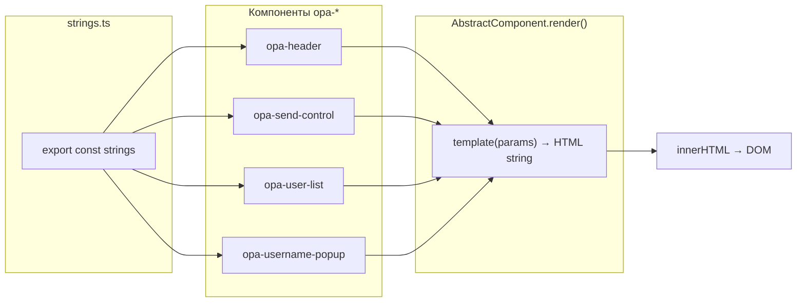
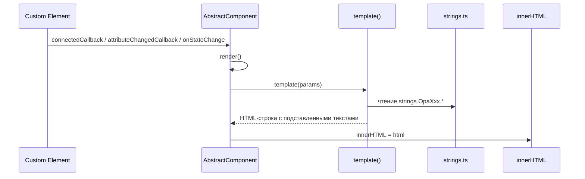
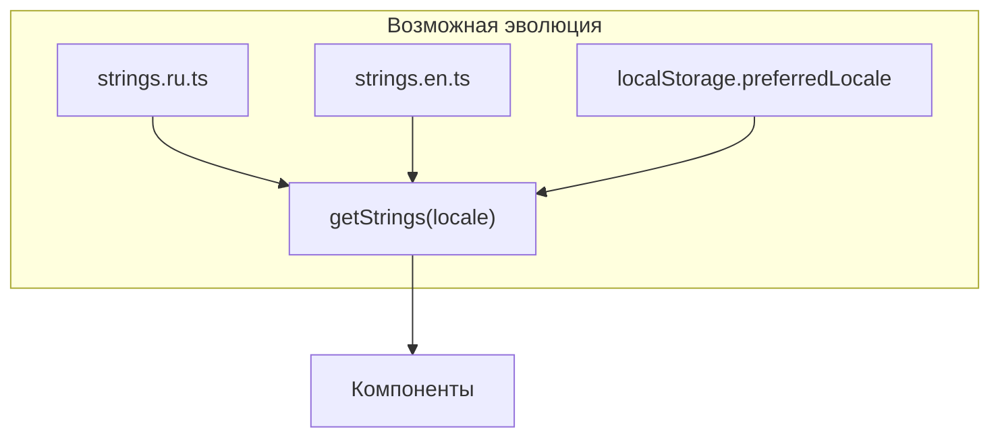

# strings.ts — централизованные UI-строки OPA

**Путь к исходнику:** `client/src/app/strings.ts`

**Версия документации:** соответствует текущему состоянию кодовой базы OPA Boilerplate.

---

## Содержание

1. [Обзор](#обзор)
2. [Структура модуля](#структура-модуля)
3. [Полный справочник ключей](#полный-справочник-ключей)
4. [Использование по компонентам](#использование-по-компонентам)
5. [Паттерн i18n в OPA](#паттерн-i18n-в-opa)
6. [Момент подстановки строк](#момент-подстановки-строк)
7. [Строки вне strings.ts](#строки-вне-stringsts)
8. [Руководство по расширению](#руководство-по-расширению)
9. [Рекомендации по локализации](#рекомендации-по-локализации)
10. [Ограничения и технический долг](#ограничения-и-технический-долг)
11. [Связанная документация](#связанная-документация)

---

## Обзор

`strings.ts` — единственный централизованный модуль пользовательских текстов интерфейса клиентского приложения OPA. Файл экспортирует константный объект `strings`, сгруппированный по именам компонентов. Каждый веб-компонент (`opa-*`) импортирует свой раздел и встраивает значения в HTML-шаблон на этапе `render()`.

Модуль **не является** полноценной системой интернационализации (i18n):

- нет переключения языка в runtime;
- нет библиотек вроде `i18next` или `vue-i18n`;
- все строки заданы статически на **английском языке**;
- локализация сводится к редактированию значений в одном файле.

Тем не менее архитектурный паттерн сознательный: UI-тексты отделены от логики компонентов и серверных сообщений, что упрощает поиск, перевод и согласованность подписей.

---

## Структура модуля

### Исходный код

```typescript
export const strings = {
    OpaHeader: {
        changeName: "Change Name",
        createRoom: "Create Room",
        leaveRoom: "Leave Room",
        error: "Some error occurred",
        createRoomFirst: "Create Room First"
    },
    OpaSendControl: {
        send: "Send"
    },
    OpaUserList: {
        inactive: "Inactive"
    },
    OpaUsernamePopup: {
        changeUserName: "Change user name",
        save: "Save",
        changeId: "Change ID",
        pleaseEnterUsername: "Please enter username",
    }
};
```

### Соглашения именования

| Уровень | Правило | Пример |
|---------|---------|--------|
| Группа (ключ верхнего уровня) | Имя класса компонента в PascalCase | `OpaHeader` ↔ класс `OpaHeader` |
| Ключ строки | camelCase, семантическое имя | `createRoom`, `pleaseEnterUsername` |
| Значение | Строковый литерал на английском | `"Create Room"` |

Группы **строго соответствуют** компонентам, которые импортируют `strings`. Компонент `opa-messages` **не имеет** секции в `strings.ts` — в нём нет пользовательских подписей (только данные с сервера).

### Экспорт и импорт

```typescript
import { strings } from "../strings";
// или
import { strings } from "../strings";  // из components/
```

Объект экспортируется как **именованная константа** `strings`. Деструктуризация отдельных групп в проекте не используется — всегда обращение через `strings.OpaHeader.changeName` и т.п.

---

## Полный справочник ключей

### Сводная таблица (все 11 ключей)

| Группа | Ключ | Значение (EN) | Тип использования |
|--------|------|---------------|-------------------|
| `OpaHeader` | `changeName` | `"Change Name"` | Текст кнопки |
| `OpaHeader` | `createRoom` | `"Create Room"` | Текст кнопки |
| `OpaHeader` | `leaveRoom` | `"Leave Room"` | Текст кнопки |
| `OpaHeader` | `error` | `"Some error occurred"` | Текст toast-уведомления |
| `OpaHeader` | `createRoomFirst` | `"Create Room First"` | Заголовок H1 |
| `OpaSendControl` | `send` | `"Send"` | Текст кнопки |
| `OpaUserList` | `inactive` | `"Inactive"` | Доп. текст пункта списка |
| `OpaUsernamePopup` | `changeUserName` | `"Change user name"` | Заголовок диалога |
| `OpaUsernamePopup` | `save` | `"Save"` | Текст кнопки |
| `OpaUsernamePopup` | `changeId` | `"Change ID"` | Текст кнопки |
| `OpaUsernamePopup` | `pleaseEnterUsername` | `"Please enter username"` | Текст toast валидации |

**Итого:** 4 группы, 11 строк, 4 компонента-потребителя.

---

### `OpaHeader` — 5 ключей

| Ключ | Значение | UI-элемент | Когда виден пользователю |
|------|----------|------------|--------------------------|
| `changeName` | `"Change Name"` | `<ui5-button>` | Всегда (с комнатой и без) |
| `createRoom` | `"Create Room"` | `<ui5-button>` | Всегда; с анимацией `_shake`, если комнаты нет |
| `leaveRoom` | `"Leave Room"` | `<ui5-button>` | Всегда |
| `error` | `"Some error occurred"` | `<ui5-toast id="wcToastError">` | При ошибке WebSocket (`AppService.showError()`) |
| `createRoomFirst` | `"Create Room First"` | `<ui5-title level="H1">` | Только когда `room-exist` ложно (`x-show="!roomExist"`) |

**Файл-потребитель:** `client/src/app/components/opa-header.ts`

---

### `OpaSendControl` — 1 ключ

| Ключ | Значение | UI-элемент | Поведение |
|------|----------|------------|-----------|
| `send` | `"Send"` | `<ui5-button design="Emphasized">` | Кнопка отправки; неактивна при пустом `msg` (`x-bind:disabled="!msg"`) |

**Файл-потребитель:** `client/src/app/components/opa-send-control.ts`

---

### `OpaUserList` — 1 ключ

| Ключ | Значение | UI-элемент | Условие отображения |
|------|----------|------------|---------------------|
| `inactive` | `"Inactive"` | `additional-text` у `<ui5-li>` | Только для пользователей с `active: false` |

**Файл-потребитель:** `client/src/app/components/opa-user-list.ts`

Строка встраивается в Alpine-выражение:

```typescript
x-bind:additional-text="user.active ? '' : '${strings.OpaUserList.inactive}'"
```

После рендера в DOM становится литералом `'Inactive'`, а не динамической ссылкой на `strings`.

---

### `OpaUsernamePopup` — 4 ключа

| Ключ | Значение | UI-элемент | Контекст |
|------|----------|------------|----------|
| `changeUserName` | `"Change user name"` | `<ui5-title slot="header">` | Заголовок модального диалога |
| `save` | `"Save"` | `<ui5-button class="opa-username-popup__save">` | Сохранение имени в `localStorage` |
| `changeId` | `"Change ID"` | `<ui5-button class="opa-username-popup__change-id">` | Генерация нового UUID |
| `pleaseEnterUsername` | `"Please enter username"` | `<ui5-toast id="wcToastPopup">` | Ошибка при пустом поле ввода |

**Файл-потребитель:** `client/src/app/components/opa-username-popup.ts`

---

## Использование по компонентам

### Матрица «компонент → ключи strings»

```
┌─────────────────────┬──────────────────────────────────────────────────┐
│ Компонент           │ Используемые ключи strings                       │
├─────────────────────┼──────────────────────────────────────────────────┤
│ opa-header          │ OpaHeader.* (все 5)                              │
│ opa-send-control    │ OpaSendControl.send                              │
│ opa-user-list       │ OpaUserList.inactive                             │
│ opa-username-popup  │ OpaUsernamePopup.* (все 4)                       │
│ opa-messages        │ — (нет импорта strings)                          │
└─────────────────────┴──────────────────────────────────────────────────┘
```

### `opa-header.ts`

```typescript
import { strings } from "../strings";

const template = (params: any) => {
    const roomExist = params["room-exist"];
    return `
        <div class="opa-header" x-data='{ roomExist: ${roomExist} }'>
            <ui5-button onclick="app.showUsernamePopup()">${strings.OpaHeader.changeName}</ui5-button>
            <ui5-button x-bind:class="{ '_shake': !roomExist }" onclick="app.createRoom()">${strings.OpaHeader.createRoom}</ui5-button>
            <ui5-button onclick="app.leaveRoom()">${strings.OpaHeader.leaveRoom}</ui5-button>
            <ui5-toast id="wcToastError" placement="TopCenter">${strings.OpaHeader.error}</ui5-toast>
            <ui5-title level="H1" x-show="!roomExist">${strings.OpaHeader.createRoomFirst}</ui5-title>
        </div>
    `;
};
```

| Особенность | Описание |
|-------------|----------|
| Способ подстановки | Template literal `${strings.OpaHeader.*}` |
| Alpine | Не используется для текстов кнопок — только для `roomExist` |
| Toast | Текст ошибки зашит в DOM; показ через `wcToastError.show()` без смены текста |

---

### `opa-send-control.ts`

```typescript
import { strings } from "../strings";

const template = () => `
<div class="opa-chat-controls" x-data="{msg:''}">
    <textarea x-model="msg"></textarea>
    <ui5-button
        x-bind:disabled="!msg"
        x-on:click="window.app.send(msg);msg='';"
        design="Emphasized"
    >${strings.OpaSendControl.send}</ui5-button>
</div>
`;
```

| Особенность | Описание |
|-------------|----------|
| Единственная строка UI | Кнопка «Send» |
| `<textarea>` | Без `placeholder` — не локализуется |

---

### `opa-user-list.ts`

```typescript
import { strings } from "../strings";

const template = ({ users }) => {
    users = JSON.stringify(users || []);
    return `
        <ui5-list ...>
            <template x-for="user in users">
                <ui5-li
                    x-text="user.name"
                    x-bind:additional-text="user.active ? '' : '${strings.OpaUserList.inactive}'"
                    additional-text-state="Information"
                ></ui5-li>
            </template>
        </ui5-list>
    `;
};
```

| Особенность | Описание |
|-------------|----------|
| Гибридная подстановка | Строка «зашивается» внутрь Alpine-выражения при `render()` |
| Имена пользователей | Приходят с сервера (`user.name`), **не** из `strings` |
| `additional-text-state` | Статическая константа `"Information"` — не в `strings.ts` |

---

### `opa-username-popup.ts`

```typescript
import { strings } from "../strings";

const template = ({ username = "" }) => `
    <ui5-dialog id="opa-username-dialog">
        <ui5-title level="H5" slot="header">${strings.OpaUsernamePopup.changeUserName}</ui5-title>
        ...
        <ui5-button class="opa-username-popup__save" design="Emphasized">${strings.OpaUsernamePopup.save}</ui5-button>
        <ui5-button class="opa-username-popup__change-id" design="Attention">${strings.OpaUsernamePopup.changeId}</ui5-button>
        <ui5-toast id="wcToastPopup" placement="TopCenter">${strings.OpaUsernamePopup.pleaseEnterUsername}</ui5-toast>
    </ui5-dialog>
`;
```

| Особенность | Описание |
|-------------|----------|
| Toast валидации | Текст фиксирован в DOM; `wcToastPopup.show()` не меняет содержимое |
| Иконка | `user.svg` — графика, не строка |

---

### `opa-messages` — без strings

Компонент `opa-messages` отображает:

- **имена авторов** — из `AppState.users` (сервер);
- **текст сообщений** — из `AppState.messages` (сервер);
- **время** — `toLocaleTimeString()` (локаль браузера);
- **системные сообщения** — генерируются на сервере (`userId: "_system"`).

Пользовательских подписей кнопок, заголовков или empty-state в компоненте нет.

---

## Паттерн i18n в OPA

### Текущая архитектура (статический словарь)



### Принципы паттерна

| Принцип | Реализация в OPA |
|---------|------------------|
| **Централизация** | Один файл `strings.ts` для всех UI-подписей клиента |
| **Группировка по компоненту** | Ключ верхнего уровня = имя класса (`OpaHeader`) |
| **Compile-time подстановка** | Строки вставляются в template literal при вызове `template()` |
| **Без runtime-локали** | Нет `getString(key, locale)` — значение фиксировано при сборке/загрузке модуля |
| **Перерисовка = обновление текстов** | При каждом `render()` шаблон заново читает актуальные значения из импортированного `strings` |

### Два способа встраивания в шаблон

**1. Прямая интерполяция (большинство компонентов):**

```typescript
`${strings.OpaHeader.createRoom}`
```

Результат в HTML: `Create Room` (статический текстовый узел).

**2. Интерполяция внутрь Alpine-выражения (`opa-user-list`):**

```typescript
`x-bind:additional-text="user.active ? '' : '${strings.OpaUserList.inactive}'"`
```

Результат в HTML:

```html
x-bind:additional-text="user.active ? '' : 'Inactive'"
```

Alpine видит строковый литерал `'Inactive'`, а не ссылку на модуль `strings`.

### Что паттерн **не** покрывает

| Категория | Где хранится | Пример |
|-----------|--------------|--------|
| Системные сообщения чата | Сервер `roomService.ts` | `"User \"uuid\" was added"` |
| Имена пользователей | `localStorage` + сервер | `"Алиса"` |
| Формат времени | `Date.toLocaleTimeString()` | `"14:32:05"` |
| Alert при фатальной ошибке WS | Хардкод в `WsService.ts` | `"SYSTEM ERROR: Can't connect to server"` |
| Атрибуты UI5 | Хардкод в шаблонах | `design="Emphasized"`, `placement="TopCenter"` |

---

## Момент подстановки строк

### Когда строки попадают в DOM



| Событие | Компоненты, у которых обновляются строки |
|---------|------------------------------------------|
| Первый `connectedCallback` | Все |
| `attributeChangedCallback` | `opa-header` (`room-exist`), `opa-username-popup` (`username`) |
| `AppService.onStateChange` → `render()` | `opa-messages`, `opa-user-list` |
| Перезагрузка страницы | Все (модуль `strings.ts` загружается заново) |

### Важно: нет hot-reload текстов без render

Изменение `strings.ts` в dev-режиме (HMR) обновит модуль, но **не** перерисует уже смонтированные компоненты автоматически — потребуется перезагрузка страницы или событие, вызывающее `render()`.

Компоненты с **однократным** рендером (`opa-header`, `opa-send-control` после mount) показывают новые строки только после полной перезагрузки или смены атрибута.

---

## Строки вне strings.ts

Для полноты картины — тексты, которые пользователь видит, но которые **не** управляются через `strings.ts`:

| Источник | Примеры | Локализация |
|----------|---------|-------------|
| `roomService.ts` (сервер) | `User "..." was added`, `user "..." left the room` | Английский, хардкод |
| `WsService.ts` | `alert("SYSTEM ERROR: Can't connect to server")` | Английский, хардкод |
| `index.html` | `<title>`, meta description | Шаблон сборки |
| Браузер | `toLocaleTimeString()` для дат сообщений | Локаль ОС/браузера |
| UI5 Web Components | Встроенные aria-label, иконки | Тема SAP Fiori |

При русификации приложения нужно учитывать и серверные системные сообщения — они попадают в ленту `opa-messages` напрямую.

---

## Руководство по расширению

### Добавление строк для нового компонента

**Шаг 1.** Добавить секцию в `strings.ts`:

```typescript
export const strings = {
    // ... существующие группы
    OpaMyWidget: {
        title: "My Widget Title",
        submit: "Submit",
        cancel: "Cancel",
    }
};
```

**Шаг 2.** Импортировать в компоненте:

```typescript
import { strings } from "../strings";

const template = (params: any) => `
    <div class="opa-my-widget">
        <h2>${strings.OpaMyWidget.title}</h2>
        <ui5-button>${strings.OpaMyWidget.submit}</ui5-button>
    </div>
`;
```

**Шаг 3.** Именовать группу по классу компонента (`OpaMyWidget` ↔ `class OpaMyWidget`).

### Добавление ключа в существующую группу

Пример: placeholder для textarea в `opa-send-control`:

```typescript
// strings.ts
OpaSendControl: {
    send: "Send",
    placeholder: "Type your message..."
}

// opa-send-control.ts
<textarea x-model="msg" placeholder="${strings.OpaSendControl.placeholder}"></textarea>
```

### Добавление empty-state в `opa-messages`

```typescript
// strings.ts — новая группа
OpaMessages: {
    empty: "No messages yet"
}

// opa-messages.ts — в шаблон
<template x-if="messages.length === 0">
    <div class="opa-messages_empty">${strings.OpaMessages.empty}</div>
</template>
```

### Чеклист при добавлении строк

- [ ] Ключ добавлен в правильную группу (`OpaXxx`)
- [ ] Имя ключа в camelCase, значение — строковый литерал
- [ ] Компонент импортирует `strings` и использует `${strings.OpaXxx.key}`
- [ ] Для Alpine-выражений проверена экранировка кавычек
- [ ] Документация компонента обновлена (раздел «Строки локализации»)
- [ ] При русификации — согласованы длины текстов с UI5-компонентами (кнопки, toast)

### Антипаттерны

| Не делать | Почему |
|-----------|--------|
| Хардкодить UI-текст в шаблоне | Усложняет поиск и перевод |
| Дублировать одну строку в нескольких группах | Риск рассинхронизации; лучше общий ключ `Common` |
| Хранить строки в `AppService` | Смешение слоёв: сервис — логика, `strings` — presentation |
| Использовать `strings` для серверных сообщений | Сервер не импортирует клиентский модуль |

---

## Рекомендации по локализации

### Минимальный путь (текущая архитектура)

Заменить значения в `strings.ts` на русские:

```typescript
OpaHeader: {
    changeName: "Сменить имя",
    createRoom: "Создать комнату",
    leaveRoom: "Выйти из комнаты",
    error: "Произошла ошибка",
    createRoomFirst: "Сначала создайте комнату"
},
OpaSendControl: {
    send: "Отправить"
},
OpaUserList: {
    inactive: "Не в сети"
},
OpaUsernamePopup: {
    changeUserName: "Изменить имя пользователя",
    save: "Сохранить",
    changeId: "Сменить ID",
    pleaseEnterUsername: "Введите имя пользователя"
}
```

Дополнительно локализовать:

- системные сообщения в `server/src/services/roomService.ts`;
- `alert` в `WsService.ts`;
- при необходимости — `toLocaleTimeString('ru-RU')` в `opa-messages.ts`.

### Путь к полноценной i18n (не реализован)



Шаги миграции:

1. Вынести словари в `strings/en.ts`, `strings/ru.ts`.
2. Добавить `getStrings(): Strings` с выбором локали из `localStorage` или `navigator.language`.
3. Вызывать `getStrings()` внутри `template()` вместо прямого импорта `strings`.
4. Добавить переключатель языка в `opa-header` и событие перерисовки всех компонентов.
5. Синхронизировать серверные сообщения (отдельный i18n на бэкенде или ключи вместо текста).

---

## Ограничения и технический долг

| Проблема | Описание | Влияние |
|----------|----------|---------|
| Нет runtime i18n | Язык фиксирован при деплое | Нельзя переключить язык без пересборки/перезагрузки |
| Английский по умолчанию | Все 11 ключей на EN | Несоответствие русской документации |
| `opa-messages` без strings | Нет empty-state, нет подписей | Пустая лента без пояснения |
| Серверные тексты отдельно | Системные сообщения на сервере | Локализация клиента не покрывает чат полностью |
| Alpine + strings в `opa-user-list` | Литерал при render | Смена языка требует `render()`, не реактивна в Alpine |
| Toast-тексты в DOM | Зашиты при render | Нельзя менять текст toast без перерисовки |
| Нет типизации ключей | `strings` — обычный object | Опечатка в ключе — runtime `undefined` в шаблоне |
| `alert` в WsService | Вне `strings.ts` | Нелокализованное системное сообщение |

### Запись в AbstractComponent.md

В документации базового класса явно указано: «Нет встроенного i18n — строки вынесены в `strings.ts`, но механизм смены языка отсутствует». Это архитектурное решение boilerplate, а не упущение отдельного компонента.

---

## Связанная документация

| Документ | Связь |
|----------|-------|
| [AbstractComponent.md](./AbstractComponent.md) | Шаг 2 в руководстве по созданию компонента — добавление строк |
| [opa-header.md](../components/opa-header.md) | Раздел «Строки локализации» |
| [opa-send-control.md](../components/opa-send-control.md) | Раздел «Локализация (strings.ts)» |
| [opa-user-list.md](../components/opa-user-list.md) | Раздел «Интернационализация» |
| [opa-username-popup.md](../components/opa-username-popup.md) | Раздел «Локализованные строки» |
| [README.md](../README.md) | Обзор фреймворка и quick start |

---

*Документация актуальна для `client/src/app/strings.ts`. При добавлении ключей или компонентов обновите таблицы в этом файле.*
