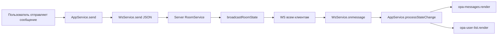
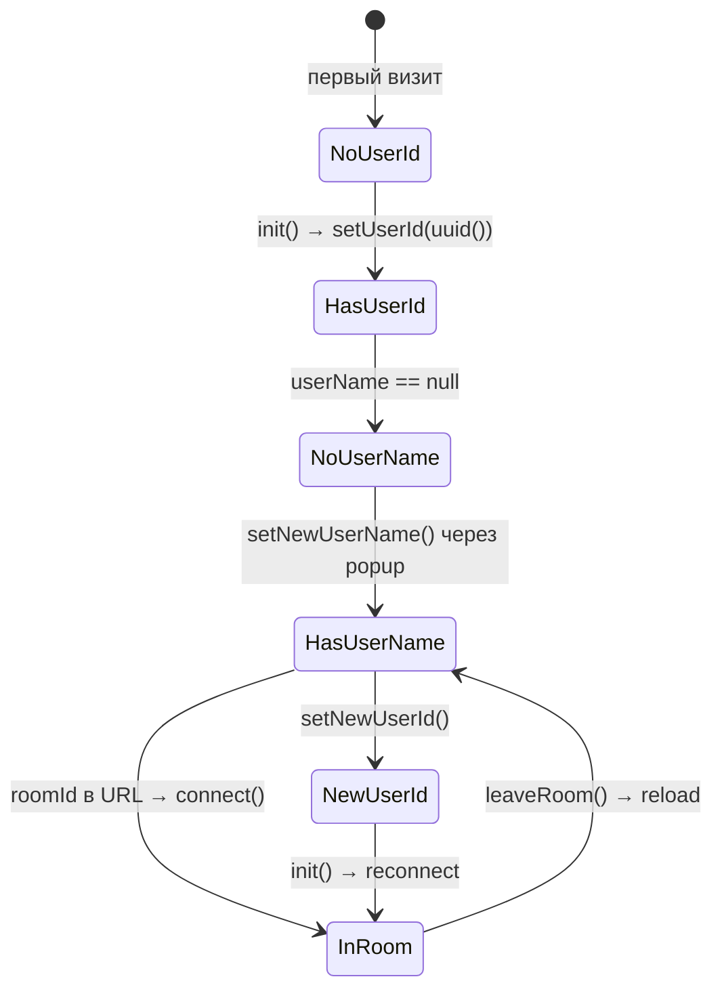
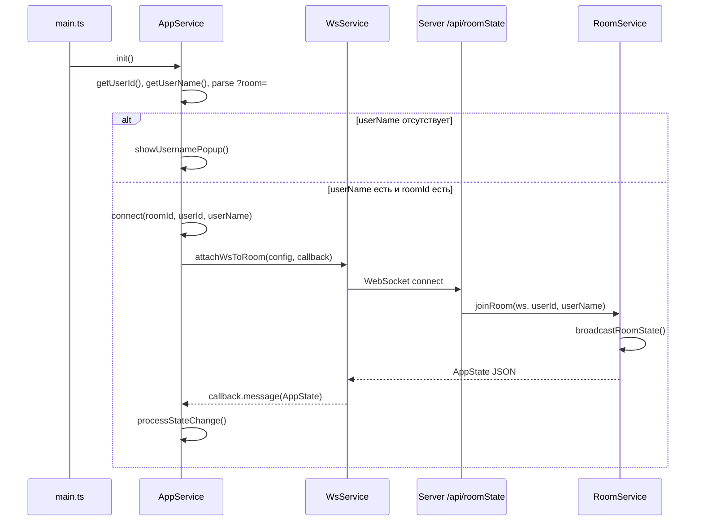
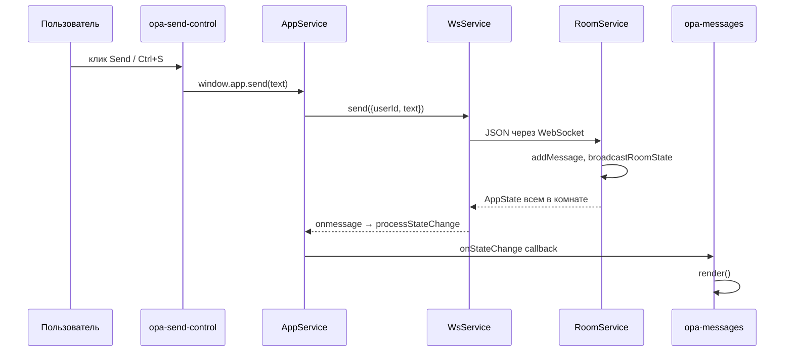
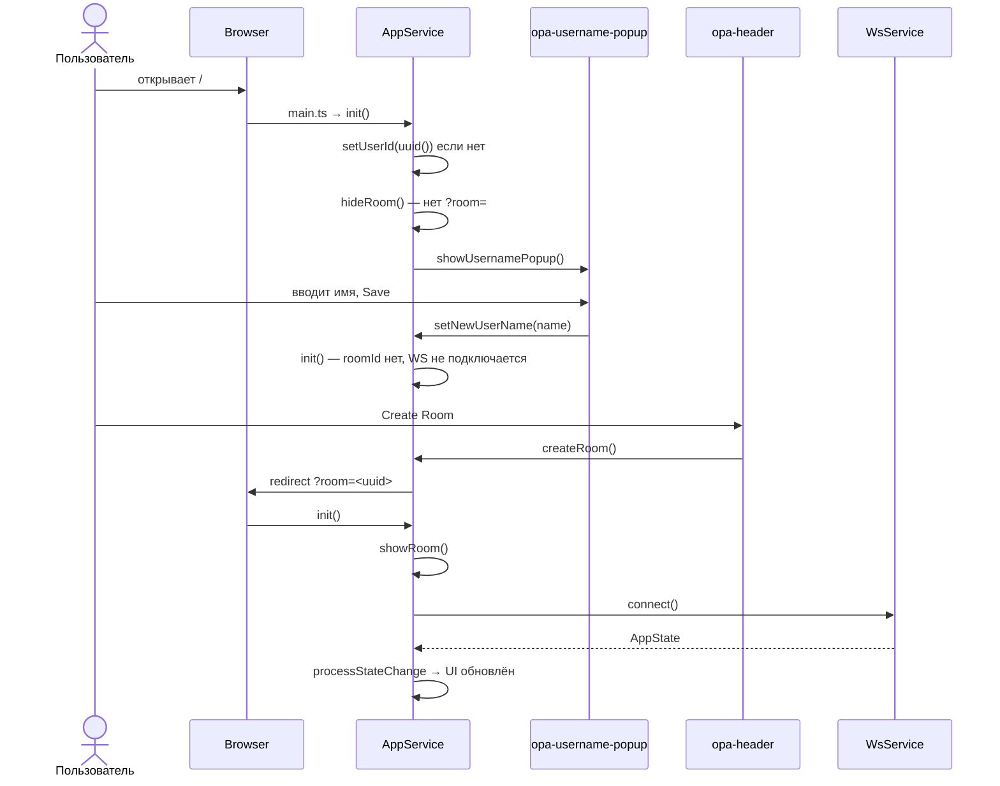
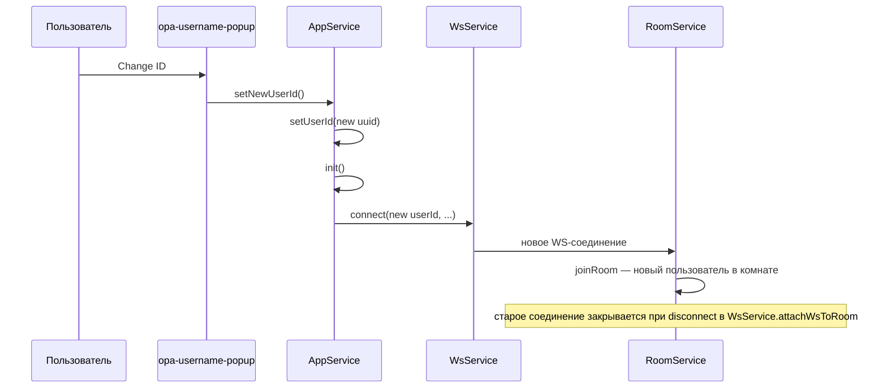
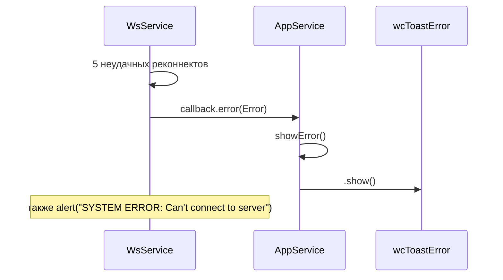

# AppService — центральный сервис клиентского приложения OPA

## Содержание

1. [Обзор](#обзор)
2. [Расположение и роль в архитектуре](#расположение-и-роль-в-архитектуре)
3. [Паттерн Singleton (модуль-синглтон)](#паттерн-singleton-модуль-синглтон)
4. [Зависимости](#зависимости)
5. [Модели данных](#модели-данных)
6. [Публичный API](#публичный-api)
7. [Внутренняя логика (неэкспортируемые функции)](#внутренняя-логика-неэкспортируемые-функции)
8. [Управление состоянием](#управление-состоянием)
9. [Ключи localStorage](#ключи-localstorage)
10. [Связь с DOM](#связь-с-dom)
11. [Интеграция с WebSocket](#интеграция-с-websocket)
12. [Глобальный API `window.app`](#глобальный-api-windowapp)
13. [Диаграммы последовательностей](#диаграммы-последовательностей)
14. [Примеры использования](#примеры-использования)
15. [Обработка ошибок](#обработка-ошибок)
16. [Потоки жизненного цикла приложения](#потоки-жизненного-цикла-приложения)
17. [Ограничения и особенности реализации](#ограничения-и-особенности-реализации)

---

## Обзор

`AppService` — это **центральный координатор** клиентского чат-приложения OPA (Open Platform Application). Сервис объединяет в себе:

- **Идентификацию пользователя** — генерация и хранение `userId` и `userName` в `localStorage`;
- **Управление комнатами** — создание, вход по URL-параметру `?room=`, выход;
- **Связь с сервером** — делегирование WebSocket-соединения в `WsService`;
- **Распространение состояния** — паттерн pub/sub через `onStateChange`;
- **Связь с UI** — прямое управление видимостью веб-компонентов и диалогами через DOM API.

Сервис **не является классом**. Это объект-литерал, экспортируемый из модуля, внутри которого замыканиями скрыты приватные переменные и функции. Такой подход в TypeScript/JavaScript эквивалентен **модульному синглтону**: при импорте модуля всегда возвращается один и тот же экземпляр `AppService`.

**Файл:** `client/src/app/services/AppService.ts`

---

## Расположение и роль в архитектуре

```
┌─────────────────────────────────────────────────────────────────┐
│                         index.html                              │
│  <opa-username-popup> <opa-header> <opa-messages> ...           │
└────────────────────────────┬────────────────────────────────────┘
                             │
┌────────────────────────────▼────────────────────────────────────┐
│                         main.ts                                 │
│  window.app = AppService                                        │
│  AppService.init()                                              │
└────────────────────────────┬────────────────────────────────────┘
                             │
┌────────────────────────────▼────────────────────────────────────┐
│                       AppService                                │
│  localStorage │ URL params │ DOM │ pub/sub callbacks            │
└──────┬──────────────────────────────┬───────────────────────────┘
       │                              │
       ▼                              ▼
┌──────────────┐              ┌───────────────────┐
│  WsService   │              │  UI Components    │
│  (WebSocket) │              │  opa-messages,    │
│              │              │  opa-user-list,   │
│              │              │  opa-header, ...  │
└──────┬───────┘              └───────────────────┘
       │
       ▼
┌──────────────────────────────────────┐
│  Server: /api/roomState (WebSocket) │
│  RoomService → broadcast AppState     │
└──────────────────────────────────────┘
```

`AppService` выступает **единой точкой входа** для бизнес-логики клиента. Компоненты либо импортируют его напрямую (`opa-messages`, `opa-user-list`, `opa-username-popup`), либо обращаются через глобальный объект `window.app` (`opa-header`, `opa-send-control`).

---

## Паттерн Singleton (модуль-синглтон)

### Реализация

```typescript
// Приватное состояние модуля (замыкание)
let roomId: string | null;
let callbacks: Function[] = [];

// Приватные функции
const init = (): void => { /* ... */ };
const connect = (...): void => { /* ... */ };

// Единственный экспортируемый объект
export const AppService = {
    createRoom,
    leaveRoom,
    getRoomId,
    getUserId,
    getUserName,
    showUsernamePopup,
    closeUsernamePopup,
    setNewUserId,
    setNewUserName,
    init,
    send,
    onStateChange
};
```

### Характеристики паттерна

| Свойство | Описание |
|----------|----------|
| **Единственный экземпляр** | Модуль загружается один раз; повторный `import` возвращает тот же объект |
| **Инкапсуляция** | `roomId`, `callbacks`, `connect`, `showRoom`, `hideRoom`, `processStateChange` недоступны извне |
| **Глобальный доступ** | Дополнительно публикуется как `window.app` в `main.ts` |
| **Отсутствие конструктора** | Нет `new AppService()` — только прямой импорт или `window.app` |
| **Состояние в замыкании** | `roomId` хранится в переменной модуля, а не в `localStorage` |

### Публикация в глобальную область

В `client/src/main.ts`:

```typescript
import {AppService} from "./app/services/AppService";

(window as any).app = AppService;
AppService.init();
```

Это позволяет вызывать методы из inline-обработчиков в HTML-шаблонах компонентов (`onclick="app.createRoom()"`) без явного импорта в каждом веб-компоненте.

---

## Зависимости

### Прямые импорты

| Зависимость | Путь | Назначение |
|-------------|------|------------|
| `uuid` (`v4`) | npm-пакет `uuid` | Генерация уникальных `userId` и `roomId` |
| `WsService` | `./WsService` | WebSocket-соединение, отправка/приём сообщений |
| `AppState` | `./AppStateModels` | TypeScript-интерфейс состояния комнаты |

### Косвенные зависимости (через DOM и window)

| Зависимость | Где используется | Назначение |
|-------------|------------------|------------|
| `document` | `showRoom`, `hideRoom`, `showUsernamePopup` | Управление веб-компонентами |
| `window.location` | `createRoom`, `leaveRoom`, `init` | Навигация и чтение URL |
| `localStorage` | `getUserId`, `setUserId`, `getUserName`, `setUserName` | Персистентность пользователя |
| `window.wcToastError` | `showError` | UI5 Toast для ошибок WS (элемент в `opa-header`) |
| `setTimeout` | `init`, `showUsernamePopup` | Отложенный показ диалога после рендера |

### Потребители AppService

| Файл | Способ доступа | Используемые методы |
|------|----------------|---------------------|
| `main.ts` | импорт + `window.app` | `init` |
| `opa-header.ts` | `window.app` / `app` | `showUsernamePopup`, `createRoom`, `leaveRoom` |
| `opa-send-control.ts` | `window.app` | `send` |
| `opa-username-popup.ts` | импорт | `getUserName`, `setNewUserName`, `setNewUserId`, `closeUsernamePopup` |
| `opa-messages.ts` | импорт | `onStateChange` |
| `opa-user-list.ts` | импорт | `onStateChange` |

---

## Модели данных

Определены в `client/src/app/services/AppStateModels.ts`:

```typescript
export interface User {
    id: string;
    name: string;
    active: boolean;
}

export interface Message {
    id: string;
    text: string;
    userId: string;
    date: string; // миллисекунды (строка на клиенте)
}

export interface AppState {
    users: User[];
    messages: Message[]; // последние 5 минут сообщений (ограничение на сервере)
}
```

> **Примечание:** на сервере (`server/src/services/roomModels.ts`) поле `Message.date` имеет тип `number`, а на клиенте — `string`. При десериализации JSON число может приходить как число; компонент `opa-messages` оборачивает значение в `new Date(msg.date)`.

---

## Публичный API

### Сводная таблица методов

| Метод | Параметры | Возвращает | Описание |
|-------|-----------|------------|----------|
| `init` | — | `void` | Инициализация приложения при загрузке |
| `createRoom` | — | `void` | Создаёт новую комнату и перенаправляет на неё |
| `leaveRoom` | — | `void` | Отключает WS, сбрасывает состояние, возвращает на главную |
| `getRoomId` | — | `string \| null` | Текущий ID комнаты из URL (кэш модуля) |
| `getUserId` | — | `string \| null` | ID пользователя из `localStorage` |
| `getUserName` | — | `string \| null` | Имя пользователя из `localStorage` |
| `setNewUserId` | — | `void` | Генерирует новый UUID, сохраняет, вызывает `init()` |
| `setNewUserName` | `userName: string` | `void` | Сохраняет имя, вызывает `init()` |
| `showUsernamePopup` | — | `void` | Открывает диалог ввода имени |
| `closeUsernamePopup` | — | `void` | Закрывает диалог ввода имени |
| `send` | `message: string` | `void` | Отправляет текстовое сообщение в комнату через WS |
| `onStateChange` | `callback: Function` | `{ unsubscribe: () => void }` | Подписка на обновления `AppState` |

---

### `init(): void`

**Назначение:** точка входа при старте приложения. Вызывается один раз из `main.ts` после регистрации `window.app`.

**Алгоритм:**

1. Если `userId` отсутствует в `localStorage` → генерируется новый UUID и сохраняется.
2. Из URL (`location.href`) извлекается query-параметр `room` → записывается в модульную переменную `roomId`.
3. Если `roomId` есть → `showRoom()` (показать UI чата).
4. Если `roomId` нет → `hideRoom()` (скрыть UI чата).
5. Если `userName` отсутствует → отложенный вызов `showUsernamePopup()` через `setTimeout` (ожидание рендера компонента) → **выход без подключения к WS**.
6. Если `userName` есть и `roomId` есть → `connect(roomId, userId, userName)`.

**Побочные эффекты:** изменение DOM, возможное открытие диалога, возможное WS-подключение.

---

### `createRoom(): void`

**Назначение:** создать новую комнату и перейти в неё.

**Параметры:** нет.

**Возвращает:** `void`.

**Поведение:**

```typescript
roomId = uuid();
window.location.href = window.location.origin + "?room=" + roomId;
```

Генерируется новый UUID, выполняется **полная перезагрузка страницы** с параметром `?room=<uuid>`. После перезагрузки `init()` снова прочитает параметр и подключится к комнате (если имя пользователя уже задано).

---

### `leaveRoom(): void`

**Назначение:** покинуть текущую комнату.

**Параметры:** нет.

**Возвращает:** `void`.

**Поведение:**

1. `WsService.disconnect()` — закрывает WebSocket.
2. `roomId = null` — сброс ID комнаты в памяти.
3. `callbacks = []` — **полная очистка всех подписчиков** `onStateChange`.
4. `window.location.href = window.location.origin` — переход на главную без query-параметров.

> **Важно:** при выходе из комнаты все callback-и уничтожаются. Компоненты, созданные до `leaveRoom`, **не переподписываются** автоматически — но после `location.href` страница перезагружается, и компоненты создаются заново.

---

### `getRoomId(): string | null`

**Назначение:** получить текущий идентификатор комнаты.

**Источник данных:** модульная переменная `roomId`, устанавливаемая в `init()` из URL.

**Не читает URL напрямую** при каждом вызове — возвращает кэшированное значение.

---

### `getUserId(): string | null`

**Назначение:** получить ID пользователя.

**Источник:** `localStorage.getItem("userId")`.

---

### `getUserName(): string | null`

**Назначение:** получить отображаемое имя пользователя.

**Источник:** `localStorage.getItem("userName")`.

---

### `setNewUserId(): void`

**Назначение:** сменить идентификатор пользователя (кнопка «Change ID» в диалоге имени).

**Параметры:** нет.

**Поведение:**

1. `setUserId(uuid())` — новый UUID в `localStorage`.
2. `init()` — переинициализация (переподключение к комнате с новым ID, если условия выполнены).

**Типичный сценарий:** пользователь хочет «войти как другой человек» в той же комнате.

---

### `setNewUserName(userName: string): void`

**Назначение:** сохранить новое имя и переинициализировать приложение.

**Параметры:**

| Параметр | Тип | Описание |
|----------|-----|----------|
| `userName` | `string` | Новое отображаемое имя |

**Поведение:**

1. `setUserName(userName)` → `localStorage.setItem("userName", userName)`.
2. `init()` → при наличии `roomId` выполняется `connect()` с обновлённым именем.

**Валидация:** в `opa-username-popup` пустое имя не сохраняется — показывается toast `wcToastPopup`.

---

### `showUsernamePopup(): void`

**Назначение:** отобразить модальный диалог смены имени.

**DOM-операции:**

1. Находит `ui5-input` внутри `.opa-username-component` и устанавливает `value` из `getUserName()`.
2. Вызывает `dialog.show()` на элементе `#opa-username-dialog`.

**Вызывается из:**

- `init()` — при первом визите (нет `userName`);
- `opa-header` — кнопка «Change Name».

---

### `closeUsernamePopup(): void`

**Назначение:** закрыть диалог имени.

**DOM-операция:** `document.getElementById("opa-username-dialog").close()`.

---

### `send(message: string): void`

**Назначение:** отправить сообщение в текущую комнату.

**Параметры:**

| Параметр | Тип | Описание |
|----------|-----|----------|
| `message` | `string` | Текст сообщения |

**Поведение:**

```typescript
WsService.send({ userId: getUserId(), text: message });
```

Сообщение сериализуется в JSON и отправляется через открытый WebSocket. Сервер (`RoomService.messageFromUser`) парсит JSON, добавляет сообщение в комнату и рассылает обновлённый `AppState` всем подключённым клиентам.

**Предусловие:** активное WS-соединение (установлено через `connect` в `init`).

---

### `onStateChange(callback: Function): { unsubscribe: () => void }`

**Назначение:** подписаться на обновления состояния комнаты.

**Параметры:**

| Параметр | Тип | Описание |
|----------|-----|----------|
| `callback` | `Function` | Функция `(appState: AppState) => void` |

**Возвращает:** объект с методом `unsubscribe`, удаляющим callback из массива.

**Пример:**

```typescript
const subscription = AppService.onStateChange((state: AppState) => {
    console.log(state.users, state.messages);
});

// Отписка (в текущем коде компоненты не используют unsubscribe)
subscription.unsubscribe();
```

**Механизм доставки:** при получении WS-сообщения `connect` → `processStateChange` → `callbacks.forEach(cb => cb(appState))`.

---

## Внутренняя логика (неэкспортируемые функции)

Эти функции недоступны через `AppService` или `window.app`, но критичны для понимания поведения.

### `connect(roomId, userId, userName): void`

Устанавливает WebSocket через `WsService.attachWsToRoom` с колбэком:

| Колбэк | Действие |
|--------|----------|
| `message` | Парсит `AppState`, вызывает `processStateChange` |
| `error` | Логирует ошибку, вызывает `showError()` |
| `close` | Логирует `"ws close"` |

### `processStateChange(appState: AppState): void`

Рассылает состояние всем подписчикам: `callbacks.forEach(callback => callback(appState))`.

### `showRoom(): void` / `hideRoom(): void`

Управляют видимостью и атрибутами DOM-элементов (см. раздел [Связь с DOM](#связь-с-dom)).

### `showError(): void`

```typescript
(window as any).wcToastError.show();
```

Показывает UI5 Toast с текстом ошибки из `opa-header`.

### Вспомогательные функции localStorage

```typescript
const setUserId = (userId: string): void => localStorage.setItem("userId", userId);
const getUserId = (): string | null => localStorage.getItem("userId");
const setUserName = (userName: string): void => localStorage.setItem("userName", userName);
const getUserName = (): string | null => localStorage.getItem("userName");
```

`setUserId` и `setUserName` не экспортируются напрямую — доступ через `setNewUserId` / `setNewUserName` и `init`.

---

## Управление состоянием

### Архитектура: Observer (pub/sub)

`AppService` **не хранит** `AppState` внутри себя. Он выступает **транзитным каналом**:

```
Server (RoomService)
    │ broadcast JSON AppState
    ▼
WsService.onmessage
    │ JSON.parse → AppState
    ▼
AppService.processStateChange
    │ forEach callback
    ▼
┌─────────────────┬─────────────────┐
│  opa-messages   │  opa-user-list  │
│  render()       │  render()       │
└─────────────────┴─────────────────┘
```

### Что хранится локально

| Данные | Где хранится | Когда обновляется |
|--------|--------------|-------------------|
| `userId` | `localStorage` | `init`, `setNewUserId` |
| `userName` | `localStorage` | `setNewUserName` |
| `roomId` | переменная модуля | `init`, `createRoom`, `leaveRoom` |
| `callbacks` | переменная модуля | `onStateChange`, `leaveRoom` |
| `users`, `messages` | **не в AppService** — в `state` компонентов | при каждом WS-сообщении |

### Поток обновления в компонентах

**opa-user-list:**

```typescript
AppService.onStateChange((appState: AppState) => {
    this.state.users = appState.users || [];
    this.render();
});
```

**opa-messages:**

```typescript
AppService.onStateChange((appState: AppState) => {
    const messages = appState.messages.map(msg => {
        let user = appState.users.find(user => user.id === msg.userId);
        let userName = user ? user.name : msg.userId;
        return {
            author: userName,
            text: msg.text,
            date: (new Date(msg.date)).toLocaleTimeString(),
            system: msg.userId === "_system"
        };
    });
    this.state.messages = messages || [];
    this.render();
});
```

Компоненты **трансформируют** сырые данные сервера в формат для шаблона (добавляют `author`, форматируют дату, помечают системные сообщения).

### Диаграмма потока состояния



---

## Ключи localStorage

| Ключ | Тип значения | Запись | Чтение | Описание |
|------|--------------|--------|--------|----------|
| `"userId"` | `string` (UUID v4) | `setUserId`, `init` (автогенерация), `setNewUserId` | `getUserId` | Уникальный идентификатор клиента. Сохраняется между сессиями |
| `"userName"` | `string` | `setUserName`, `setNewUserName` | `getUserName` | Отображаемое имя. **Обязательно** для подключения к комнате |

### Жизненный цикл данных



### Что **не** сохраняется в localStorage

- `roomId` — только в URL и переменной модуля;
- история сообщений — только на сервере (в памяти `RoomService`);
- список пользователей — приходит по WS.

---

## Связь с DOM

`AppService` **напрямую манипулирует DOM**, минуя реактивные фреймворки. Это создаёт жёсткую связь с конкретными тегами и ID элементов.

### Элементы, используемые AppService

| Селектор / элемент | Операция | Функция | Назначение |
|--------------------|----------|---------|------------|
| `opa-messages` (первый в DOM) | `style.display = "block" \| "none"` | `showRoom`, `hideRoom` | Показ/скрытие ленты сообщений |
| `opa-send-control` (первый) | `style.display` | `showRoom`, `hideRoom` | Показ/скрытие панели ввода |
| `opa-user-list` (первый) | `style.display` | `showRoom`, `hideRoom` | Показ/скрытие списка пользователей |
| `opa-header` (первый) | `setAttribute("room-exist", true\|false)` | `showRoom`, `hideRoom` | Переключение UI заголовка (кнопки, подсказка) |
| `#opa-username-dialog` | `.show()`, `.close()` | `showUsernamePopup`, `closeUsernamePopup` | Модальный диалог имени |
| `.opa-username-component > ui5-input` | `setAttribute("value", ...)` | `showUsernamePopup` | Предзаполнение поля имени |
| `#wcToastError` (через `window`) | `.show()` | `showError` | Toast ошибки WebSocket |

### Структура страницы (index.html)

```html
<opa-username-popup></opa-username-popup>
<div class="opa-content-layout">
    <opa-header class="area-a"></opa-header>
    <opa-messages class="area-b"></opa-messages>
    <opa-send-control class="area-c"></opa-send-control>
    <opa-user-list class="area-d"></opa-user-list>
</div>
```

### Поведение `opa-header` при смене `room-exist`

Атрибут `room-exist` наблюдается через `observedAttributes` в `AbstractComponent`. При изменении компонент перерисовывается:

- `roomExist === false` → заголовок «Create Room First», кнопка Create Room с анимацией `_shake`;
- `roomExist === true` → заголовок скрыт (`x-show="!roomExist"`).

### Риски DOM-связности

1. **Порядок элементов** — используется `[0]` (первый найденный тег); дубликаты тегов приведут к непредсказуемому поведению.
2. **Отсутствие null-check** — `document.querySelector(...)!` и `getElementsByTagName(...)[0]` без проверки на `undefined` вызовут runtime-ошибку, если разметка изменится.
3. **Non-null assertion (`!`)** — предполагается, что компоненты уже зарегистрированы и отрендерены к моменту вызова.

---

## Интеграция с WebSocket

### Делегирование в WsService

`AppService` не создаёт WebSocket напрямую. Вся низкоуровневая логика в `WsService`:

| Параметр WsService | Значение |
|--------------------|----------|
| URL | `{ws\|wss}://{host}/api/roomState?roomId=...&userId=...&userName=...` |
| Dev-хост | `localhost:3000` (если `location.host` начинается с `localhost:`) |
| Таймаут подключения | 30 секунд |
| Ping | `"H"` каждые 50 секунд |
| Реконнект | до 5 попыток с интервалом 1 сек |

### Формат сообщений

**Клиент → Сервер (чат):**

```json
{
  "userId": "<uuid>",
  "text": "Текст сообщения"
}
```

**Клиент → Сервер (heartbeat):**

```
"H"
```

**Сервер → Клиент (состояние):**

```json
{
  "users": [
    { "id": "...", "name": "...", "active": true }
  ],
  "messages": [
    { "id": "...", "text": "...", "userId": "...", "date": 1710000000000 }
  ]
}
```

### Цепочка вызовов при подключении



### Цепочка отправки сообщения



---

## Глобальный API `window.app`

### Инициализация

```typescript
// client/src/main.ts
(window as any).app = AppService;
```

После загрузки `main.ts` в браузере доступен объект:

```javascript
window.app === AppService // true (тот же объект)
```

### Использование в шаблонах компонентов

**opa-header.ts** — inline `onclick` (без `window.`):

```html
<ui5-button onclick="app.showUsernamePopup()">...</ui5-button>
<ui5-button onclick="app.createRoom()">...</ui5-button>
<ui5-button onclick="app.leaveRoom()">...</ui5-button>
```

**opa-send-control.ts** — Alpine.js:

```html
<ui5-button x-on:click="window.app.send(msg);msg='';">Send</ui5-button>
```

**opa-send-control.ts** — обработчик клавиатуры:

```typescript
window.app.send((e.target as HTMLTextAreaElement).value);
```

### Полный список доступных методов через `window.app`

```javascript
window.app.init()
window.app.createRoom()
window.app.leaveRoom()
window.app.getRoomId()
window.app.getUserId()
window.app.getUserName()
window.app.showUsernamePopup()
window.app.closeUsernamePopup()
window.app.setNewUserId()
window.app.setNewUserName("Имя")
window.app.send("Привет!")
window.app.onStateChange((state) => console.log(state))
```

### TypeScript и глобальный тип

В проекте нет объявления `interface Window { app: ... }`. Используется `(window as any).app`, что отключает проверку типов. Для строгой типизации можно добавить в `global.d.ts`:

```typescript
import type { AppService } from './app/services/AppService';
declare global {
    interface Window {
        app: typeof AppService;
        wcToastError: { show(): void };
        wcToastPopup: { show(): void };
    }
}
```

---

## Диаграммы последовательностей

### Полный жизненный цикл: первый визит → создание комнаты → чат



### Смена userId в диалоге



### Обработка ошибки WebSocket



---

## Примеры использования

### Импорт в TypeScript-компоненте

```typescript
import { AppService } from "../services/AppService";
import { AppState } from "../services/AppStateModels";

// Подписка на состояние
AppService.onStateChange((appState: AppState) => {
    console.log("Пользователи:", appState.users);
    console.log("Сообщения:", appState.messages);
});

// Чтение данных пользователя
const userId = AppService.getUserId();
const userName = AppService.getUserName();
```

### Вызов из консоли браузера (отладка)

```javascript
// Проверить текущие данные
app.getUserId();
app.getUserName();
app.getRoomId();

// Отправить тестовое сообщение (нужна активная комната)
app.send("Тест из консоли");

// Принудительно показать диалог имени
app.showUsernamePopup();
```

### Программное создание комнаты

```javascript
// Эквивалент кнопки Create Room
app.createRoom();
// → перезагрузка на https://example.com?room=<новый-uuid>
```

### Подписка с отпиской

```typescript
const handler = (state: AppState) => {
    updateMyWidget(state);
};

const { unsubscribe } = AppService.onStateChange(handler);

// При уничтожении виджета
unsubscribe();
```

### Интеграция нового компонента с состоянием

```typescript
import { AppService } from "../services/AppService";
import { AppState } from "../services/AppStateModels";
import { AbstractComponent } from "../AbstractComponent";

class OpaMyWidget extends AbstractComponent {
    constructor() {
        super(template, { count: 0 });
        AppService.onStateChange((appState: AppState) => {
            this.state.count = appState.users.filter(u => u.active).length;
            this.render();
        });
    }
}
```

---

## Обработка ошибок

### Уровни обработки

| Уровень | Источник | Действие |
|---------|----------|----------|
| **WsService** | Таймаут 30 сек | `ws.close(5000, "Client 30 sec timeout")` |
| **WsService** | Обрыв соединения | До 5 реконнектов через 1 сек |
| **WsService** | Исчерпание попыток | `alert(...)`, `callback.error(Error)` |
| **WsService** | `ws.onerror` | `callback.error(Error)` |
| **AppService** | `callback.error` | `console.error`, `showError()` → toast |
| **AppService** | `callback.close` | Только `console.log("ws close")` |
| **opa-username-popup** | Пустое имя | `wcToastPopup.show()` |

### Что **не** обрабатывается в AppService

1. **Ошибка парсинга JSON** в `WsService.onmessage` — необработанное исключение при невалидном ответе сервера.
2. **Отправка без соединения** — `WsService.send` вызовет ошибку, если `ws` не инициализирован.
3. **Отсутствие DOM-элементов** — падение при изменении разметки.
4. **`getUserId()` возвращает null при send** — в JSON уйдёт `"userId": null`.

### Рекомендации при расширении

```typescript
// Пример обёртки send с проверкой
const safeSend = (message: string): boolean => {
    if (!getRoomId()) {
        console.warn("Нет активной комнаты");
        return false;
    }
    if (!getUserId()) {
        console.warn("Нет userId");
        return false;
    }
    send(message);
    return true;
};
```

---

## Потоки жизненного цикла приложения

### Сценарий 1: Первый визит без комнаты

```
main.ts загружен
  → window.app = AppService
  → init()
    → userId создан в localStorage
    → roomId = null → hideRoom()
    → userName = null → showUsernamePopup() (отложенно)
  → пользователь вводит имя
  → setNewUserName() → init()
    → roomId всё ещё null → WS не подключается
  → UI: заголовок с «Create Room First»
```

### Сценарий 2: Вход по ссылке с комнатой

```
URL: /?room=abc-123
  → init()
    → userId из localStorage (или новый)
    → roomId = "abc-123" → showRoom()
    → userName есть → connect("abc-123", userId, userName)
  → WS подключён, AppState рассылается в компоненты
```

### Сценарий 3: Выход из комнаты

```
leaveRoom()
  → WsService.disconnect()
  → roomId = null, callbacks = []
  → location.href = origin (без ?room=)
  → полная перезагрузка
  → init() → hideRoom(), WS не подключается
```

### Сценарий 4: Создание комнаты

```
createRoom()
  → roomId = uuid()
  → redirect ?room=<uuid>
  → init() → showRoom() + connect()
```

---

## Ограничения и особенности реализации

1. **Нет единого хранилища AppState** — состояние комнаты живёт только в callback-ах компонентов; нельзя вызвать `AppService.getState()`.

2. **Тип `Function` вместо типизированного колбэка** — `onStateChange(callback: Function)` лишает TypeScript-проверки сигнатуры.

3. **Очистка callbacks при `leaveRoom`** — при навигации без перезагрузки (если бы она была убрана) подписчики были бы потеряны.

4. **`setNewUserName` / `setNewUserId` всегда вызывают `init()`** — полная переинициализация, включая повторный парсинг URL и возможное повторное WS-подключение (`WsService.attachWsToRoom` сначала вызывает `disconnect()`).

5. **Комментарий в коде** — в `showUsernamePopup` закомментирована старая реализация через `opa-username-popup` attribute; актуальная — через `ui5-input`.

6. **Синхронизация моделей клиент/сервер** — в `roomService.ts` есть TODO: `sync client\server models`; тип `date` различается (`number` vs `string`).

7. **Перезагрузка страницы** — `createRoom` и `leaveRoom` используют `window.location.href`, что сбрасывает всё состояние в памяти и заново запускает `init()`.

8. **Нет SSR** — сервис предполагает браузерное окружение (`window`, `document`, `localStorage`, `WebSocket`).

---

## Связанные файлы

| Файл | Описание |
|------|----------|
| `client/src/app/services/AppService.ts` | Исходный код сервиса |
| `client/src/app/services/WsService.ts` | WebSocket-клиент |
| `client/src/app/services/AppStateModels.ts` | Интерфейсы `User`, `Message`, `AppState` |
| `client/src/main.ts` | Точка входа, `window.app`, вызов `init()` |
| `client/src/app/components/opa-header.ts` | Кнопки комнаты и имени |
| `client/src/app/components/opa-username-popup.ts` | Диалог имени |
| `client/src/app/components/opa-messages.ts` | Лента сообщений |
| `client/src/app/components/opa-user-list.ts` | Список пользователей |
| `client/src/app/components/opa-send-control.ts` | Отправка сообщений |
| `client/index.html` | Разметка веб-компонентов |
| `server/src/controllers/wsRoomRoute.ts` | WS-эндпоинт сервера |
| `server/src/services/roomService.ts` | Логика комнаты и broadcast состояния |

---

*Документация актуальна для кодовой базы OPA Boilerplate. При изменении `AppService.ts` обновите соответствующие разделы.*
