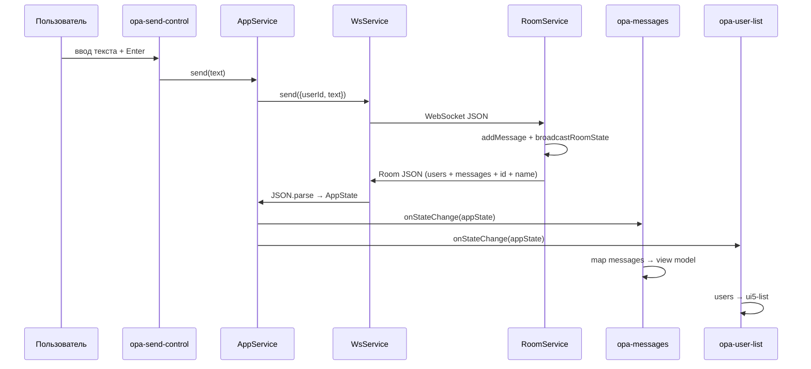

# AppStateModels — модели состояния клиентского приложения

Документ описывает TypeScript-интерфейсы из файла `client/src/app/services/AppStateModels.ts`, их связь с серверными моделями `server/src/services/roomModels.ts`, контракт обмена данными по WebSocket и использование в UI-компонентах.

---

## Содержание

1. [Обзор](#обзор)
2. [Архитектурная роль](#архитектурная-роль)
3. [Интерфейс `User`](#интерфейс-user)
4. [Интерфейс `Message`](#интерфейс-message)
5. [Интерфейс `AppState`](#интерфейс-appstate)
6. [Сравнение с серверными `roomModels`](#сравнение-с-серверными-roommodels)
7. [Клиентско-серверный контракт](#клиентско-серверный-контракт)
8. [Использование в компонентах и сервисах](#использование-в-компонентах-и-сервисах)
9. [Ожидания по валидации и типобезопасности](#ожидания-по-валидации-и-типобезопасности)
10. [Примеры JSON-состояния](#примеры-json-состояния)
11. [Известные расхождения и TODO](#известные-расхождения-и-todo)
12. [Схема потока данных](#схема-потока-данных)

---

## Обзор

`AppStateModels.ts` — минимальный набор типов, описывающих **снимок состояния комнаты чата**, который клиент получает от сервера через WebSocket. Файл содержит три экспортируемых интерфейса:

| Интерфейс   | Назначение                                      |
|-------------|-------------------------------------------------|
| `User`      | Участник комнаты                                |
| `Message`   | Одно сообщение в истории чата                   |
| `AppState`  | Агрегированное состояние: пользователи + сообщения |

Модели **не содержат логики**: ни сериализации, ни валидации, ни преобразований. Они используются исключительно как контракт типов TypeScript на стороне клиента. Фактические данные приходят как JSON из WebSocket-сообщения, парсятся через `JSON.parse` и приводятся к типу `AppState` без runtime-проверок.

Источник данных на сервере — объект `Room` из `roomModels.ts`, который рассылается всем подключённым клиентам комнаты методом `RoomService.broadcastRoomState()`.

---

## Архитектурная роль

```
┌─────────────────┐     WebSocket (JSON)      ┌──────────────────┐
│  RoomService    │ ────────────────────────► │  WsService       │
│  (server)       │   JSON.stringify(room)    │  (client)        │
└─────────────────┘                           └────────┬─────────┘
        ▲                                              │
        │ roomModels.Room                              │ JSON.parse → AppState
        │                                              ▼
        │                                     ┌──────────────────┐
        │                                     │  AppService      │
        │                                     │  processStateChange│
        │                                     └────────┬─────────┘
        │                                              │
        │                              onStateChange callbacks
        │                                              ▼
        │                              ┌───────────────────────────┐
        │                              │ opa-messages, opa-user-list│
        └──────────────────────────────│ (UI-компоненты)           │
                                       └───────────────────────────┘
```

Клиент сознательно моделирует **подмножество** серверного `Room`: поля `id` и `name` комнаты на клиенте в типах не отражены, хотя физически приходят в JSON-пayload. TypeScript их «игнорирует», JavaScript сохраняет их в объекте, но ни один компонент их не читает.

---

## Интерфейс `User`

### Исходное определение (клиент)

```typescript
export interface User {
    id: string;
    name: string;
    active: boolean;
}
```

### Определение на сервере

```typescript
export interface User {
    id: string;
    name: string;
    active: boolean;
}
```

**Полное совпадение** структуры и семантики полей между клиентом и сервером.

### Поля — подробное описание

| Поле     | Тип      | Обязательность | Описание |
|----------|----------|----------------|----------|
| `id`     | `string` | Да             | Уникальный идентификатор пользователя в рамках комнаты. На клиенте генерируется через `uuid()` и сохраняется в `localStorage` под ключом `"userId"`. Идентификатор **не привязан к аккаунту** — при «смене ID» (`setNewUserId`) создаётся новый UUID. |
| `name`   | `string` | Да             | Отображаемое имя пользователя. Задаётся пользователем через диалог имени, хранится в `localStorage` (`"userName"`). При повторном входе в комнату сервер обновляет `name`, если пользователь с тем же `id` переподключился с другим именем. |
| `active` | `boolean`| Да             | Признак активного WebSocket-соединения. `true` — пользователь онлайн; `false` — соединение закрыто, но пользователь ещё не удалён из списка (grace period ~10 секунд). |

### Жизненный цикл `User` на сервере

1. **Первый вход** (`RoomService.joinRoom`): если пользователя с данным `id` нет — добавляется в `room.users` с `active: true`, создаётся системное сообщение.
2. **Повторный вход** (reconnect с тем же `id`): обновляются `name` и `active: true`, отменяется таймер отложенного удаления.
3. **Отключение** (`userDisconnect`): `active` устанавливается в `false`, состояние рассылается клиентам.
4. **Финальное удаление** (`finalUserDisconnect`, через `LAZY_REMOVE_TIMEOUT = 10_000` мс): пользователь удаляется из массива `users`, создаётся системное сообщение о выходе.

### Использование на клиенте

- **`opa-user-list`**: массив `appState.users` напрямую передаётся в шаблон. Для неактивных пользователей (`active === false`) UI5 List показывает дополнительный текст «неактивен» (строка из `strings.OpaUserList.inactive`).
- **`opa-messages`**: по `userId` сообщения выполняется поиск `User` в `appState.users` для отображения имени автора. Если пользователь не найден (например, уже удалён), в качестве автора показывается сам `userId`.

---

## Интерфейс `Message`

### Исходное определение (клиент)

```typescript
export interface Message {
    id: string;
    text: string;
    userId: string;
    date: string; //milisec
}
```

### Определение на сервере

```typescript
export interface Message {
    id: string;
    text: string;
    userId: string;
    date: number; //milisec
}
```

### Поля — подробное описание

| Поле     | Тип (клиент) | Тип (сервер) | Обязательность | Описание |
|----------|--------------|--------------|----------------|----------|
| `id`     | `string`     | `string`     | Да             | UUID сообщения. Генерируется на сервере через `uuid()` при вызове `addMessage`. Клиент не создаёт сообщения локально — только отображает полученные. |
| `text`   | `string`     | `string`     | Да             | Текст сообщения. Для пользовательских сообщений — содержимое, введённое в `opa-send-control`. Для системных — служебный текст (вход/выход пользователя). |
| `userId` | `string`     | `string`     | Да             | ID автора сообщения. Специальное значение `"_system"` обозначает системное сообщение (не привязано к реальному пользователю). |
| `date`   | `string`     | `number`     | Да             | Время создания в **миллисекундах** с Unix epoch. На сервере: `utils.now()` → `(new Date()).getTime()` (число). В JSON при сериализации приходит как **число**. На клиенте тип объявлен как `string`, но фактически в runtime это число; `new Date(msg.date)` корректно работает с обоими типами. |

### Расхождение типа `date`

| Аспект | Клиент | Сервер |
|--------|--------|--------|
| Объявленный тип | `string` | `number` |
| Фактический runtime-тип после `JSON.parse` | `number` | `number` |
| Комментарий в коде | `//milisec` | `//milisec` |

Это **известное несоответствие типов** (отмечено в TODO сервера: «sync client\server models»). На практике ошибок нет, потому что `Date` принимает и число, и строку с числом. Однако TypeScript не предупреждает о потенциальных проблемах, а автодополнение может вводить в заблуждение.

### Системные сообщения (`userId === "_system"`)

Сервер создаёт системные сообщения в следующих случаях:

| Событие | Пример текста |
|---------|---------------|
| Новый пользователь добавлен | `User "<userId>" was added` |
| Пользователь окончательно покинул комнату | `user "<userId>" left the room` |

На клиенте (`opa-messages`) системные сообщения:

- получают CSS-класс `_system` (особое оформление в `style.css`);
- автор отображается как `"_system"` (имя пользователя не подставляется).

### Создание пользовательских сообщений

Клиент отправляет на сервер JSON:

```json
{ "userId": "<uuid из localStorage>", "text": "<текст сообщения>" }
```

Сервер парсит payload в `messageFromUser`, вызывает `addMessage(parsedMsg.text, parsedMsg.userId)` и рассылает обновлённое состояние комнаты.

---

## Интерфейс `AppState`

### Исходное определение (клиент)

```typescript
export interface AppState {
    users: User[]
    messages: Message[]; //last 5 min messages
}
```

### Серверный аналог — `Room`

```typescript
export interface Room {
    id: string,
    name: string,
    users: User[],
    messages: Message[]
}
```

### Поля — подробное описание

| Поле       | Тип            | Обязательность | Описание |
|------------|----------------|----------------|----------|
| `users`    | `User[]`       | Да             | Список всех участников комнаты, включая неактивных (с `active: false`) в период grace period после отключения. Порядок — порядок добавления; при удалении пользователь исключается из массива. |
| `messages` | `Message[]`    | Да             | История сообщений комнаты. **Комментарий в коде** указывает «last 5 min messages», но **на сервере фильтрация по времени не реализована** — хранятся и отправляются **все** сообщения с момента создания комнаты. |

### Дополнительные поля в wire-format (не в `AppState`)

Сервер рассылает полный объект `Room`. Клиент типизирует его как `AppState`, но в JSON дополнительно присутствуют:

| Поле   | Тип      | Описание |
|--------|----------|----------|
| `id`   | `string` | UUID комнаты (из query-параметра `?room=` URL). |
| `name` | `string` | Автогенерируемое имя комнаты (`unique-names-generator`: adjectives + colors + animals, например `big_red_donkey`). На клиенте **не отображается** (TODO на сервере: «display room name»). |

Эти поля **безопасно игнорируются** клиентским кодом: ни `AppService`, ни компоненты к ним не обращаются.

---

## Сравнение с серверными `roomModels`

### Таблица соответствия типов

| Клиент (`AppStateModels`) | Сервер (`roomModels`) | Совпадение |
|---------------------------|------------------------|------------|
| `User`                    | `User`                 | Полное     |
| `Message`                 | `Message`              | Частичное (`date`: `string` vs `number`) |
| `AppState`                | `Room` (без `id`, `name`) | Структурное подмножество |
| —                         | `Room.id`              | Только на сервере / в wire-format |
| —                         | `Room.name`            | Только на сервере / в wire-format |

### Сводка расхождений

1. **`Message.date`**: `string` (клиент) vs `number` (сервер) — функционально совместимо, типы не синхронизированы.
2. **`AppState` vs `Room`**: клиент не моделирует метаданные комнаты.
3. **Комментарий «last 5 min messages»**: задумано, но не реализовано на сервере.
4. **TODO в `roomService.ts`**: явная пометка «sync client\server models».

---

## Клиентско-серверный контракт

### Транспорт

| Параметр | Значение |
|----------|----------|
| Протокол | WebSocket (`ws` / `wss`) |
| Endpoint | `/api/roomState?roomId=<uuid>&userId=<uuid>&userName=<string>` |
| Формат данных | JSON (UTF-8) |
| Направление state | Сервер → клиент (broadcast) |
| Направление сообщений | Клиент → сервер (отправка текста) |

### Сообщения сервер → клиент

**Тип payload:** сериализованный объект `Room` (клиент интерпретирует как `AppState`).

**Когда отправляется:**

- пользователь входит в комнату (`joinRoom`);
- пользователь отправляет сообщение;
- пользователь отключается (`userDisconnect`, `active: false`);
- пользователь окончательно удаляется (`finalUserDisconnect`);
- любое изменение, вызывающее `broadcastRoomState()`.

**Формат:**

```json
{
  "id": "<room-uuid>",
  "name": "<generated-room-name>",
  "users": [ /* User[] */ ],
  "messages": [ /* Message[] */ ]
}
```

**Служебные сообщения WebSocket:**

- `"H"` — heartbeat (клиент отправляет каждые 50 секунд; сервер отвечает тем же, не меняя state).

### Сообщения клиент → сервер

| Тип | Формат | Назначение |
|-----|--------|------------|
| Heartbeat | `"H"` (строка) | Поддержание соединения |
| Текст сообщения | `{"userId":"<uuid>","text":"<string>"}` | Новое сообщение в чат |

### Поведение при ошибках

- Клиент не валидирует структуру входящего JSON; некорректный payload приведёт к runtime-ошибке в компонентах (например, при вызове `.map` на `undefined`).
- При обрыве WebSocket клиент делает до 5 попыток переподключения (`WsService.MAX_TRIES`).
- Таймаут первичного подключения — 30 секунд.

---

## Использование в компонентах и сервисах

### `AppService` (`client/src/app/services/AppService.ts`)

Центральная точка интеграции моделей состояния.

| Функция | Роль |
|---------|------|
| `connect()` | Устанавливает WebSocket через `WsService.attachWsToRoom`. В callback `message` входящий объект приводится к `AppState` и передаётся в `processStateChange`. |
| `processStateChange(appState)` | Вызывает все зарегистрированные callback'и. |
| `onStateChange(callback)` | Pub/sub API: компоненты подписываются на обновления. Возвращает `{ unsubscribe }`. |
| `send(message: string)` | Отправляет `{ userId, text }` на сервер (не использует типы `AppStateModels` напрямую). |

```typescript
message(message: any): void {
    const state: AppState = message;
    processStateChange(state);
}
```

Приведение типа **явное и небезопасное**: `message: any` → `AppState` без проверок.

### `opa-messages` (`client/src/app/components/opa-messages.ts`)

Подписывается на `AppService.onStateChange` и **трансформирует** `AppState` во view-модель:

| Поле view-модели | Источник |
|------------------|----------|
| `author`         | `users.find(u => u.id === msg.userId)?.name ?? msg.userId` |
| `text`           | `msg.text` |
| `date`           | `(new Date(msg.date)).toLocaleTimeString()` — локализованное время |
| `system`         | `msg.userId === "_system"` |

После обновления вызывается `render()` и прокрутка к последнему сообщению.

### `opa-user-list` (`client/src/app/components/opa-user-list.ts`)

Подписывается на `AppService.onStateChange` и напрямую использует `appState.users`:

```typescript
this.state.users = appState.users || [];
```

Fallback `|| []` — единственная защита от отсутствующего поля на клиенте.

### `WsService` (`client/src/app/services/WsService.ts`)

Не импортирует `AppStateModels`. Парсит JSON и передаёт результат в callback как `any`:

```typescript
wsRoomCallback.message(JSON.parse(event.data));
```

Типизация `AppState` начинается только на уровне `AppService`.

---

## Ожидания по валидации и типобезопасности

### Что **есть**

- Статическая типизация TypeScript на этапе компиляции.
- Неявные fallback'и в UI: `appState.users || []`, `messages || []`, `user ? user.name : msg.userId`.

### Чего **нет**

| Аспект | Статус |
|--------|--------|
| Runtime schema validation (Zod, io-ts, ajv) | Отсутствует |
| Проверка обязательных полей при получении WS-сообщения | Отсутствует |
| Проверка типов полей (`date` как number/string) | Отсутствует |
| Санитизация HTML в `text` | Отсутствует (используется `x-text` в Alpine.js — XSS через textContent маловероятен) |
| Ограничение длины `text` / `name` | Отсутутствует |
| Фильтрация сообщений старше 5 минут | Не реализована (несмотря на комментарий) |

### Ожидаемые инварианты (неформальный контракт)

При корректной работе сервера клиент **ожидает**:

1. `users` — массив (может быть пустым).
2. `messages` — массив (может быть пустым).
3. Каждый `User` имеет непустые `id`, `name` и boolean `active`.
4. Каждое `Message` имеет `id`, `text`, `userId`, `date`.
5. `date` — число миллисекунд (совместимо с конструктором `Date`).
6. `userId` в сообщениях либо совпадает с `User.id` из `users`, либо равен `"_system"`.
7. При каждом событии приходит **полный снимок** состояния (не delta/patch).

### Рекомендации при доработке

- Синхронизировать `Message.date` как `number` на клиенте.
- Добавить runtime-валидацию входящего payload (хотя бы проверка наличия `users` и `messages` как массивов).
- Либо реализовать фильтрацию «последние 5 минут» на сервере, либо убрать/исправить комментарий в `AppState`.
- Расширить `AppState` до `Room` на клиенте, если планируется отображение имени комнаты.

---

## Примеры JSON-состояния

### Пустая комната (только что создана, один пользователь вошёл)

```json
{
  "id": "a1b2c3d4-e5f6-7890-abcd-ef1234567890",
  "name": "big_red_donkey",
  "users": [
    {
      "id": "f47ac10b-58cc-4372-a567-0e02b2c3d479",
      "name": "Alice",
      "active": true
    }
  ],
  "messages": [
    {
      "id": "6ba7b810-9dad-11d1-80b4-00c04fd430c8",
      "text": "User \"f47ac10b-58cc-4372-a567-0e02b2c3d479\" was added",
      "userId": "_system",
      "date": 1720700000000
    }
  ]
}
```

### Активный чат с несколькими пользователями

```json
{
  "id": "a1b2c3d4-e5f6-7890-abcd-ef1234567890",
  "name": "quiet_blue_fox",
  "users": [
    {
      "id": "f47ac10b-58cc-4372-a567-0e02b2c3d479",
      "name": "Alice",
      "active": true
    },
    {
      "id": "550e8400-e29b-41d4-a716-446655440000",
      "name": "Bob",
      "active": true
    },
    {
      "id": "6ba7b811-9dad-11d1-80b4-00c04fd430c8",
      "name": "Charlie",
      "active": false
    }
  ],
  "messages": [
    {
      "id": "msg-001",
      "text": "User \"f47ac10b-58cc-4372-a567-0e02b2c3d479\" was added",
      "userId": "_system",
      "date": 1720700000000
    },
    {
      "id": "msg-002",
      "text": "User \"550e8400-e29b-41d4-a716-446655440000\" was added",
      "userId": "_system",
      "date": 1720700010000
    },
    {
      "id": "msg-003",
      "text": "Привет всем!",
      "userId": "f47ac10b-58cc-4372-a567-0e02b2c3d479",
      "date": 1720700020000
    },
    {
      "id": "msg-004",
      "text": "Привет, Alice!",
      "userId": "550e8400-e29b-41d4-a716-446655440000",
      "date": 1720700030000
    }
  ]
}
```

### Состояние после отключения пользователя (grace period)

Bob закрыл вкладку; Charlie уже удалён из комнаты:

```json
{
  "id": "a1b2c3d4-e5f6-7890-abcd-ef1234567890",
  "name": "quiet_blue_fox",
  "users": [
    {
      "id": "f47ac10b-58cc-4372-a567-0e02b2c3d479",
      "name": "Alice",
      "active": true
    },
    {
      "id": "550e8400-e29b-41d4-a716-446655440000",
      "name": "Bob",
      "active": false
    }
  ],
  "messages": [
    {
      "id": "msg-003",
      "text": "Привет всем!",
      "userId": "f47ac10b-58cc-4372-a567-0e02b2c3d479",
      "date": 1720700020000
    },
    {
      "id": "msg-005",
      "text": "user \"6ba7b811-9dad-11d1-80b4-00c04fd430c8\" left the room",
      "userId": "_system",
      "date": 1720700100000
    }
  ]
}
```

### Payload исходящего сообщения клиента (не `AppState`)

```json
{
  "userId": "f47ac10b-58cc-4372-a567-0e02b2c3d479",
  "text": "Новое сообщение"
}
```

---

## Известные расхождения и TODO

Зафиксированные в кодовой базе задачи, связанные с моделями:

| Источник | TODO | Влияние на модели |
|----------|------|-------------------|
| `roomService.ts` | `sync client\server models` | `Message.date`, отсутствие `Room` на клиенте |
| `roomService.ts` | `display room name` | `Room.name` не используется клиентом |
| `roomService.ts` | `dblike` | State in-memory, без персистентности |
| `roomService.ts` | `remove room after 1 hour` | Комнаты живут, пока есть соединения + grace period |
| `AppStateModels.ts` | `//last 5 min messages` | Фильтрация не реализована |

---

## Схема потока данных



---

## Связанные файлы

| Файл | Роль |
|------|------|
| `client/src/app/services/AppStateModels.ts` | Определение интерфейсов (данный документ) |
| `client/src/app/services/AppService.ts` | Подписка на state, отправка сообщений |
| `client/src/app/services/WsService.ts` | WebSocket-транспорт |
| `client/src/app/components/opa-messages.ts` | Отображение сообщений |
| `client/src/app/components/opa-user-list.ts` | Список участников |
| `server/src/services/roomModels.ts` | Серверные модели (`Room`, `User`, `Message`) |
| `server/src/services/roomService.ts` | Бизнес-логика комнаты и broadcast |
| `server/src/controllers/wsRoomRoute.ts` | WebSocket route handler |

---

*Документ сгенерирован на основе исходного кода репозитория `opa`. При изменении моделей или контракта WebSocket необходимо обновить этот файл.*
