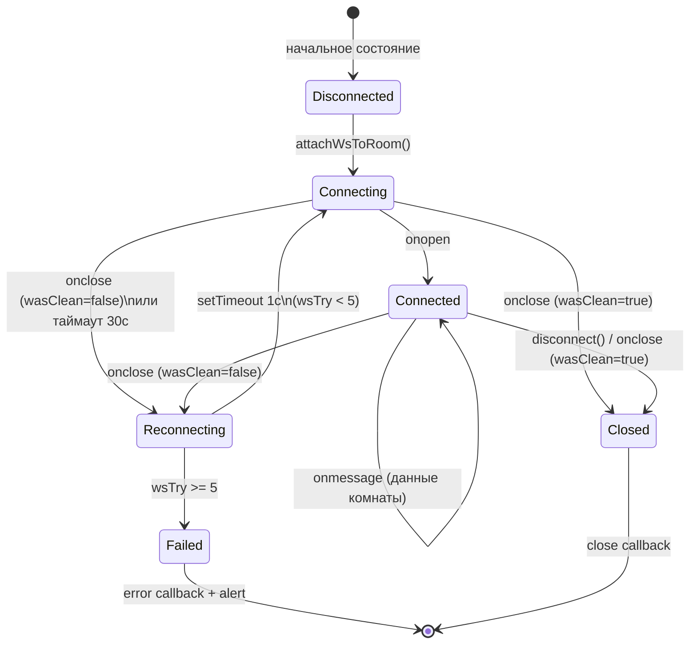
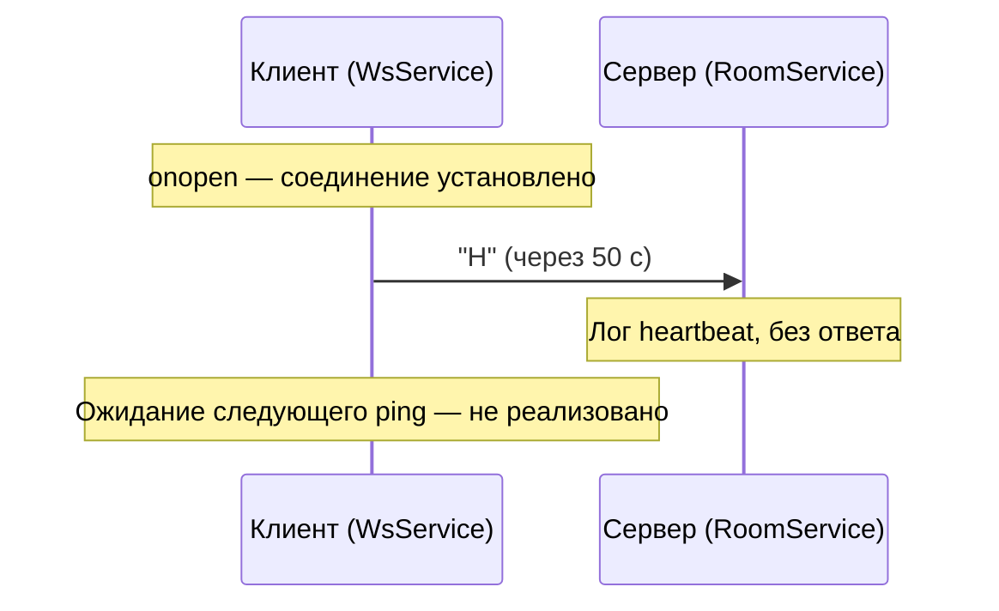
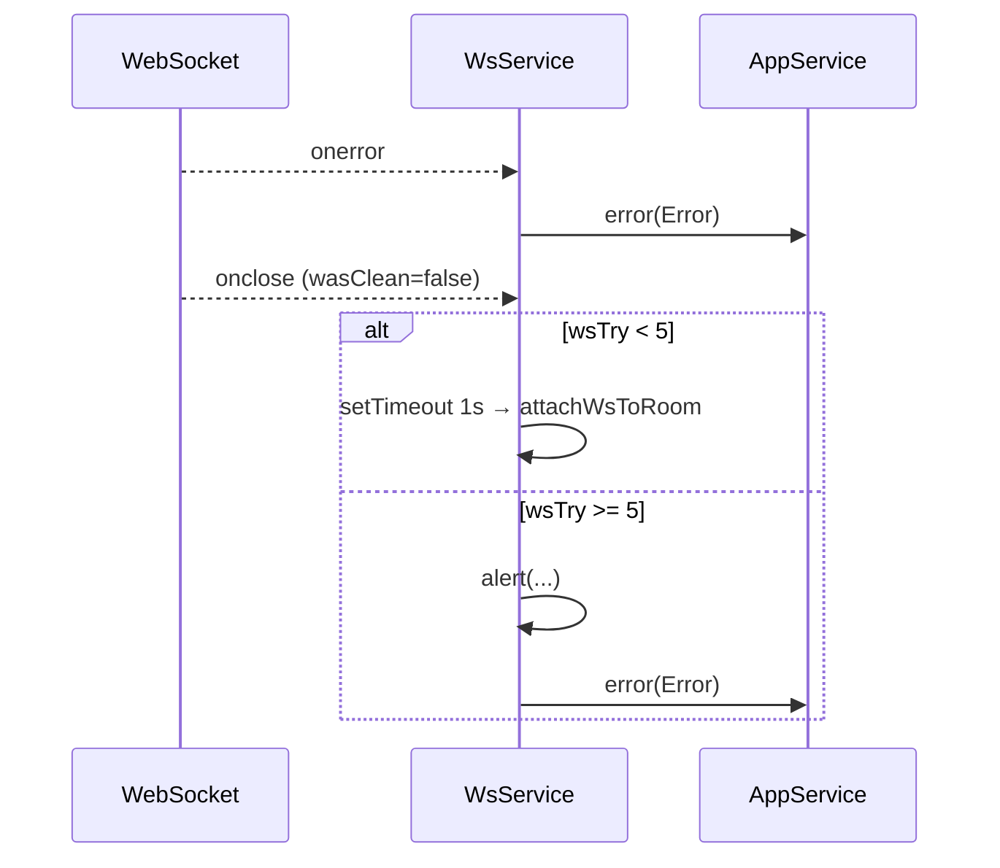
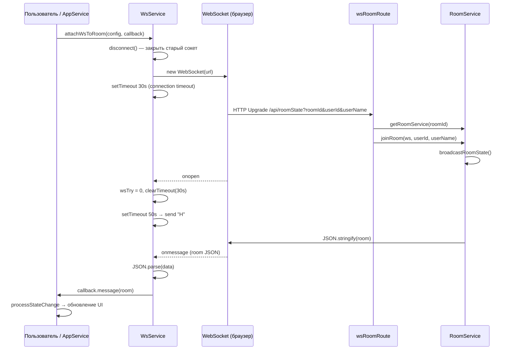
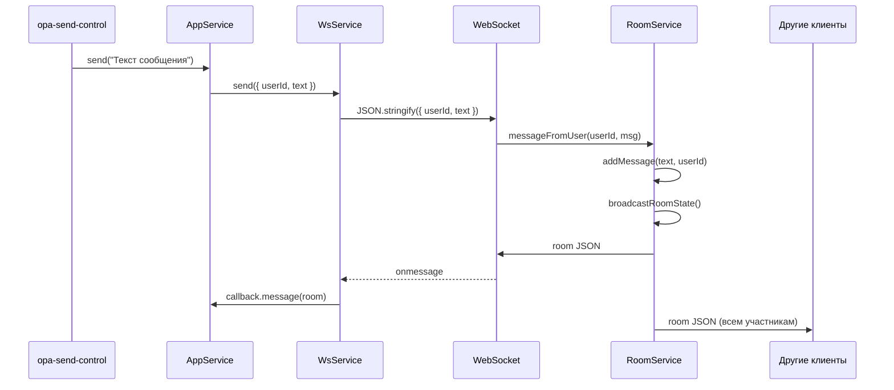
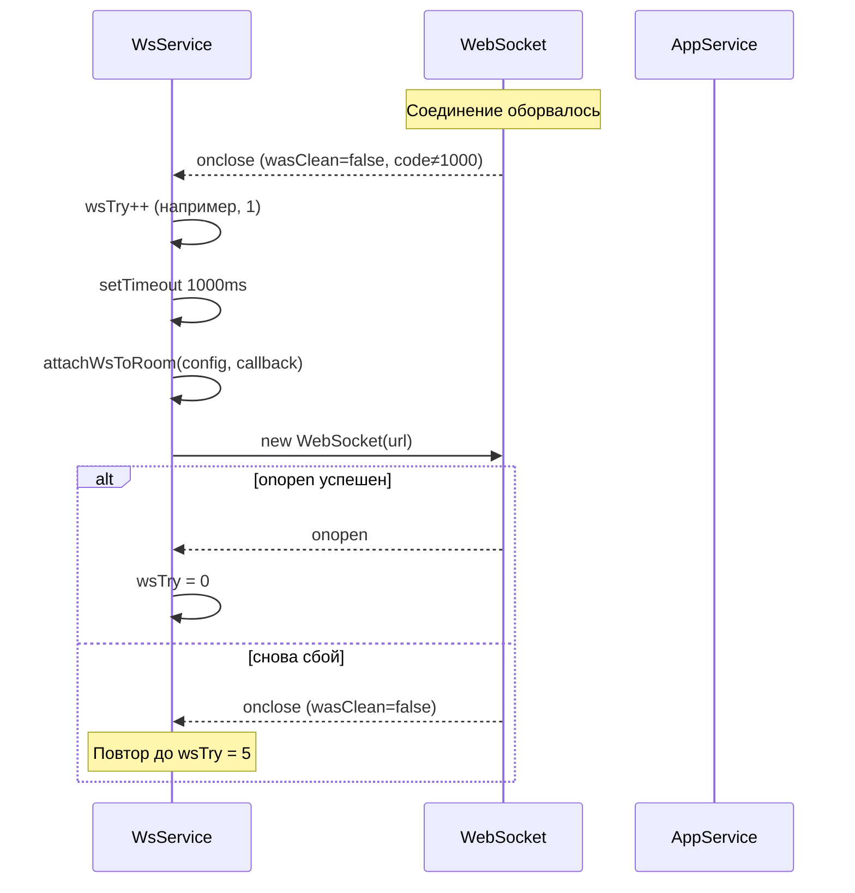
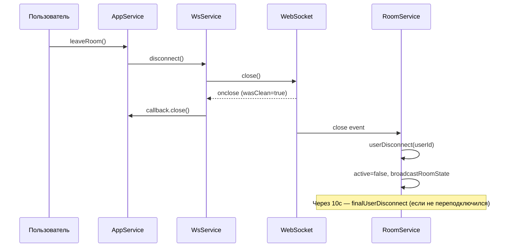
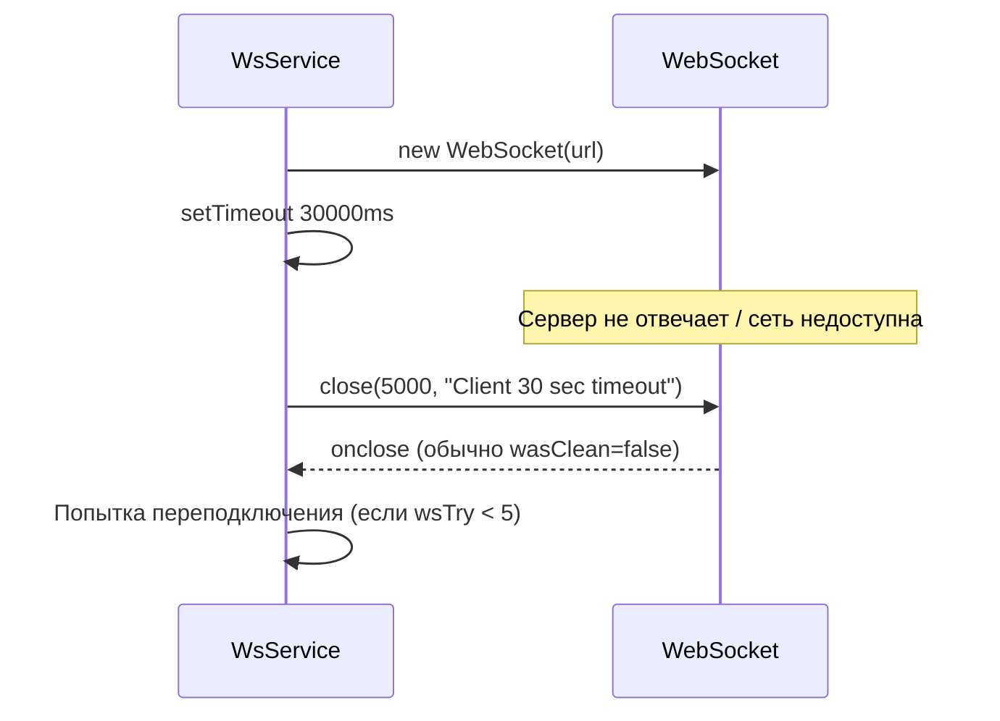
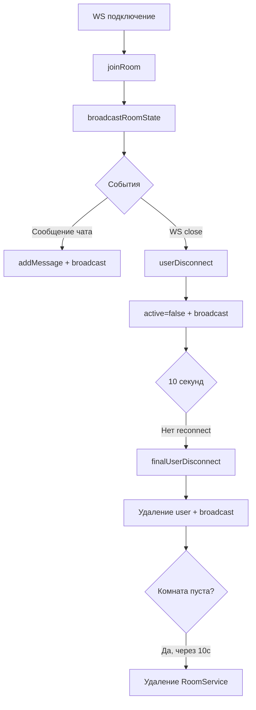

# WsService — клиентский WebSocket-сервис

Подробная документация по модулю `client/src/app/services/WsService.ts`, который отвечает за установку и поддержание WebSocket-соединения клиента с сервером комнаты OPA (Online Presence Application).

---

## Содержание

1. [Обзор](#обзор)
2. [Публичный API](#публичный-api)
3. [Интерфейсы](#интерфейсы)
4. [Формат URL подключения](#формат-url-подключения)
5. [Жизненный цикл соединения](#жизненный-цикл-соединения)
6. [Протокол сообщений](#протокол-сообщений)
7. [Heartbeat (поддержание соединения)](#heartbeat-поддержание-соединения)
8. [Логика переподключения](#логика-переподключения)
9. [Колбэки (WsRoomCallback)](#колбэки-wsroomcallback)
10. [Диаграммы последовательности](#диаграммы-последовательности)
11. [Примеры использования](#примеры-использования)
12. [Сценарии ошибок](#сценарии-ошибок)
13. [Особенности реализации и ограничения](#особенности-реализации-и-ограничения)
14. [Связь с серверной частью](#связь-с-серверной-частью)

---

## Обзор

`WsService` — тонкая обёртка над нативным браузерным API `WebSocket`. Сервис решает следующие задачи:

| Задача | Описание |
|--------|----------|
| Подключение к комнате | Устанавливает WS-соединение с эндпоинтом `/api/roomState` |
| Идентификация пользователя | Передаёт `roomId`, `userId`, `userName` в query-параметрах URL |
| Приём состояния комнаты | Десериализует JSON-снимки комнаты и передаёт их в колбэк `message` |
| Отправка сообщений | Сериализует произвольный объект в JSON и отправляет на сервер |
| Устойчивость | Таймаут подключения (30 с), переподключение при обрыве (до 5 попыток), heartbeat-символ `"H"` |
| Отключение | Явное закрытие сокета через `disconnect()` |

Сервис экспортируется как объект с тремя методами:

```typescript
export const WsService = {
    attachWsToRoom,  // подключиться к комнате
    send,            // отправить сообщение
    disconnect       // закрыть соединение
};
```

**Важно:** внутри модуля хранится **один глобальный экземпляр** сокета (`let ws: WebSocket`). Повторный вызов `attachWsToRoom` сначала вызывает `disconnect()`, затем создаёт новое соединение. Одновременно может существовать только одно WS-подключение на вкладку.

Основной потребитель — `AppService.ts`, который при входе в комнату вызывает `attachWsToRoom`, а при отправке чата — `WsService.send()`.

---

## Публичный API

### `attachWsToRoom(config, callback)`

Устанавливает WebSocket-соединение с комнатой.

| Параметр | Тип | Описание |
|----------|-----|----------|
| `config` | `WsRoomConfig` | Идентификаторы комнаты и пользователя |
| `callback` | `WsRoomCallback` | Обработчики событий WS |

**Поведение при вызове:**

1. Вызывается `disconnect()` — закрывается предыдущий сокет (если был).
2. Сбрасывается счётчик попыток переподключения (`wsTry = 0`).
3. Формируется URL и создаётся `new WebSocket(url)`.
4. Регистрируются обработчики `onopen`, `onclose`, `onerror`, `onmessage`.
5. Запускается таймер таймаута подключения (30 секунд).

### `send(message)`

Отправляет сообщение на сервер.

```typescript
const send = (message: any): void => ws.send(JSON.stringify(message));
```

| Параметр | Тип | Описание |
|----------|-----|----------|
| `message` | `any` | Объект, сериализуемый в JSON |

**Предусловие:** соединение должно быть открыто (`ws.readyState === WebSocket.OPEN`). Метод не проверяет состояние сокета — при вызове до подключения или после закрытия возможна ошибка в рантайме.

### `disconnect()`

Корректно закрывает текущее соединение.

```typescript
const disconnect = (): void => ws?.close();
```

Использует optional chaining: если сокет ещё не создан, вызов безопасен. Закрытие через `close()` без кода считается **чистым** (`wasClean = true`), что приводит к вызову колбэка `close()` без переподключения.

---

## Интерфейсы

### `WsRoomConfig`

Конфигурация подключения к комнате. Все поля передаются серверу как query-параметры URL.

```typescript
export interface WsRoomConfig {
    roomId: string;   // UUID комнаты (из ?room= в URL страницы)
    userId: string;   // UUID пользователя (из localStorage)
    userName: string; // Отображаемое имя пользователя (из localStorage)
}
```

| Поле | Источник в приложении | Назначение на сервере |
|------|----------------------|----------------------|
| `roomId` | Query-параметр `?room=` | Ключ для `RoomServiceManager.getRoomService(roomId)` |
| `userId` | `localStorage.userId` | Уникальный идентификатор пользователя в комнате |
| `userName` | `localStorage.userName` | Имя для отображения в списке участников |

**Пример значений:**

```typescript
{
    roomId: "a1b2c3d4-e5f6-7890-abcd-ef1234567890",
    userId: "f47ac10b-58cc-4372-a567-0e02b2c3d479",
    userName: "Иван"
}
```

### `WsRoomCallback`

Набор колбэков, вызываемых при событиях WebSocket.

```typescript
export interface WsRoomCallback {
    message: (message: any) => void;  // получено сообщение (состояние комнаты)
    close: () => void;                // соединение закрыто чисто
    error: (error: Error) => void;    // ошибка WS или исчерпание попыток
}
```

| Колбэк | Когда вызывается | Типичная реакция (AppService) |
|--------|------------------|-------------------------------|
| `message` | Получены данные, отличные от `"H"` | Парсинг как `AppState`, обновление UI |
| `close` | `CloseEvent.wasClean === true` | Логирование (без UI-ошибки) |
| `error` | `onerror` или исчерпание 5 попыток | `console.error` + toast-уведомление |

**Примечание:** тип `message` — `any`, потому что сервер отправляет полный объект `Room`, а клиент (`AppService`) использует подмножество полей как `AppState`.

---

## Формат URL подключения

### Шаблон

```
{wsProtocol}://{domain}/api/roomState?roomId={roomId}&userId={userId}&userName={userName}
```

### Определение протокола

```typescript
const wsProtocol = window.location.protocol === "https:" ? "wss" : "ws";
```

| Протокол страницы | Протокол WS |
|-------------------|-------------|
| `https:` | `wss` |
| `http:` | `ws` |

### Определение домена

```typescript
let domain = window.location.host;
if (domain.startsWith("localhost:")) {
    domain = "localhost:3000";
}
```

| Среда | `window.location.host` | Итоговый `domain` | Причина |
|-------|------------------------|-------------------|---------|
| Production (единый сервер) | `example.com` | `example.com` | Клиент и API на одном хосте |
| Production (порт) | `example.com:443` | `example.com:443` | Без изменений |
| Dev (Vite) | `localhost:5173` | `localhost:3000` | Vite dev-сервер не проксирует WS; бэкенд слушает порт 3000 |
| Dev (другой порт) | `localhost:8080` | `localhost:3000` | Та же логика для любого `localhost:*` |

### Примеры готовых URL

**Локальная разработка (Vite на 5173, сервер на 3000):**

```
ws://localhost:3000/api/roomState?roomId=abc-123&userId=def-456&userName=Alice
```

**Production по HTTPS:**

```
wss://myapp.example.com/api/roomState?roomId=abc-123&userId=def-456&userName=Alice
```

**Важно:** `userName` не кодируется через `encodeURIComponent`. Имена с пробелами, кириллицей или спецсимволами могут вызвать проблемы парсинга URL. Рекомендуется кодировать значения на стороне вызывающего кода (в текущей реализации этого нет).

---

## Жизненный цикл соединения

### Состояния



### Пошаговое описание

#### 1. Инициация (`attachWsToRoom`)

- Предыдущий сокет закрывается (`disconnect()`).
- Создаётся новый `WebSocket`.
- `wsTry` сбрасывается в `0`.
- Запускается `CONNECTION_TIMEOUT` (30 000 мс).

#### 2. Успешное подключение (`onopen`)

- Лог: `"WS connected"`.
- Счётчик `wsTry` сбрасывается в `0` (успешное подключение обнуляет историю неудач).
- Таймер таймаута подключения снимается.
- Через `PING_INTERVAL` (50 000 мс) отправляется первый heartbeat `"H"`.

#### 3. Получение данных (`onmessage`)

- Если `event.data === "H"` — heartbeat, только debug-лог.
- Иначе — `JSON.parse(event.data)` и вызов `wsRoomCallback.message(parsed)`.

#### 4. Закрытие (`onclose`)

- Снимаются таймеры подключения и heartbeat.
- Лог кода и причины закрытия.
- **Чистое закрытие** (`wasClean === true`):
  - Лог: `"WS closed normally"`.
  - Вызывается `wsRoomCallback.close()`.
  - Переподключение **не** выполняется.
- **Нечистое закрытие** (`wasClean === false`):
  - Лог: `"WS interrupted"`.
  - Если `wsTry < MAX_TRIES` (5): инкремент `wsTry`, повтор через 1 секунду.
  - Иначе: `alert`, `wsRoomCallback.error(...)`.

#### 5. Ошибка (`onerror`)

- Снимается таймер heartbeat (если был установлен).
- Лог ошибки.
- Вызывается `wsRoomCallback.error(new Error("WS error:" + error.message))`.
- Браузер обычно следом вызывает `onclose` с `wasClean = false`, что может запустить переподключение.

### Константы жизненного цикла

| Константа | Значение | Назначение |
|-----------|----------|------------|
| `MAX_TRIES` | `5` | Максимум попыток переподключения при нечистом закрытии |
| `CONNECTION_TIMEOUT` | `30 * 1000` (30 с) | Таймаут ожидания `onopen` |
| `PING_INTERVAL` | `50 * 1000` (50 с) | Задержка перед отправкой heartbeat `"H"` |

---

## Протокол сообщений

### Направление: клиент → сервер

Все сообщения от клиента — **текстовые строки** (WebSocket text frames).

#### 1. Heartbeat

| Поле | Значение |
|------|----------|
| Тело | `"H"` (один символ) |
| Content-Type | Текст (не JSON) |
| Частота | Один раз через 50 с после `onopen` (см. раздел Heartbeat) |

Сервер (`RoomService.messageFromUser`) распознаёт `"H"` и **не** добавляет его в историю сообщений:

```typescript
if (msg === "H") {
    console.log(`Client send H (heartbeat), userId=${userId}`);
    return;
}
```

#### 2. Сообщение чата

Формат JSON:

```typescript
{
    userId: string;  // ID отправителя
    text: string;      // Текст сообщения
}
```

**Пример:**

```json
{
    "userId": "f47ac10b-58cc-4372-a567-0e02b2c3d479",
    "text": "Привет, комната!"
}
```

Сервер парсит JSON, добавляет сообщение в `room.messages` и рассылает обновлённое состояние всем участникам.

### Направление: сервер → клиент

#### 1. Heartbeat (теоретически)

Символ `"H"` — клиент игнорирует его как данные и не передаёт в `message`-колбэк. В текущей реализации сервер **не отправляет** `"H"` обратно.

#### 2. Снимок состояния комнаты (`Room`)

При любом изменении комнаты сервер вызывает `broadcastRoomState()` и отправляет **полный объект комнаты**:

```typescript
interface Room {
    id: string;
    name: string;      // автогенерируемое имя (например, "big_red_donkey")
    users: User[];
    messages: Message[];
}

interface User {
    id: string;
    name: string;
    active: boolean;   // true — WS подключён, false — отключён (lazy remove)
}

interface Message {
    id: string;        // UUID
    text: string;
    userId: string;    // ID пользователя или "_system" для системных сообщений
    date: number;      // timestamp в миллисекундах
}
```

**Пример входящего сообщения:**

```json
{
    "id": "room-uuid-here",
    "name": "big_red_donkey",
    "users": [
        { "id": "user-1", "name": "Alice", "active": true },
        { "id": "user-2", "name": "Bob", "active": false }
    ],
    "messages": [
        {
            "id": "msg-uuid-1",
            "text": "User \"user-1\" was added",
            "userId": "_system",
            "date": 1720700000000
        },
        {
            "id": "msg-uuid-2",
            "text": "Привет!",
            "userId": "user-1",
            "date": 1720700001000
        }
    ]
}
```

### Когда сервер отправляет обновления

| Событие | Действие сервера |
|---------|------------------|
| Пользователь подключился (`joinRoom`) | `broadcastRoomState()` |
| Пользователь отправил сообщение | `addMessage()` + `broadcastRoomState()` |
| Пользователь отключился (WS close) | `active = false` + `broadcastRoomState()` |
| Lazy-remove (10 с без переподключения) | Удаление из `users` + системное сообщение + `broadcastRoomState()` |

### Маппинг на клиентский `AppState`

`AppService` приводит входящий `Room` к `AppState`:

```typescript
interface AppState {
    users: User[];
    messages: Message[];  // комментарий в коде: "last 5 min messages"
}
```

Поля `id` и `name` комнаты на уровне `WsService` не отбрасываются — они просто не используются в `AppService.processStateChange`.

---

## Heartbeat (поддержание соединения)

### Назначение

Heartbeat предназначен для поддержания активности соединения и обнаружения «мёртвых» сокетов (через промежуточные прокси, NAT, балансировщики).

### Реализация на клиенте

```typescript
ws.onopen = () => {
    // ...
    setTimeout(() => {
        console.log("ping");
        ws.send("H");
    }, PING_INTERVAL);  // 50 секунд
};
```

При получении `"H"` от сервера:

```typescript
if (event.data === "H") {
    console.debug("heart-bit");
} else {
    wsRoomCallback.message(JSON.parse(event.data));
}
```

### Реализация на сервере

Сервер принимает `"H"` и завершает обработку без ответа и без изменения состояния комнаты.

### Важные замечания

| Аспект | Фактическое поведение |
|--------|----------------------|
| Периодичность | Используется **однократный** `setTimeout`, а не `setInterval`. После подключения отправляется **только один** `"H"` через 50 секунд |
| Ответ сервера | Сервер не отвечает `"H"` обратно |
| `wsHeartbeatTimeoutId` | Объявлен и очищается в `onclose`/`onerror`, но **нигде не устанавливается** — логика таймаута heartbeat не реализована |
| Прокси / LB | Единичный ping через 50 с может быть недостаточен для долгоживущих соединений за агрессивными прокси |

### Рекомендуемая (но не реализованная) схема



---

## Логика переподключения

### Условия запуска

Переподключение запускается **только** при нечистом закрытии:

```typescript
if (event.wasClean) {
    wsRoomCallback.close();
} else {
    if (wsTry < MAX_TRIES) {
        ++wsTry;
        setTimeout(() => attachWsToRoom(wsRoomConfig, wsRoomCallback), 1000);
    } else {
        // ошибка
    }
}
```

### Параметры

| Параметр | Значение |
|----------|----------|
| `MAX_TRIES` | 5 |
| Задержка между попытками | 1000 мс (1 секунда) |
| Сброс счётчика | При успешном `onopen` → `wsTry = 0` |
| Сброс при новом `attachWsToRoom` | `wsTry = 0` (новая сессия подключения) |

### Подсчёт попыток

При последовательных нечистых закрытиях без успешного `onopen`:

| Событие | `wsTry` до | Условие | `wsTry` после | Действие |
|---------|------------|---------|---------------|----------|
| 1-е нечистое закрытие | 0 | 0 < 5 | 1 | Переподключение через 1 с |
| 2-е | 1 | 1 < 5 | 2 | Переподключение |
| 3-е | 2 | 2 < 5 | 3 | Переподключение |
| 4-е | 3 | 3 < 5 | 4 | Переподключение |
| 5-е | 4 | 4 < 5 | 5 | Переподключение |
| 6-е | 5 | 5 < 5 ✗ | — | `alert` + `error` callback |

**Итого:** 1 первоначальная попытка + до **5** переподключений = максимум **6** установок соединения подряд при постоянном сбое.

### Что **не** вызывает переподключение

- Явный `disconnect()` → чистое закрытие → `close()` callback.
- Успешный уход из комнаты через `AppService.leaveRoom()` → `WsService.disconnect()`.
- Таймаут 30 с вызывает `ws.close(5000, "Client 30 sec timeout")` — код 5000 не является стандартным WebSocket close code; поведение `wasClean` зависит от браузера, обычно это нечистое закрытие → переподключение.

### Поведение при переподключении

`attachWsToRoom` вызывается рекурсивно с **теми же** `wsRoomConfig` и `wsRoomCallback`. На сервере (`joinRoom`):

- Если пользователь ещё не удалён (в пределах `LAZY_REMOVE_TIMEOUT` = 10 с), он помечается `active: true`, WS заменяется.
- Если прошло > 10 с, пользователь удаляется из комнаты и добавляется заново с системным сообщением.

---

## Колбэки (WsRoomCallback)

### `message(message: any)`

**Триггер:** любое входящее WS-сообщение, кроме `"H"`.

**Данные:** десериализованный JSON — объект `Room` с сервера.

**Обработка в AppService:**

```typescript
message(message: any): void {
    const state: AppState = message;
    processStateChange(state);
}
```

`processStateChange` оповещает всех подписчиков через `AppService.onStateChange()`.

### `close()`

**Триггер:** `CloseEvent.wasClean === true`.

**Типичные причины:**

- Вызов `WsService.disconnect()`.
- Сервер корректно закрыл соединение.
- Пользователь покинул комнату (`leaveRoom`).

**Поведение в AppService:** только `console.log("ws close")` — UI не показывает ошибку.

### `error(error: Error)`

**Триггеры:**

1. Событие `ws.onerror` — немедленный вызов с текстом `"WS error:" + error.message`.
2. Исчерпание 5 попыток переподключения — `"SYSTEM ERROR: Can't connect to server"`.

**Поведение в AppService:**

```typescript
error(error: Error): void {
    console.error("WS error: ", error);
    showError();  // wcToastError.show()
}
```

**Дополнительно при исчерпании попыток:** браузерный `alert("SYSTEM ERROR: Can't connect to server")` **до** вызова колбэка `error`.

### Порядок вызова при сбое сети



**Важно:** при обрыве сети `error` может вызываться **несколько раз** (на каждый `onerror` и при финальном исчерпании попыток). Подписчики должны быть к этому готовы.

---

## Диаграммы последовательности

### Успешное подключение и получение состояния



### Отправка сообщения чата



### Переподключение при обрыве



### Явное отключение (leave room)



### Таймаут подключения (30 секунд)



---

## Примеры использования

### Минимальный пример (низкоуровневый)

```typescript
import { WsService, WsRoomConfig, WsRoomCallback } from "./WsService";

const config: WsRoomConfig = {
    roomId: "my-room-uuid",
    userId: "my-user-uuid",
    userName: "Алексей"
};

const callback: WsRoomCallback = {
    message(room) {
        console.log("Участники:", room.users);
        console.log("Сообщения:", room.messages);
    },
    close() {
        console.log("Соединение закрыто");
    },
    error(err) {
        console.error("Ошибка WS:", err.message);
    }
};

// Подключиться
WsService.attachWsToRoom(config, callback);

// Отправить сообщение (после onopen)
WsService.send({
    userId: config.userId,
    text: "Привет, мир!"
});

// Отключиться
WsService.disconnect();
```

### Пример из AppService (production-поток)

```typescript
const connect = (roomId: string, userId: string, userName: string): void => {
    const wsRoomCallback: WsRoomCallback = {
        close(): void {
            console.log("ws close");
        },
        error(error: Error): void {
            console.error("WS error: ", error);
            showError();
        },
        message(message: any): void {
            const state: AppState = message;
            processStateChange(state);
        }
    };
    WsService.attachWsToRoom({ roomId, userId, userName }, wsRoomCallback);
};

// Отправка из UI
const send = (message: string): void =>
    WsService.send({ userId: getUserId(), text: message });
```

### Подписка на изменения состояния (через AppService)

```typescript
import { AppService } from "./AppService";

const subscription = AppService.onStateChange((state: AppState) => {
    renderUsers(state.users);
    renderMessages(state.messages);
});

// Отписка
subscription.unsubscribe();
```

### Сценарий: вход в комнату по URL

```
1. Пользователь открывает https://app.example.com/?room=<uuid>
2. AppService.init() читает roomId из query
3. Если userName отсутствует — показывается диалог ввода имени
4. connect(roomId, userId, userName) → WsService.attachWsToRoom(...)
5. Сервер присылает начальный снимок комнаты
6. UI обновляется через onStateChange
```

---

## Сценарии ошибок

### 1. Сервер недоступен

| Этап | Поведение |
|------|-----------|
| Подключение | `onerror` → `error` callback; `onclose` (нечистое) |
| Переподключение | До 5 попыток с интервалом 1 с |
| Финал | `alert("SYSTEM ERROR: Can't connect to server")` + `error` callback |
| UI | Toast-ошибка через `AppService.showError()` |

### 2. Таймаут подключения (30 с)

| Этап | Поведение |
|------|-----------|
| Триггер | `setTimeout` 30 с без `onopen` |
| Действие | `ws.close(5000, "Client 30 sec timeout")` |
| Лог | `"Failed to connect WS after 30 sec"` |
| Далее | Обычно нечистое закрытие → переподключение |

### 3. Обрыв соединения в процессе работы

| Этап | Поведение |
|------|-----------|
| Триггер | Потеря сети, рестарт сервера, kill WS |
| `onclose` | `wasClean = false`, код ≠ 1000 |
| Переподключение | Автоматическое (до 5 раз) |
| Сервер | `userDisconnect` → `active: false`; при успешном reconnect в течение 10 с — восстановление без потери пользователя |

### 4. Ошибка парсинга JSON

| Этап | Поведение |
|------|-----------|
| Триггер | Сервер прислал невалидный JSON |
| Действие | `JSON.parse` в `onmessage` выбросит исключение |
| Обработка | **Не перехватывается** в WsService — необработанное исключение в обработчике события |
| Риск | Может нарушить дальнейшую обработку WS-событий в текущей вкладке |

### 5. Отправка до установки соединения

| Этап | Поведение |
|------|-----------|
| Триггер | `WsService.send()` до `onopen` или после `close` |
| Действие | `ws.send()` на закрытом/соединяющемся сокете |
| Результат | Исключение в консоли браузера; колбэк `error` **не** вызывается автоматически |

### 6. Двойной вызов `attachWsToRoom`

| Этап | Поведение |
|------|-----------|
| Действие | Первый сокет закрывается через `disconnect()` |
| `onclose` первого | `wasClean = true` → `close()` callback первой сессии |
| Далее | Создаётся новый сокет; счётчик `wsTry` сброшен |

### 7. Ошибка на сервере в `wsRoomRoute`

| Этап | Поведение |
|------|-----------|
| Триггер | Исключение в `try/catch` (например, невалидный `roomId`) |
| Действие | `next(error)` → Express error handler → HTTP 500 |
| WS | Соединение может не установиться; клиент увидит таймаут или `onerror` |

### 8. Исчерпание попыток во время показа alert

Пользователь видит модальный `alert`, блокирующий UI. После закрытия alert приложение остаётся без активного WS; для повторного подключения нужен ручной вызов `attachWsToRoom` (например, перезагрузка страницы или повторный `AppService.init()`).

### Сводная таблица кодов закрытия

| Код | Источник | `wasClean` (типично) | Переподключение |
|-----|----------|----------------------|-----------------|
| 1000 | Нормальное закрытие | `true` | Нет |
| 1001 | Going away (навигация) | `false` | Да |
| 1006 | Abnormal closure (без close frame) | `false` | Да |
| 5000 | Клиентский таймаут 30 с | `false` | Да |
| Любой при `disconnect()` | Клиент | `true` | Нет |

---

## Особенности реализации и ограничения

### Архитектурные

1. **Singleton-сокет** — один `ws` на модуль; нельзя быть в двух комнатах одновременно.
2. **Нет типизации сообщений** — `message: any` и `send(message: any)`; протокол не зафиксирован на уровне TypeScript в WsService.
3. **Глобальный `alert`** — при фатальной ошибке блокирует UI; не интегрирован с дизайн-системой приложения.
4. **Нет экспоненциального backoff** — фиксированная задержка 1 с между попытками.

### Технические

1. **Heartbeat не периодический** — только один `setTimeout` на 50 с.
2. **`wsHeartbeatTimeoutId` не используется** — нет проверки «сервер не отвечает на ping».
3. **Query-параметры не экранируются** — риск для имён с `&`, `=` и non-ASCII.
4. **`onerror` и `onclose` дублируют сигнализацию** — `error` callback может вызываться многократно.
5. **Нет проверки `readyState` в `send()`** — хрупкость при гонках состояний.

### Dev vs Production

| Аспект | Development | Production |
|--------|-------------|------------|
| Хост WS | Принудительно `localhost:3000` | `window.location.host` |
| Порт клиента | Vite (например, 5173) | Тот же, что у сервера (3000) |
| Статика + API | Раздельные порты | Единый Express-сервер (`server.ts`) |

---

## Связь с серверной частью

### Маршрут WebSocket

Файл: `server/src/controllers/wsRoomRoute.ts`

Эндпоинт регистрируется в `server/src/server.ts`:

```typescript
appWs.app.ws("/api/roomState", wsRoomRoute);
```

### Обработчик подключения

```typescript
export const wsRoomRoute = (ws: WS, req: express.Request, next: any): void => {
    const { roomId, userId, userName } = req.query;
    const roomService = RoomServiceManager.getRoomService(roomId);
    ws.on("message", (msg: string) => roomService.messageFromUser(userId, msg));
    ws.on("close", () => roomService.userDisconnect(userId));
    ws.on("error", (err) => { /* лог */ });
    roomService.joinRoom(ws, userId, userName);
};
```

### Жизненный цикл комнаты на сервере



### Симметрия протокола

| Действие | Клиент (WsService) | Сервер (RoomService) |
|----------|-------------------|----------------------|
| Подключение | `new WebSocket(url)` | `joinRoom(ws, ...)` |
| Heartbeat | `send("H")` | `messageFromUser` → ignore |
| Сообщение | `send(JSON)` | `addMessage` + `broadcastRoomState` |
| Состояние | `onmessage` → `callback.message` | `ws.send(JSON.stringify(room))` |
| Отключение | `disconnect()` / обрыв | `userDisconnect` / `finalUserDisconnect` |

---

## Файлы для дальнейшего изучения

| Файл | Роль |
|------|------|
| `client/src/app/services/WsService.ts` | Данный сервис |
| `client/src/app/services/AppService.ts` | Оркестрация подключения и отправки |
| `client/src/app/services/AppStateModels.ts` | Клиентские типы состояния |
| `server/src/controllers/wsRoomRoute.ts` | WS-маршрут Express |
| `server/src/services/roomService.ts` | Бизнес-логика комнаты |
| `server/src/services/roomModels.ts` | Серверные типы Room/User/Message |
| `server/src/services/roomServiceManager.ts` | Пул комнат в памяти |
| `server/src/server.ts` | Регистрация `/api/roomState` |

---

*Документация актуальна для исходного кода в репозитории OPA. При изменении `WsService.ts` или серверного протокола этот документ следует обновить.*
